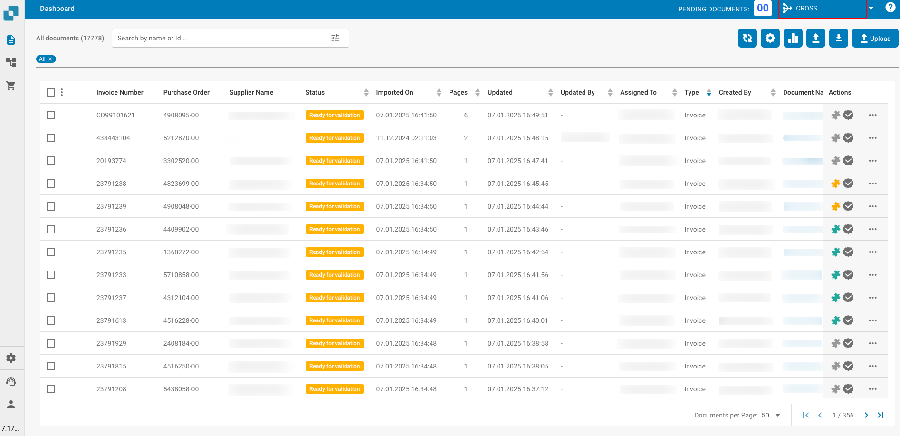
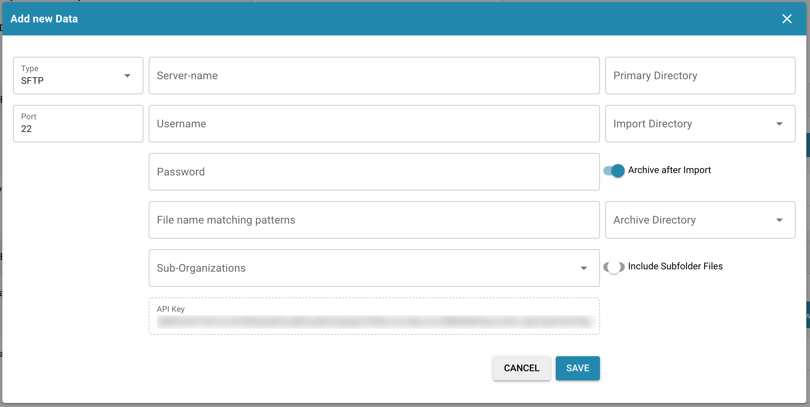
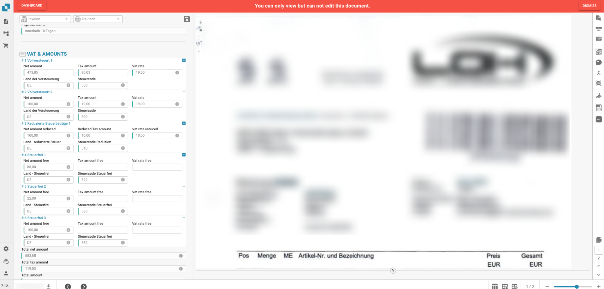

# Note della versione

> **Ultima release hotfix:** [Hotfixes 15 settembre 2026](incremental-updates-15-september-2026.md) (R1.0.13): un unico insieme di regole per la ricerca nella dashboard, fornitori riconosciuti quando un singolo campo di ricerca è univoco, la corrispondenza degli ordini di acquisto spiega le proprie decisioni, corretti i documenti bloccati e i falsi errori di esportazione, Touchless Intelligence, accesso più veloce e dati master di grandi dimensioni senza blocchi. Precedente: [Hotfixes 8 settembre 2026](incremental-updates-8-september-2026.md). Tutte le pagine degli hotfix sono elencate nella navigazione sotto Note di rilascio.

## **Release R1.0 23/24 maggio 2026**

> **Disponibilità Sandbox:** 28 aprile 2026

### Nuove funzionalità:

* **Activity Logging / Access Audit:**\
  Registro dettagliato dell'attività e audit trail degli accessi in tutta l'applicazione per conformità e monitoraggio. Diverse tipologie di logging per tutti i microservizi e basate su intervalli di tempo.

* **Ricerca rapida globale:**\
  Premi Cmd+K / Ctrl+K da qualsiasi punto dell'app per cercare tra oltre 200 rotte e più di 40 funzionalità in-page. Mostra i primi 8 risultati con fuzzy matching, navigazione con i tasti freccia e collegamenti alla App Index Page completa.

* **Sitemap (App Index Page):**\
  Pagina indice ricercabile che cataloga ogni pagina navigabile e ogni funzionalità in-page (finestre di dialogo, sidebar, pannelli) in DocBits. Organizzata in 18 categorie con filtri per tipo, pill di categoria, ricerca sincronizzata con l'URL e voci con permessi mostrate come bloccate per gli utenti non amministratori.

* **Analytics Dashboard:**\
  Analisi complete dell'elaborazione dei documenti con Executive Overview, API Metrics, Quality Metrics, Processing Performance, Document Flow Analytics, Activity Log, Event Log e Audit Trail.

* **Funzionalità di esportazione dashboard:**\
  Nuova funzionalità di esportazione dashboard che consente l'esportazione di elenchi in formato CSV o XLSX.

* **Full-Text Search / DocSearch:**\
  Ricerca vettoriale basata su IA su tutti i documenti indicizzati, con filtro per fornitore in tempo reale, funzionalità "Find Similar" e impostazioni di indicizzazione configurabili.

* **Supplier Delivery Statistics:**\
  Nuove viste che forniscono informazioni sulle metriche di elaborazione dei documenti relative ai fornitori.

* **Debug Collector:**\
  Premi Ctrl+Shift+P per catturare uno snapshot completo di debug che include chiamate API, stato WebSocket, errori, log della console, metriche di performance e informazioni sull'ambiente. Gli snapshot possono essere copiati negli appunti o inviati direttamente come ticket di supporto con un report in formato HTML e un file JSON allegato.

* **AI Agents (DocNet):**\
  Agenti autonomi in background che elaborano automaticamente le e-mail in arrivo, classificando, estraendo e instradando i documenti senza intervento manuale. Gli agenti lavorano autonomamente sui task assegnati ed escalano agli utenti tramite richieste di approvazione quando è necessario il giudizio umano. Include una dashboard dedicata per monitorare attività e performance degli agenti.

* **Nuovi E-Documents:**\
  Oltre 80 nuovi tipi di e-invoice globali e più di 40 nuovi formati tra cui XRechnung 3.0.2, ZUGFeRD 2.2/2.3.2, varianti Factur-X e Asia-Pacific PINT Credit Notes. Copertura di classificazione ed estrazione al 100 %.

* **AI Script Chat:**\
  Assistente di chat basato su IA per lo sviluppo di base di script, con risposte in streaming in tempo reale.

* **Script Versioning:**\
  Cronologia completa delle versioni degli script con tracciamento delle modifiche, confronto e capacità di ripristino. Fornisce la gestione delle versioni per gli script analoga a quella utilizzata per le versioni degli E-Docs.

* **Cronologia di esportazione nelle Dashboard Actions:**\
  Accesso alla cronologia di esportazione di un documento direttamente dal menu delle azioni della dashboard.

* **Generic API Exporter (APS450, GLS840):**\
  Destinazione di esportazione API generica configurabile tramite una configurazione Mapping-File, per un'integrazione flessibile con sistemi esterni. È stato implementato il supporto per APS450 e GLS840.

* **Configurazioni di esportazione multiple:**\
  Supporto per più configurazioni di esportazione attive per tipo di documento, con ordine di esecuzione e un pulsante di ri-esportazione per riprovare dallo step fallito.

* **Nuova versione di Watchdog:**\
  Riprogettazione completa della pagina WatchDog Settings. Aggiunte nuove funzionalità di comfort, tra cui lo stato corrente di WatchDog, guida e comandi per l'installazione, configurazione dei template XSLT e un'impostazione per l'aggiornamento automatico. È stata inoltre implementata la funzionalità che consente a WatchDog di gestire più configurazioni contemporaneamente.

* **Integrazione Vertex:**\
  Integrazione Consumer Use Tax tramite Vertex per il calcolo automatizzato delle imposte e la conformità durante l'elaborazione dei documenti.

* **Riprogettazione della UI e ristrutturazione delle impostazioni:**\
  Rinnovamento completo della UI in tutta l'applicazione. Pagine di login e autenticazione ridisegnate. Area delle impostazioni ridisegnata con sidebar a scomparsa, sottocategorie organizzate, navigazione basata su ancore, pannello di aiuto contestuale e badge di tracciamento dello stato. Modifiche all'UI dei Document scripts. Nuova UI per il Document flow. UI migliorata di List of Values.

* **Idea Board:**\
  Bacheca di richieste di funzionalità in cui gli utenti possono inviare, discutere e votare nuove funzionalità, miglioramenti, bugfix necessari, ecc., con editor di testo ricco e supporto per le immagini.

* **API Key Management:**\
  Pagina delle impostazioni dedicata alla creazione, visualizzazione e gestione di più chiavi API.

* **Funzionalità di ricerca Master Data Lookup:**\
  Capacità di ricerca Master Data migliorata grazie a opzioni di ricerca adeguate in base ai campi selezionati.

* **User Activity Chart:**\
  Grafico visivo che mostra i pattern di attività degli utenti e le metriche di engagement. Dashboard dell'attività di login con grafici di confronto delle tendenze, aggregazione giornaliera/settimanale e geolocalizzazione basata su GeoLite2.

* **User Login History:**\
  Users Detail View con cronologia dei login.

* **Sidebar personalizzabile:**\
  Riordino drag-and-drop, toggle di visualizzazione e pin-to-top per gli elementi di menu della sidebar. Le preferenze vengono memorizzate per utente con un'opzione "Reset to default". Rispetta i feature flag.

* **Video Carousel:**\
  Carousel video con riproduzione automatica sulla pagina prepare-dashboard che mostra brevi video animati di suggerimenti sul prodotto (Global Search, Keyboard Shortcuts, Document Upload, Table Customization). Layout a due colonne con video a sinistra e preparazione della dashboard a destra. Il reindirizzamento automatico viene messo in pausa mentre gli utenti navigano tra i video.

* **Advanced Workflow Designer:**\
  Costruttore di automazioni visivo basato su nodi con canvas drag-and-drop per pipeline di elaborazione multi-step. Supporta wait step, percorsi paralleli, template riutilizzabili, Or condition card, pulsante manuale di test/run, esecuzione parziale "Test from Here" e log di esecuzione per nodo con evidenziazione visiva del flusso che mostra esattamente quali nodi sono stati eseguiti.

* **Workflow KPI Dashboard:**\
  Dashboard di metriche chiave per monitorare l'esecuzione dei workflow.

* **Workflow Partner Card SDK:**\
  SDK per sviluppatori terzi per creare card di workflow personalizzate, con revisione basata su IA, validazione in sandbox e documentazione introduttiva.

* **Workflow Test Manager:**\
  Test manager automatizzato per i workflow, che consente agli amministratori di creare ed eseguire test singolarmente o in blocco.

### Miglioramenti:

* **Database (tutti i moduli) — Migrazione delle colonne ID:**\
  Tutte le colonne "ID" del database DocBits sono state migrate internamente da stringhe a un tipo ID dedicato (UUID7). Il database Postgres sottostante è stato migrato alla V18 per supportare questo miglioramento.

* **Elaborazione dei documenti — Ulteriori miglioramenti:**\
  Modifica della logica di esportazione relativa al numero massimo di pagine da considerare: ora verrà esportato l'intero documento. Durante la validazione del documento, l'utente avrà la possibilità di sovrascrivere il limite massimo di pagine predefinito per quello specifico documento. Il calcolo del Pending Document Counter è stato migliorato.

* **Versioni, stato e data di rilascio dei servizi:**\
  Lo stato di disponibilità dei servizi è fornito nel popup "Service Versions".

* **Espansione linguistica:**\
  Supporto esteso a 22 lingue con selettore di lingua aggiornato.

* **Design di Access Control a livello di campo:**\
  Controllo degli accessi ridisegnato/migliorato con uno stato di attivazione più chiaro, accesso a livello di campo, gestione coerente delle regole e permessi basati su gruppi semplificati. Risolve i conflitti di regole tra Access Control e View Permissions, mostra il proprietario dell'importazione nell'UI e applica il controllo degli accessi in modo coerente alla validazione dei campi, alle tabelle estratte dall'IA e a tutte le viste.

* **Activity Stream per tutte le schermate:**\
  L'Activity Stream è ora disponibile su tutte le schermate di elaborazione documenti (Ready for Validation, PO Matching, Accounting, Quote Details, Reject), non solo su Pending Approval. Spostato in una posizione coerente nel pannello destro di tutte le schermate.

* **Pagina Document Flow:**\
  Pagina dedicata per visualizzare e tracciare il flusso di elaborazione dei documenti, mostrando le transizioni di stato e l'avanzamento attraverso la pipeline.

* **Dual Monitor Mode (impostazione utente globale):**\
  Dual Monitor Mode spostato in un'impostazione utente globale, persistente tra le sessioni.

* **Miglioramenti al Layout Builder:**\
  Supporto per campi nascosti e di sola lettura con indicatori visivi, divisore di pannello ridimensionabile e impostazioni di lunghezza dei campi. Applica il Default Layout a più Origins senza doverli visitare individualmente.

## **Release HotFix 3 16 aprile 2026**

### Miglioramenti di DocBits:

* **Estrazione QR code per fatture polacche:**\
  DocBits ora supporta l'estrazione del QR code specificamente per le fatture polacche, migliorando l'acquisizione automatizzata dei dati per i documenti provenienti dalla Polonia.

### Correzioni di bug:

* Corretto un problema in cui l'esportazione automatica falliva quando il PO Matching era già avvenuto ma l'ordine di acquisto non era associato al documento.
* Corretto un problema in cui i prezzi unitari venivano arrotondati in modo errato per le fatture con unità di imballaggio (Verpackungseinheiten / VPE).
* Corretto un problema in cui i messaggi di errore di esportazione da ION/MEC (ad es. fallimenti di Acknowledge.PurchaseOrder) non venivano visualizzati in DocBits, mostrando lo stato "Exported" nonostante l'esportazione fosse fallita.
* Corretto un problema in cui il prezzo unitario nella schermata di approvazione era errato quando veniva utilizzata l'estrazione delle tabelle tramite IA.
* Corretto un problema in cui lo script Total Matching generava un errore nella schermata di validazione.
* Corretto un problema in cui l'elaborazione del documento falliva con un errore ("UserAuthentication object has no setter for 'org_id'").
* Corretto un problema in cui il training delle tabelle non funzionava per fornitori specifici, con le colonne che finivano nelle colonne nascoste invece che nei campi mappati.
* Corretto un problema in cui il PO Matching falliva su fatture di grandi dimensioni (oltre 10 pagine) a causa del superamento del limite di dimensione della richiesta multipart.
* Corretto un problema in cui i valori di colonna popolati dagli script non venivano mantenuti dopo un riavvio del documento.
* Corretto un problema in cui il toggle "Ignore Table Validation" veniva mostrato come attivo (verde) nell'UI ma era in realtà disattivato in background.
* Corretto un problema in cui la qualità del documento era significativamente degradata dopo l'importazione.
* Corretto un problema in cui le versioni dei microservizi e le date di rilascio visualizzate nell'app erano incoerenti tra gli ambienti dopo un deployment completo.
* Corretto un problema in cui l'estrazione del codice a barre falliva a causa di un errore durante la creazione dell'oggetto di autenticazione utente dai dati del task.
* Corretto un problema in cui i dettagli di contatto del fornitore venivano svuotati al salvataggio nel Supplier Portal.
* Corretto un problema in cui i documenti incappavano in un errore NoneType durante l'esportazione.
* Corretto un problema in cui il corpo dell'e-mail non veniva incluso quando il primo file allegato era un'immagine PNG o JPEG.
* Corretto un problema in cui il corpo dell'e-mail mancava per diversi documenti.
* Corretto un problema in cui il DocBits Operator "ai-exporting" non produceva risultati di esportazione nei sistemi di destinazione (LN/D3).

## **Release HotFix 2 31 marzo 2026**

### Miglioramenti di DocBits:

* **Elaborazione PDF ibrida — Estrazione XML controllata dall'utente:**\
  Quando un PDF contiene dati XML incorporati, gli utenti possono ora scegliere se DocBits deve utilizzare l'XML incorporato per l'estrazione o elaborare il documento come un PDF standard. Questo offre alle organizzazioni il pieno controllo su come vengono gestiti i documenti ibridi, garantendo che venga applicato il metodo di estrazione più adatto al loro flusso di lavoro.

* **AP Assignment Code nella schermata di Approval:**\
  La pagina AP Manager Approval ora include un campo AP Assignment Code, integrato con Infor M3 CRS620. Questo consente agli approvatori di verificare e confermare i codici di assegnazione direttamente durante il processo di approvazione senza passare a sistemi esterni.

* **Corrispondenza del totale PO con il totale del documento:**\
  DocBits ora supporta la corrispondenza del totale dell'ordine di acquisto con il totale del documento, fornendo un ulteriore livello di validazione durante il PO Matching per rilevare le discrepanze più precocemente nel processo.

* **Aggiornamento del numero di articolo fornitore e VPE:**\
  DocBits ora supporta l'aggiornamento dei campi numero di articolo fornitore e VPE (Verpackungseinheit / unità di imballaggio) durante l'elaborazione dei documenti, con i valori sincronizzati verso M3 in fase di esportazione.

* **Classificazione migliorata del layout del documento:**\
  L'ID del layout del documento (tfidf_id) viene ora generato basandosi solo sul testo dell'intestazione, escludendo il testo del piè di pagina. Questo migliora la precisione della classificazione impedendo al contenuto del piè di pagina di influenzare il rilevamento del tipo di documento.

* **Pulsante Export & Next:**\
  È stato aggiunto un nuovo pulsante "Export & Next", che consente agli utenti di esportare il documento corrente e passare immediatamente al successivo nella coda, ottimizzando il flusso di lavoro di revisione ed esportazione.

* **Processo di approvazione per fatture di costo:**\
  Il processo di approvazione per le fatture di costo è stato migliorato con una logica di instradamento e validazione ottimizzata.

### Correzioni di bug:

* Corretto un problema in cui l'esportazione Infor SFTP falliva con un errore a causa di un comando di libreria errato.
* Corretto un problema in cui le caselle di controllo booleane non potevano essere visualizzate nella schermata di approvazione.
* Corretto un problema in cui venivano inviati messaggi UNMU anche quando non c'erano discrepanze nell'unità di acquisto.
* Corretto un problema in cui l'imposta sulle vendite veniva erroneamente classificata come addebito nella schermata di PO Matching, risultando in un importo non saldato negativo.
* Corretto un problema in cui l'esportazione falliva quando l'unità di acquisto non era impostata nella conferma d'ordine ma era presente nell'ordine di acquisto.
* Corretto un problema in cui il corpo dell'e-mail mancava per diversi documenti.
* Corretto un problema in cui il numero di articolo del fornitore non era visibile nella schermata di approvazione e gli aggiornamenti non venivano inviati a M3.
* Corretto un problema in cui l'esportazione dei fornitori verso Infor restituiva un errore.
* Corretto un problema in cui il PO Matching produceva errori durante l'elaborazione.
* Corretto un problema in cui la funzione `findAll` non funzionava correttamente negli script dei documenti.
* Corretto un problema in cui la colonna "Updated By" di Watchdog mostrava erroneamente l'utente Fellow Admin invece dell'utente effettivo.
* Corretto un problema in cui il BOD-Mapping non poteva essere configurato nell'interfaccia Watchdog.
* Corretto un problema in cui gli addebiti venivano erroneamente mostrati come importi non saldati invece di essere visualizzati come addebiti.
* Corretto un problema in cui l'abbinamento automatico non funzionava per le fatture multi-riga nonostante la presenza di una configurazione di abbinamento.
* Corretto un problema in cui un trattino ("-") nel numero di articolo veniva considerato durante il PO Matching per l'ordine di acquisto ma ignorato sulla fattura, causando una discrepanza falsa.
* Corretto un problema in cui sia i file PDF che XML venivano caricati nella cartella di esportazione anche quando l'interruttore "Export PDF" era disattivato.
* Corretto un problema in cui uno stato mancante sulla scheda del workflow impediva ai documenti di procedere attraverso il flusso di lavoro.
* Corretto un problema in cui la qualità del documento era significativamente degradata dopo l'importazione.
* Corretto un problema in cui la schermata PO Match generava un errore ("Cannot read properties of null").
* Corretto un problema in cui l'elenco dei valori predefiniti non poteva essere modificato.
* Corretto un problema in cui il workflow non riusciva a leggere correttamente lo stato del campo, causando un instradamento errato.
* Corretto un problema in cui le importazioni di e-mail in entrata fallivano con un errore.
* Corretto un problema in cui le righe mancanti non arrivavano correttamente in M3 durante l'esportazione.
* Corretto un problema in cui le fatture codificate e approvate occasionalmente non venivano aggiornate allo stato "approvato" in M3 tramite l'API APS110.
* Corretto un problema con la configurazione Multi Banking che non funzionava correttamente.
* Corretti molteplici problemi con la visualizzazione e il comportamento di salvataggio dei dashboard condivisi.
* Corretto un problema in cui il campo numero di articolo fornitore era limitato a 30 caratteri, impedendo la memorizzazione di valori più lunghi.
* Corretto un problema in cui i valori di prezzo unitario e prezzo unitario per unità causavano un errore durante l'esportazione.
* Corretto un problema in cui le righe PO con uno stato escluso (ad es. "Closed") potevano ancora essere trascinate e abbinate nella schermata di PO Matching nonostante fossero escluse dalle regole di abbinamento.

### Modifiche alla configurazione:

* Aggiornati i modelli e-mail per rimuovere il pulsante "Go to Task".
* Regolati gli script e le impostazioni dei campi obbligatori sugli elementi di costo.

## **Release HotFix 1 16 marzo 2026**

### Miglioramenti di DocBits:

* **Cronologia documenti nell'esportazione SFTP:**\
  DocBits ora supporta l'inclusione della cronologia completa del documento come parte del payload XML esportato durante l'esportazione su SFTP. Questa funzionalità è configurabile tramite Export Settings e fornisce ai sistemi a valle un registro di audit completo di ogni cambio di stato e azione eseguita su un documento in DocBits — incluso chi ha effettuato la modifica, quando è avvenuta e quali erano gli stati precedente e attuale. Questo è particolarmente prezioso per la conformità, la tracciabilità e l'analisi operativa.
* **Aggiornamento degli addebiti nella conferma d'ordine per Infor On Premise:**\
  I clienti Infor On Premise possono ora elaborare conferme d'ordine che includono addebiti direttamente in DocBits. Gli addebiti vengono completamente aggiornati attraverso l'esportazione, rendendo il processo di conferma d'ordine end-to-end fluido e rimuovendo la necessità di aggiustamenti manuali a valle.
*   **Applicare il Layout predefinito a tutti gli Origins:**\
    Un nuovo pulsante **Apply Default Layout to Origins** è stato introdotto nella schermata di configurazione del layout. Gli amministratori possono ora distribuire il layout predefinito a tutti gli origins all'interno di un'organizzazione con una singola azione, eliminando il laborioso processo manuale di copia e incolla del JSON di layout per ciascun origin individualmente. Questo è particolarmente utile durante l'onboarding di nuovi clienti dove più origins devono essere configurati in modo coerente.

    .png)
*   **Selezione del tipo di documento per l'importazione FTP:**\
    Le configurazioni di importazione FTP ora supportano l'assegnazione del tipo di documento per cartella. Durante la configurazione di un'importazione FTP, gli utenti possono specificare quale tipo di documento — come Fattura o Conferma d'Ordine — deve essere applicato a tutti i documenti importati da quella cartella. I documenti vengono classificati automaticamente all'importazione, eliminando la necessità di assegnazione manuale del tipo di documento dopo l'acquisizione. Questo supporta le organizzazioni che gestiscono più tipi di documento attraverso diverse sotto-organizzazioni e cartelle.

    .png)
* **Esportazione verso GLS840 per Infor On Premise:**\
  DocBits ora supporta l'esportazione di documenti verso il programma GLS840 per i clienti Infor On Premise, ampliando la gamma di destinazioni di esportazione supportate per gli ambienti on-premise.
*   **Miglioramenti dell'interfaccia per Watchdog e configurazione di esportazione:**\
    Le schermate di configurazione Watchdog e di configurazione dell'esportazione sono state aggiornate con un'interfaccia utente migliorata, offrendo un layout più pulito e un'esperienza più intuitiva per gli amministratori che gestiscono queste impostazioni.

    .png)

    .png)

### Correzioni di bug:

* Corretto un problema in cui gli utenti con diritti di visualizzazione validi non potevano visualizzare i documenti — la logica dei permessi è stata ristrutturata con un controllo del livello di accesso che sostituisce il precedente approccio di filtraggio basato sui gruppi.
* Migliorata la gestione delle eccezioni in molteplici aree dell'applicazione per una maggiore stabilità.
* Risolto un problema in cui le colonne di tipo booleano non venivano gestite correttamente durante l'estrazione dei campi.
* Corretto un problema di autenticazione asincrona nell'endpoint di caricamento file.
* Risolti problemi di visualizzazione dell'interfaccia per la tabella PO nella schermata di validazione.
* Aggiornato il modello di script per includere commenti di tracciamento delle modifiche per una migliore verificabilità.
* Corretto un problema con i campi a tendina che non si comportavano correttamente nella schermata di validazione.
* Corretto un problema in cui il campo sotto-organizzazione non era precompilato durante l'aggiornamento delle assegnazioni dei documenti dal dashboard.

## **Release Winter Summit 10 dicembre 2025**

### Miglioramenti di DocBits:

*   **Personalizzazione avanzata delle regole di corrispondenza ordini:**\
    DocBits ora fornisce un controllo più granulare e personalizzabile sulle regole di corrispondenza degli ordini di acquisto. Gli amministratori possono configurare con precisione quali colonne devono essere valutate durante il processo di corrispondenza per ogni tipo di documento, assicurando che vengano considerati solo i campi più rilevanti. Inoltre, le tolleranze possono essere definite a livello di colonna, consentendo una maggiore flessibilità nella gestione di piccole discrepanze. Ogni regola può anche essere configurata per applicarsi alla corrispondenza manuale, alla corrispondenza automatica o a entrambe, offrendo ai team la possibilità di adattare il flusso di lavoro di corrispondenza ai loro requisiti operativi esatti. Questi miglioramenti migliorano significativamente l'adattabilità e la precisione del processo di corrispondenza degli ordini di acquisto.

    
*   **Supporto per più conti finanziari dei fornitori:**\
    DocBits ora supporta la gestione di più conti finanziari per i fornitori tramite il RemitToPartyMaster BOD fornito da Infor. Questo miglioramento consente alle organizzazioni di mantenere più record di conti di rimessa per un singolo fornitore, migliorando la flessibilità e l'accuratezza nell'elaborazione dei pagamenti. È stata introdotta una nuova impostazione di configurazione per abilitare o disabilitare questa capacità, consentendo agli amministratori di attivare la funzionalità in base alle loro esigenze operative.

    
*   **Aggiunto accesso utente ai risultati di estrazione OCR:**\
    Il pulsante **Vista OCR** nella schermata di convalida dei campi è ora disponibile per tutti gli utenti che hanno accesso alla convalida, anziché essere limitato agli amministratori. Con questo aggiornamento, qualsiasi utente autorizzato può rivedere direttamente i risultati di estrazione OCR, facilitando la convalida dell'accuratezza dei dati e il monitoraggio delle prestazioni complessive dell'OCR. Questo miglioramento promuove una maggiore trasparenza e migliora l'efficienza del flusso di lavoro di convalida.

    
* **Rendering dinamico delle colonne nelle schermate di approvazione:**\
  Visualizzazioni di approvazione migliorate per visualizzare dinamicamente solo le colonne configurate per il confronto nelle preferenze del database di ciascuna organizzazione. In precedenza, alcune colonne specifiche dell'organizzazione apparivano vuote quando non erano configurate per il confronto, causando confusione. Ora, le visualizzazioni di approvazione mostrano solo i campi che vengono attivamente confrontati. Ciò fornisce schermate di approvazione più chiare e specifiche per l'organizzazione senza colonne vuote o irrilevanti.
* **Campo tipo ordine aggiunto alla ricerca dati anagrafici**:\
  L'elenco di intestazione ordine di acquisto ora include una colonna "Tipo ordine" nella ricerca dati anagrafici, fornendo capacità di categorizzazione aggiuntive.
* **Miglioramenti al dashboard filtri personalizzati:**\
  La funzionalità di condivisione del dashboard è stata migliorata per fornire maggiore flessibilità agli utenti condivisi. Le persone che hanno dashboard condivisi con loro ora possono regolare e modificare i filtri del dashboard, consentendo loro di personalizzare le informazioni visualizzate in base alle loro esigenze specifiche. Questo miglioramento supporta un'esperienza di visualizzazione più personalizzata e interattiva, assicurando che gli utenti possano facilmente perfezionare le informazioni sui dati più rilevanti per le loro attività.
* **Prefissi personalizzabili per le colonne della schermata di approvazione:**\
  È stata introdotta una nuova opzione configurabile per visualizzare prefissi prima delle colonne dei documenti nelle schermate di approvazione. Questa funzionalità può essere gestita direttamente all'interno del generatore di layout, dando agli amministratori il controllo completo sulla visualizzazione dei prefissi e sui tipi di documento a cui si applicano. Abilitando questa opzione, gli utenti ottengono un contesto più chiaro e una migliore leggibilità durante la revisione dei documenti durante il processo di approvazione.

### Miglioramenti generali

* Migliorata la registrazione degli errori per le tabelle mal addestrate nell'estrazione delle tabelle.
* Aggiunto un limite di condivisione per i dashboard fino a 10 utenti o 5 gruppi, insieme a un messaggio di errore chiaro quando viene raggiunto il limite.
* Migliorata la gestione degli errori per i dashboard personalizzati quando un utente tenta di creare un dashboard con un nome già esistente.

### Correzioni di Bug:

* Risolto un problema per cui le email sembravano inviate con successo dalla sezione Dettagli Fornitore ma non venivano consegnate ai destinatari.
* Risolto un problema per cui i campi a discesa aggiunti alle schermate di approvazione/rifiuto non venivano visualizzati.
* Risolto un problema per cui tutti i documenti esportati erano contrassegnati come ultimo aggiornamento dall'utente sbagliato.
* Risolto un problema per cui i documenti mostravano lo stato "Flusso di lavoro in corso" ma non venivano eseguiti flussi di lavoro e il registro rimaneva vuoto.
* Risolto un problema per cui utenti non correlati venivano assegnati ai documenti al momento dell'esportazione senza svolgere alcun lavoro su di essi.
* Risolto un problema per cui utenti con autorizzazioni corrette non potevano rifiutare documenti assegnati e ricevevano errori.
* Risolto un problema per cui le icone del flusso di documenti non venivano visualizzate per alcune organizzazioni.
* Risolto un problema per cui appariva un popup durante il caricamento di documenti tramite trascinamento sul dashboard.
* Risolto un problema per cui i flag E-TEXT venivano visualizzati come abilitati nell'interfaccia utente anche se la risposta API mostrava tutti i valori come falsi.
* Risolto un problema per cui si verificava un errore durante il caricamento di documenti contenenti pagine vuote.
* Risolto un problema per cui i collegamenti ipertestuali delle attività nelle notifiche email non reindirizzavano gli utenti alla schermata di approvazione corretta.
* Risolto un problema per cui la selezione della sotto-organizzazione trasversale causava la mancata visualizzazione dei fornitori nella Ricerca dei Dati Anagrafici. Gli utenti possono ora visualizzare correttamente i dati dei fornitori inter-organizzativi.

## Release Autumn Summit 22 Ottobre 2025

### Miglioramenti di DocBits:

*   #### Miglioramenti al Design del Modello Email:

    L'editor del modello email è stato ridisegnato per fornire una struttura più chiara e un'esperienza più fluida. La selezione dei campi del documento è ora più intuitiva e gli allegati possono essere inclusi direttamente nei modelli. Questi miglioramenti rendono più veloce e semplice creare email professionali e personalizzate.

    
*   #### Miglioramenti al Dashboard:

    Il dashboard è stato ampliato per migliorare la navigazione e la personalizzazione. Con nuove schede, gli utenti possono passare più rapidamente tra diversi tipi di documenti, riducendo il tempo trascorso nella ricerca della visualizzazione corretta.

    
*   #### Dashboard di Filtri Personalizzati:

    Inoltre, i dashboard possono ora essere personalizzati e filtrati in base alle preferenze individuali. Questi dashboard personalizzati possono anche essere condivisi con i colleghi, facilitando la creazione di visualizzazioni di report coerenti per l'intero team.

    
*   #### Registri di Notifiche Email:

    È disponibile una nuova funzionalità di registrazione per tutte le notifiche email. Gli utenti possono ora consultare un elenco delle notifiche inviate, facilitando la verifica delle consegne e la risoluzione dei problemi in caso di mancata ricezione delle email.
*   #### Supporto Fattura Elettronica: e-SLOG 1.6 & 2.0:

    È stato introdotto il supporto per formati di fattura elettronica aggiuntivi. Il sistema può ora elaborare e generare le versioni e-SLOG 1.6 e 2.0, ampliando la compatibilità con partner e requisiti normativi.
*   #### Miglioramenti alla Rilevazione dei Duplicati:

    Il rilevamento dei duplicati è stato potenziato con due potenti opzioni di configurazione. L'**Intervallo di Rilevamento dei Duplicati** consente di definire un intervallo di tempo per controllare i duplicati in modo più preciso, mentre l'impostazione **Vietare l'Esportazione dei Duplicati** impedisce automaticamente l'esportazione dei documenti rilevati come duplicati. Insieme, questi miglioramenti forniscono maggiore controllo e garantiscono una maggiore precisione dei dati.

    
*   #### Miglioramenti all'Albero delle Decisioni:

    Gli alberi decisionali sono ora più versatili, con la capacità di restituire i valori dei campi del documento. Ciò consente una logica di automazione più avanzata, consentendo ai flussi di lavoro di prendere decisioni basate sui dati effettivi del documento.
*   #### Nuove Carte di Flusso di Lavoro:

    Due nuove carte di flusso di lavoro ampliano le capacità di automazione. La prima consente di verificare se un documento appartiene a una specifica sotto-organizzazione, facilitando la gestione delle configurazioni multi-entità. La seconda introduce un controllo della tolleranza della data di consegna, che confronta le date di consegna con la data attuale in giorni lavorativi per aiutare a gestire ed applicare i requisiti di consegna in modo più efficace.
*   #### Miglioramenti all'Esportazione CSV:

    La funzionalità di esportazione CSV è stata significativamente migliorata. Invece di esportare solo i documenti visualizzati nella pagina corrente, il sistema esporta ora tutti i documenti in un set di dati. Ogni esportazione crea un registro e il CSV risultante viene inviato automaticamente via email, garantendo un processo di esportazione più completo e affidabile.
*   #### Intervallo di Eliminazione dell'Ordine di Acquisto:

    Una nuova opzione di configurazione consente agli amministratori di definire un intervallo di tempo per l'eliminazione dell'ordine di acquisto. Questo miglioramento aggiunge flessibilità e controllo sulle politiche di conservazione dei dati, garantendo che gli ordini di acquisto vengano rimossi solo quando appropriato.

### Correzioni di Bug

* Risolto un problema in cui i dati precedenti venivano inclusi durante l'esportazione dei documenti.
* Corretto il filtro per gli Errori di Esportazione, che in precedenza mostrava anche altri stati.
* Risolto un mismatch di validazione della tabella in cui "Prezzo Unitario" causava errori ma "Prezzo Unitario Per" no, nonostante i valori fossero corretti.
* Risolto un problema in cui l'aggiunta di una nuova colonna al dashboard falliva.
* Corretto un problema in cui i compiti non erano visibili nella colonna dei compiti del dashboard.
* Risolto il comportamento di ordinamento casuale in modo che le liste seguano ora un ordine coerente.
* Risolto un problema in cui non era possibile interrompere la modifica delle dimensioni delle colonne.
* Risolto un bug che impediva il matching manuale delle linee nella schermata di corrispondenza degli ordini di acquisto.
* Corretto un problema in cui l'opzione di allegato email veniva reimpostata dopo il salvataggio.
* Risolto un problema in cui l'auto contabilizzazione mostrava inizialmente gli ID del database all'apertura per la prima volta.
* Corretto il comportamento del campo fuzzy in modo che i valori non vengano più sovrascritti in modo errato.
* Risolto un problema in cui i campi nell'auto conto scomparivano dopo aver eliminato il contenuto.
* Corretto un bug in cui l'utente non poteva rinominare "Nome" e "Cognome" nella finestra di impostazioni.
* Risolto un problema in cui i documenti potevano rimanere bloccati in "flusso di lavoro in corso".
* Risolto un problema di colore dell'icona del menu in cui i colori dell'organizzazione selezionata non venivano applicati correttamente.
* Corretto un problema in cui i codici QR talvolta non venivano riconosciuti.
* Risolto un problema in cui gli account non potevano essere rimossi con il tasto backspace per inserirne uno diverso.
* Risolto un mix di lingue dopo il login seguente alla push in produzione.

## Release Spring Bloom – 23 aprile 2025

### Miglioramenti di DocBits:

* **Opzione di Filtro per il Registro di Importazione Email:** Gli utenti ora hanno la possibilità di filtrare i registri di importazione e ordinare la tabella per una panoramica più chiara ed efficiente. Questo miglioramento semplifica il processo di identificazione e gestione delle voci email, migliorando la risoluzione dei problemi e la gestione complessiva dei registri.
* **Supporto Multilingue per la Lista dei Valori:** Abbiamo ampliato le capacità multilingue alla funzionalità Lista dei Valori. Gli amministratori possono ora definire etichette in più lingue, assicurando che l'etichetta corretta venga visualizzata automaticamente in base alle impostazioni della lingua di sistema dell'utente. Questo miglioramento promuove una maggiore accessibilità e localizzazione, rendendo più facile per gli utenti di tutto il mondo interagire con la piattaforma nella loro lingua madre.
* **Miglioramenti ai Dettagli Utente nelle Impostazioni:** L'interfaccia delle impostazioni ora visualizza informazioni complete sugli utenti. Gli amministratori possono facilmente visualizzare le affiliazioni ai gruppi, i dettagli delle sotto-organizzazioni e ulteriori dati chiave, consentendo una migliore gestione dei ruoli degli utenti e una comprensione più chiara delle strutture del team.
* **Informazioni di Contabilità Automatica nella Schermata di Approvazione:** La schermata di approvazione ora presenta dettagli di contabilità automatica insieme alle informazioni sulle fatture. Questo miglioramento fornisce una visione più profonda dei dati delle transazioni, facilitando processi di revisione più fluidi e decisioni più informate riguardo alle fatture.
* **Contatore delle Attività per Documenti nella Vista Dashboard:** I documenti nella dashboard possono ora indicare le attività aperte ad essi associate e visualizzare il numero totale di attività in sospeso. Questa funzionalità fornisce agli utenti una panoramica rapida delle azioni in sospeso, migliorando la gestione delle attività e l'efficienza del flusso di lavoro.
* **Selezione del Modello AI Basato sul Fornitore:** Gli utenti possono ora selezionare il modello AI utilizzato per l'estrazione dei dati su base per-fornitore. Questo miglioramento consente un'ottimizzazione più precisa, garantendo una migliore accuratezza di estrazione per diversi fornitori e migliorando i risultati complessivi del processo di elaborazione dei dati.
* **Log di Flusso di Lavoro Migliorati per le Schede degli Alberi Decisionali:** I log ora visualizzano l'output dell'albero decisionale, rendendo più facile tracciare e comprendere come sono state prese le decisioni all'interno dei flussi di lavoro.
*   **Introduzione di un Nuovo Setup di Auto-Test per Migliorare la Funzionalità e la Stabilità del Sistema:**

    Siamo entusiasti di annunciare l'implementazione di un nuovo sistema di test automatizzati progettato per migliorare la funzionalità e l'affidabilità complessive della nostra piattaforma. Questo nuovo setup eseguirà controlli costanti e approfonditi sul nostro sistema per identificare eventuali problemi prima che impattino sulla tua esperienza. Automatizzando questi test, possiamo garantire risposte più rapide a potenziali problemi e mantenere i più alti standard di qualità per il nostro sistema.

    ​

### Correzioni di Bug

* Risolto un problema in cui i compiti non apparivano nella schermata di validazione/approvazione.
* Sistemata la posizione del pulsante Avanti/Indietro in modo che rimanga statico.
* Risolti problemi di scorrimento nelle visualizzazioni dello script e dell'albero decisionale, assicurando che i pulsanti di azione rimangano fissi durante lo scorrimento.
* Rimossa la campo del paese di origine dalle fatture elettroniche.
* Risolto un problema con il contatore dei compiti che visualizzava un numero inaccurato di compiti.
* Aggiunte traduzioni mancanti.
* Corretto i campi personalizzati per visualizzare nomi descrittivi invece di ID.
* Aggiornata la lista delle scorciatoie per la schermata di corrispondenza PO.
* Risolto un problema in cui i documenti venivano scaricati con un nome file errato.
* Sistemate le incoerenze di ordinamento nella tabella delle righe delle fatture all'interno della corrispondenza PO.
* Risolto un problema che influenzava la funzionalità di creazione dei compiti.
* Risolto un problema nella corrispondenza PO in cui l'ordinamento della tabella delle fatture si resetterebbe quando si abbina una riga.
* Risolti problemi di contabilità automatica assicurando che i riferimenti di prenotazione si dividano correttamente quando un importo è diviso.
* Aggiornate le informazioni sull'host ClickHouse.
* Risolto un problema in cui documenti duplicati non venivano riconosciuti come duplicati.
* Sistemati problemi di esportazione causati da riferimenti di prenotazione troppo lunghi.
* Risolto un problema in cui le caselle di controllo di sola lettura non erano di sola lettura.
* Risolto un problema in cui gli utenti potevano essere aggiunti a una sotto-organizzazione due volte.
* Risolto un problema in cui cambiare la sotto-organizzazione per un documento causava il ripristino dell'utente o del gruppo assegnato.

​

## Release Hot Fix Winter Frost 10 Aprile 2025

### Miglioramenti di DocBits:

* **Funzione Script `set_column_date_value` Migliorata:** La funzione `set_column_date_value` ora include il supporto per l'opzione `skip_weekend`, consentendo ai valori di data di saltare automaticamente i fine settimana quando applicati.
* **Supporto per il Caricamento di File Migliorato:** I file PNG e JPEG possono ora essere caricati direttamente e vengono automaticamente convertiti in formato PDF per una gestione dei documenti semplificata.
* **Aggiornamenti della Funzionalità Watchdog:**
  * Ora supporta l'esportazione in **Enaio** per una migliore integrazione del sistema.
  * Capacità di parsing migliorate per estrarre informazioni dalle strutture XML di `Sync.ContentDocument`, consentendo un'elaborazione dei dati più efficiente.

### Correzioni di Bug

* Risolto un problema su una funzione script.
* Risolto un problema in cui gli ordini di acquisto avevano uno stato errato dopo essere stati aggiornati.

## Release Hot Fix Winter Frost 11 marzo 2025

### Miglioramenti di DocBits:

* **Estrazione Dati Migliorata:** Aggiunta un'opzione per estrarre il **Purchase Order** o il **Item Number** da una riga sopra o sotto.
* **Accesso Espanso alle Sotto-Organizzazioni Incrociate:** Gli utenti non amministratori possono ora accedere anche alla funzionalità **Cross Sub-Organizations**.

### **Correzioni di Bug:**

* Risolto un problema in cui gli utenti non potevano essere aggiunti a un gruppo.
* Risolto un problema con i fallimenti di importazione email.
* Risolto un problema con la formazione sul campo su documenti con più di una pagina
* Risolto un problema in cui gli script non funzionavano correttamente.
* Risolto un problema in cui i dati del documento non venivano visualizzati correttamente
* Risolto un problema con l'impostazione dell'aggiornamento automatico dell'ordine di acquisto
* Risolto un problema in cui i token di abbonamento venivano visualizzati in modo errato
* Risolto un problema in cui la schermata delle attività visualizzava una versione obsoleta del documento
* Risolto un problema che causava il mancato cambiamento dello stato dei documenti

## Release Winter Frost 22 gennaio 2025

#### Nuove funzionalità

### Supporto per ZUGFeRD 2.1 e versioni successive

DocBits include ora il supporto completo per le versioni ZUGFeRD 2.1 e superiori, che consente la gestione e l'elaborazione senza soluzione di continuità delle fatture elettroniche conformi a ZUGFeRD. L'integrazione garantisce:

* **Compatibilità**: DocBits è in grado di gestire le fatture ZUGFeRD sia in formato strutturato (XML) che non strutturato (PDF), mantenendo la conformità agli standard UE come la EN 16931 per la fatturazione elettronica.
* **Efficienza**: gli utenti possono importare, convalidare ed estrarre dati dalle e-invoice ZUGFeRD senza sforzo, riducendo al minimo l'inserimento manuale dei dati e i tempi di elaborazione.
* **Flessibilità**: che si lavori con i profili basic, comfort o extended dello standard ZUGFeRD, DocBits offre gli strumenti per gestire ogni livello di complessità delle fatture.
* **Preparazione al futuro**: con il supporto per le versioni più recenti, DocBits garantisce che le aziende restino conformi alle normative sull'e-invoicing in continua evoluzione negli Stati membri dell'UE e oltre.

Integrando gli standard ZUGFeRD 2.1 e più recenti, DocBits semplifica le transazioni transfrontaliere e si allinea alle esigenze aziendali moderne, diventando uno strumento essenziale per le organizzazioni che danno priorità alla trasformazione digitale e alla conformità normativa. [Scopri le versioni ZUGFeRD e le relative mappature DocBits](https://docs.docbits.com/italian/administration-and-setup/settings/global-settings/document-types/edi/zugferd)

### Integrazione con API esterne per una migliore elaborazione dei documenti

DocBits introduce una funzionalità avanzata per sfruttare le API esterne durante l'elaborazione dei documenti, migliorando la completezza e l'accuratezza dei dati estratti. Questa funzionalità riduce significativamente l'inserimento manuale popolando i campi mancanti con informazioni accurate e aggiornate, recuperate in tempo reale da fonti affidabili. Garantisce così che i documenti vengano elaborati più rapidamente e con maggiore coerenza.

### Accesso Cross Sub-Organizations

Per le organizzazioni con più sotto-organizzazioni abilitate, DocBits introduce la funzionalità Cross Sub-Organizations. Questo miglioramento consente agli utenti amministrativi di semplificare la gestione dei documenti in tutte le sotto-organizzazioni sotto un'unica struttura. Gli utenti admin possono ora accedere e visualizzare tutti i documenti di ogni sotto-organizzazione senza dover cambiare sotto-organizzazione. Questa visibilità centralizzata permette agli amministratori di vedere tutti i documenti di tutte le sotto-organizzazioni, rendendo facile individuare file specifici e mantenendo al contempo una visione d'insieme. [Scopri di più](https://docs.docbits.com/italian/administration-and-setup/settings/global-settings/groups-users-and-permissions/sub-organizations#cross-sub-organisations-access)

<figure><figcaption></figcaption></figure>

### Visibilità dei documenti in base ai permessi di gruppo

DocBits introduce controlli avanzati di visibilità dei documenti, che consentono una gestione più precisa dell'accesso per gli utenti non amministratori tramite permessi basati sui gruppi. Questa funzionalità permette agli amministratori di definire quali documenti sono visibili a utenti o gruppi specifici, garantendo flussi di lavoro semplificati e una maggiore sicurezza dei dati. Gli utenti admin possono assegnare i documenti a gruppi specifici, concedendo la visibilità solo agli utenti di quei gruppi. In questo modo gli utenti vedono solo i documenti rilevanti per il proprio ruolo o team, riducendo il disordine e migliorando la concentrazione. [Scopri di più](https://docs.docbits.com/italian/administration-and-setup/settings/global-settings/groups-users-and-permissions/groups-and-permissions)

<figure><figcaption></figcaption></figure>

### Workflow sequenziale e cronologia di approvazione

DocBits introduce una potente funzionalità di workflow sequenziale e cronologia di approvazione, progettata per migliorare l'efficienza e la tracciabilità dell'elaborazione dei documenti. Consentendo ai documenti di seguire un albero decisionale predefinito, questa funzionalità garantisce revisione e approvazione ordinate, mantenendo un registro completo delle azioni intraprese. Gestione del workflow sequenziale:

* I documenti possono essere assegnati a più utenti in una sequenza predefinita, garantendo che ogni fase di revisione o convalida avvenga nell'ordine corretto.
* Ogni utente del workflow riceve una notifica quando è il suo turno di agire sul documento, riducendo confusione e ritardi.
* I workflow possono essere personalizzati in base a specifici processi aziendali

**Cronologia di approvazione:**

* Un registro completo di tutte le azioni eseguite sul documento è disponibile nelle viste di convalida e approvazione. Include:
  * Azioni utente (ad es. "approvato", "rifiutato")
  * Timestamp per ogni azione
  * Commenti o note aggiunti dagli utenti durante la revisione
* La cronologia garantisce trasparenza e fornisce una traccia di audit per conformità e risoluzione dei problemi. [Scopri di più](https://docs.docbits.com/italian/administration-and-setup/settings/global-settings/document-types/more-settings/approval/approval-history)

<figure><figcaption></figcaption></figure>

### Miglioramento dell'archivio documenti SFTP/FTP

Il miglioramento dell'archivio documenti SFTP/FTP in DocBits si basa sulla funzionalità di importazione esistente e introduce un metodo senza soluzione di continuità per archiviare i file dopo l'elaborazione. Una nuova impostazione nella configurazione dell'importazione FTP consente di abilitare o disabilitare l'archiviazione dei file. Una volta che i file sono stati acquisiti ed elaborati con successo in DocBits, vengono automaticamente archiviati in una cartella designata sul server SFTP/FTP se l'opzione è abilitata. Questo garantisce che i file elaborati siano conservati per fini di archiviazione senza ingombrare le directory di importazione attive. [Scopri di più](https://docs.docbits.com/italian/end-user-and-partner-section/end-user-section/how-to-import-documents/ftp)

<figure><figcaption></figcaption></figure>

### Sezioni fiscali multiple per tipo di imposta ed esportazione in LN

Questa funzionalità migliora la gestione delle imposte consentendo la classificazione dettagliata e l'esportazione delle informazioni fiscali in Infor LN (Full Tax, Reduced Tax, Tax Free). Ciò consente un migliore allineamento con strutture fiscali complesse e garantisce un'integrazione senza soluzione di continuità con i sistemi contabili.

**Più sezioni fiscali per tipo**:

* DocBits supporta ora l'aggiunta di più sezioni fiscali sotto ogni tipo di imposta, come:
  * Full Tax: aliquote IVA o imposte sulle vendite standard.
  * Reduced Tax: aliquote ridotte per specifici beni o servizi (ad es. beni di prima necessità).
  * Tax-Free: esenzioni per le operazioni ammissibili.
* Queste sezioni consentono una categorizzazione precisa degli importi fiscali, garantendo la conformità alle normative fiscali e agli standard contabili.

**Integrazione dinamica con Auto Accounting**:

* In base ai dati estratti durante l'elaborazione dei documenti, le sezioni fiscali rilevanti vengono visualizzate automaticamente nella schermata Auto Accounting.
* Questo consente agli utenti di convalidare e correggere rapidamente le voci fiscali senza calcoli o reinserimenti manuali, semplificando il flusso di lavoro.

**Esportazione in Infor LN**:

* I dati fiscali, incluse tutte le sezioni e classificazioni rilevanti, vengono esportati senza soluzione di continuità in Infor LN, garantendo coerenza tra l'elaborazione dei documenti in DocBits e il sistema ERP.
* I dati esportati sono collegati alle rispettive righe di costo in Infor LN, mantenendo tracciabilità chiara e una rendicontazione finanziaria accurata.

<figure><figcaption></figcaption></figure>

<figure><figcaption></figcaption></figure>

### Miglioramenti della dashboard

DocBits ha introdotto aggiornamenti significativi nella dashboard, incentrati su usabilità, efficienza e migliore visibilità dei dati. Questi miglioramenti includono un nuovo filtro "Assigned To Group" e un'interfaccia ottimizzata per i log dei documenti, che semplificano l'interazione e la gestione dei documenti da parte degli utenti.

### Miglioramenti del PO Matching

DocBits introduce diversi miglioramenti di usabilità nella schermata di PO Matching, progettati per semplificare il processo di corrispondenza tra le righe degli ordini di acquisto (PO) e le fatture. Questi miglioramenti offrono controlli più intuitivi per la selezione di più righe e indicatori visivi chiari per la gestione dei dati PO obsoleti.

**Ctrl + clic per la selezione di singole righe**:

* Gli utenti possono ora tenere premuto il tasto Ctrl e cliccare su righe specifiche per selezionare più righe non contigue nella schermata di PO matching.

**Shift + clic per la selezione di un intervallo**:

* Gli utenti possono selezionare un intervallo di righe tenendo premuto il tasto Shift, cliccando sulla prima riga e poi sull'ultima. Tutte le righe comprese tra la prima e l'ultima selezione verranno selezionate automaticamente.

**Rilevamento automatico dei dati obsoleti**:

* Se i dati PO associati a una fattura sono vecchi (in base alle impostazioni di sistema), viene visualizzata un'icona di notifica all'utente. Questo indicatore visivo garantisce che l'utente sia consapevole dei dati non aggiornati che potrebbero non riflettere le ultime modifiche all'ordine di acquisto.

### Correzioni di bug

* Risolto un problema per garantire che tutti i valori possibili vengano visualizzati correttamente durante i processi di auto-accounting
* Migliorata l'interfaccia utente dei log di workflow per rendere la navigazione e l'usabilità più intuitive
* Aggiornati i campi del documento per visualizzare informazioni aggiuntive, come i flag obbligatorio e nascosto, direttamente nell'interfaccia utente
* Aggiunta la visibilità delle descrizioni dei gruppi nelle impostazioni dei gruppi
* Visualizzate le restrizioni di lunghezza per i nomi dei gruppi durante la creazione per prevenire errori
* Risolti problemi nella funzionalità di test dell'albero decisionale e risolte incongruenze di traduzione
* Migliorata la funzionalità di ricerca nei log di workflow per risultati di ricerca più accurati ed efficaci
* Corretto un problema per impedire agli utenti di eliminare inavvertitamente le bozze di e-document
* Risolti bug nel processo di importazione email per garantire un'integrazione e una gestione dei dati senza soluzione di continuità
* Corretti problemi nel salvataggio dei tag generati dall'IA, garantendo una conservazione coerente dei dati
* Corretto un problema di ordinamento che si verificava applicando l'ordinamento su pagine diverse della dashboard
* Migliorato il contatore dei documenti per visualizzare accuratamente il numero di documenti elaborati da DocBits
* Migliorate le traduzioni in tutta l'applicazione per aumentare l'usabilità nelle diverse lingue

