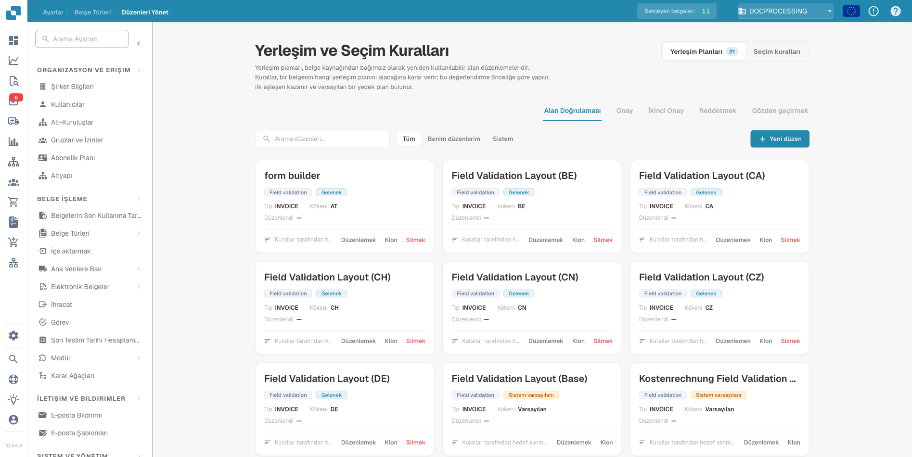
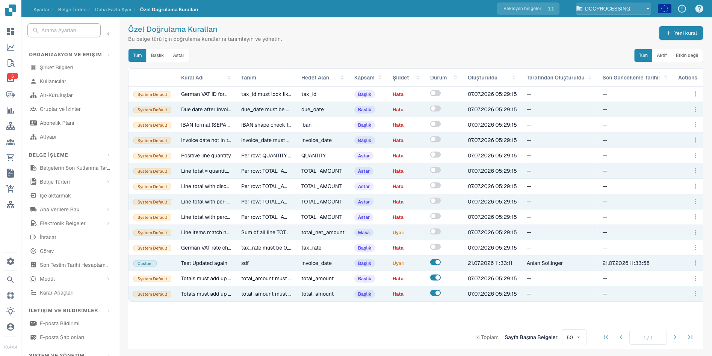
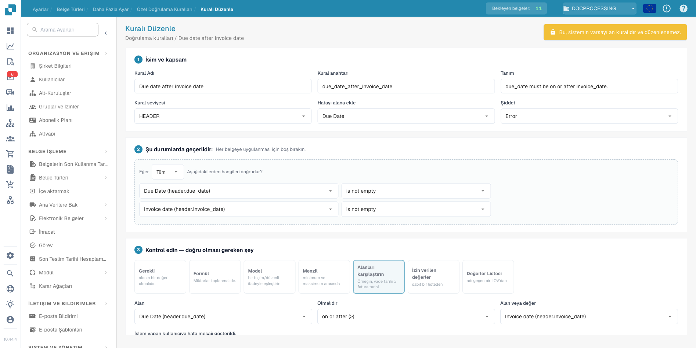
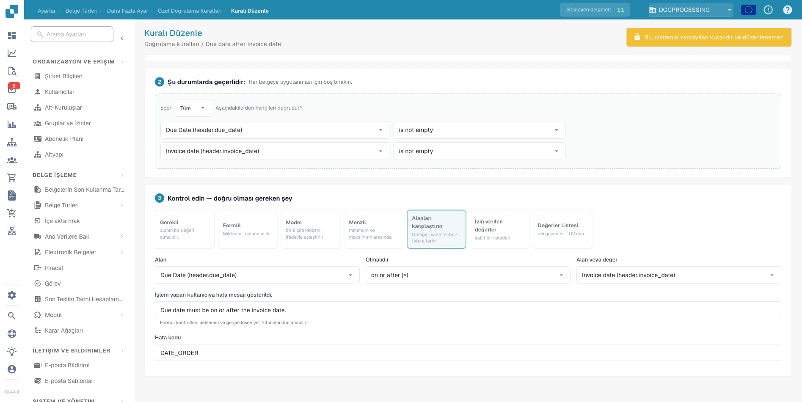

# DocBits Sürüm Notları — 14–23 Temmuz 2026

_23 Temmuz 2026'daki DocBits üretim yükseltmesinde (Nova kanal güncellemesi)
nelerin değiştiği — 14 Temmuz sürümünden bu yana yapılan her şeyi kapsıyor.
Her hizmet önce şu anda canlıda olan sürümü, ardından yenilikleri veya
düzeltmeleri sade bir dille listeliyor. Listelenmeyen hizmetlerde müşteriye
yönelik bir değişiklik olmadı._

---

## Öne Çıkanlar

- **Manage Layouts ve Doğrulama Kuralları uygulamaya geldi.** Önceki sürümde
  sunucu tarafında tanıtılan kural motorları artık tam bir kullanıcı
  arayüzüne sahip. Belge düzenlerini doğrudan yönetebilir, kendi doğrulama
  kurallarınızı tanımlayabilir ve doğru düzeni belgenin geldiği yer yerine
  kuralların seçmesini sağlayabilirsiniz. Her ikisi de belge türünde
  **Custom Validation Rules** etkinleştirilene kadar kapalı kalıyor — siz
  açmadıkça hiçbir şey değişmiyor.
- **Hata ekranından destek talebi.** Bir şeyler ters gittiğinde artık
  doğrudan hata kaydından destek talebi açabilirsiniz. Talep teknik bağlamı
  zaten içeriyor; sizin anlatmanız gerekmiyor.
- **Bölgeye uygun gelen e-posta.** ABD kuruluşları kendi bölgelerinde gelen
  içe aktarma adresleri alıyor ve ulusal bulut kiracılarındaki (GCC, 21Vianet
  ve benzeri) Microsoft 365 posta kutuları artık bir Cloud Instance seçimiyle
  yapılandırılabiliyor.
- **Daha net PO eşleştirme durumu.** Satır kalemi tablosu eşlenemeyen
  faturalar eskiden "satınalma siparişi bulunamadı" olarak etiketleniyor ve
  insanları yanlış sorunun peşine düşürüyordu. Artık hangi sütunun
  eşlenmediğini gösteren ayrıntılarla birlikte kendi "tablo eksik"
  durumlarını alıyorlar.
- **Betik değişiklikleri parola korumalı.** Özel betikler belgelerin nasıl
  işlendiğini değiştirebildiğinden, her betik düzenlemesi artık saatte bir
  değişen bir parola gerektiriyor. Güncel parolayı yöneticinizden isteyin.
- **Turbo yapay zeka katmanı emekliye ayrıldı.** Turbo modeli kullanım
  ömrünün sonuna ulaştı. Bu modeli seçmiş olan herkes otomatik olarak Fast'e
  taşındı; yapmanız gereken bir şey yok.

---

## Web App — canlı: `10.44.4`

### Manage Layouts

Önceki sürümde sunucu tarafında yayınlanan kural motorları artık kendi
kullanıcı arayüzüne kavuştu: Ayarlar → Belge Türleri → Manage Layouts.

Düzenler, belgenin geldiği yere bağlı olmayan, yeniden kullanılabilir alan
yerleşimleridir. Bir belgenin hangi düzeni alacağına seçim kuralları karar
veriyor: kurallar önceliğe göre değerlendiriliyor, ilk eşleşen kazanıyor ve
bir varsayılan düzen yedek olarak devreye giriyor.

<figure><figcaption>
Layouts &#x26; Selection Rules: kural tabanlı seçimle yeniden kullanılabilir düzenler
</figcaption></figure>

### Doğrulama Kuralları

Doğrulama Kuralları, bir belge işlenirken çıkarılan değerleri otomatik olarak
denetliyor ve her başarısızlığı, ilgili alana bağlı olarak doğrudan belge
üzerinde işaretliyor. Amaç: hatalı veriyi belge ERP'nize aktarıldıktan sonra
değil, doğrulama sırasında yakalamak. Tipik denetimler: fatura tarihinden
önce olan bir vade tarihi, net toplamı tutturmayan satır kalemleri, yanlış
biçimde bir IBAN veya KDV numarası ya da boş bırakılmış zorunlu bir alan.

Kuralları Ayarlar → Belge Türleri → Custom Validation Rules altından
yönetiyorsunuz. Sürümle birlikte sistem varsayılan kurallarından oluşan bir
katalog geliyor; her kural, o belge türü için siz açana kadar kapalı
kalıyor.

<figure><figcaption>
Custom Validation Rules: bir belge türünün kural kataloğu; her kural tek tek etkinleştiriliyor
</figcaption></figure>

Her kural üç bölümden oluşuyor. **Name &#x26; scope** (ad ve kapsam),
kuralın adını, belge başlığını mı yoksa her satırı mı denetlediğini, hatanın
hangi alana bağlanacağını ve bir başarısızlığın hata mı yoksa yalnızca uyarı
mı sayılacağını belirliyor. **Applies when** (geçerlilik koşulları), kuralın
hangi belgelerde çalışacağına karar veren koşulları içeriyor; boş
bırakırsanız kural tüm belgelere uygulanıyor.

<figure><figcaption>
Kural düzenleme: üstte ad, kapsam ve önem derecesi, altta Applies-when koşulları
</figcaption></figure>

**Check** (denetim) bölümü, yedi denetim türünden birini kullanarak neyin
doğru olması gerektiğini tanımlıyor: zorunlu alan, tutarlar üzerinde bir
formül, bir desen (biçim veya regex), sayısal aralık, iki alanın
karşılaştırılması, izin verilen değerlerden oluşan sabit bir liste veya
adlandırılmış bir List of Values. İşlemi yapan kullanıcıya gösterilen hata
mesajını ve hata kodunu siz yazıyorsunuz.

"Due date after invoice date" (vade tarihi fatura tarihinden sonra) sistem
kuralı bu deseni gösteriyor: her iki tarih de doluyken uygulanıyor, iki
alanı "on or after" (aynı tarihte veya sonrasında) ile karşılaştırıyor ve
sıralama yanlış olduğunda "Due date must be on or after the invoice date."
(Vade tarihi, fatura tarihinde veya sonrasında olmalıdır.) mesajını
bildiriyor.

<figure><figcaption>
Check bölümü: alan karşılaştırması, özel hata mesajı ve hata kodu
</figcaption></figure>

### Belgelerle çalışma

- **Silinen belgeler:** bu arada silinmiş bir belgeyi açmak, betik hataları
  yerine düzgün bir mesaj gösteriyor.
- **Alan Doğrulama:** sayfa numarası girişi daha geniş ve Enter'a
  basıldığında ilgili sayfaya atlıyor. Bir betikle salt okunur yapılan alan,
  alan bağlantısını göstermeye devam ediyor.
- **Tablo çıkarımı:** bir sütunu silmek adını yeniden kullanılabilir hale
  getiriyor ve silinen başlıklar kaydedilen tabloda yeniden ortaya çıkmıyor.
- **Onaylar:** kullanıcılar artık gruplarının yetkisi olmayan bir Sales Tax
  adımını onaylayamıyor ve onay geçmişi yeniden tüm kayıtları gösteriyor.
- **Görevler ve bildirimler:** silme seçeneği, yönetici hakkı olmayan
  kullanıcılardan gizlendi.

### Pano ve arama

- **Dışa aktarma:** dışa aktarmalar seçili olan panoyu kullanıyor ve
  kaydedilmemiş değişiklikleri olan bir panoyu dışa aktarmadan önce uygulama
  sizi uyarıyor.
- **Arama:** Invoice Type, değer listesiyle birlikte arama alanı olarak
  kullanılabiliyor.
- **İçe aktarma günlüğü:** bölünmüş belgeler üst belgeleri üzerinden
  bulunabiliyor ve Failed Filenames sütunu yalnızca gerçekten başarısız olan
  veya atlanan dosyaları listeliyor.

### Oturum açma

- **Silinen hesaplar:** silinmiş bir hesapla giriş yapmak, genel bir hatayla
  başarısız olmak yerine bunu açıkça söylüyor.
- **SSO:** farklı bir bölge seçiliyken oturum açarken oluşan bir hata
  düzeltildi.

### Ayarlar ve yönetim

- **Destek talepleri:** doğrudan bir hata kaydından talep oluşturun. Talepler
  ortam ve sürüm kanalı bilgisini taşıyor; ekran görüntüsü yakalama da artık
  takılmıyor.
- **Workflow Builder:** yeni oluşturulan veya yeniden adlandırılan kartlar,
  e-posta şablonları ve diğer açılır liste öğeleri sayfayı yeniden yüklemeye
  gerek kalmadan hemen görünüyor.
- **Belge Türleri:** çıkarım bölümünde yeni Structured Extraction ayarı.
- **Yapay zeka modeli seçimi:** emekliye ayrılan Turbo katmanı açılır
  listeden kaldırıldı; mevcut seçimler Fast olarak görünüyor.
- **Hizmet Sürümleri iletişim kutusu:** artık kaydırılabiliyor, Auth Bridge
  hizmetini içeriyor ve Vesta ile Nova sürüm kanalı adlarını gösteriyor.
- **İçe aktarma sayfası:** abonelik kaydı boş olan kuruluşlarda artık
  çökmüyor.

### Küçük düzeltmeler

Boş bildirim mesajları bastırılıyor, yeni/düzenle fikir iletişim kutusu
kaydırılabiliyor, alan ayarlarındaki kaymış onay kutuları yeniden hizalandı,
engellenen belge silme işlemleri nedenini açıklıyor ve E-Belge ayarları
Default'tan Custom'a geçişi sorunsuz ele alıyor.

## API Service — canlı: `12.61.8`

- **Olgunlaşan doğrulama kuralları:** yeni koşul operatörleri (içerir, ile
  başlar, ile biter), değer listesi kaynaklarından gelen değerler, belge
  türü bazında etkinleştirme ve her kuralı kimin oluşturduğunu ya da
  değiştirdiğini gösteren bir denetim izi. Kurallar değiştiğinde belgeler
  otomatik olarak yeniden doğrulanıyor.
- **Dönüştürme kuralları:** artık tüm belge üzerinde değer atayabiliyor veya
  temizleyebiliyor, belge türü bazında etkinleştiriliyor ve aynı denetim
  izini taşıyor.
- **Düzen seçim kuralları:** etkinleştirme belge türüne taşındı ve düzen
  şablonları kimin ne zaman değişiklik yaptığını kaydediyor.
- **Betik güvenliği:** betik değişiklikleri zamana dayalı bir parola
  gerektiriyor (bkz. Öne Çıkanlar).
- **Kişisel panolar:** kaydedilmeyen paylaşım ayarları düzeltildi.
- **Pano araması:** Invoice Type genişletilmiş arama alanlarına katıldı ve
  barkod veya QR bölmesiyle oluşturulan belgeler üst belgeleri üzerinden
  bulunabiliyor.
- **Yüklemeler:** ağ yeniden denemesi sırasında aynı dosyanın tekrar tekrar
  yüklenmesi artık yinelenen belgeler oluşturmuyor.
- **Tedarikçi araması:** sonuçlar sabit bir bekleme süresi sonunda değil,
  veri hazır olur olmaz geliyor.
- **Infor dışa aktarma:** birim fiyatlar dört ondalık basamağı koruyor. M3
  dışa aktarmaları sıfır tutarlı satır masraflarını içerebiliyor.
- **Onaylar:** bir onay, yalnızca onaylayan kişi ilgili onay talebinin
  atanmış kişisi olduğunda o taleple ilişkilendiriliyor.
- **Giriş kararlılığı:** token doğrulamasındaki geçici bir hata artık
  kullanıcıların oturumunu kapatmıyor; uygulama bunun yerine yeniden
  deniyor.
- **Sınıflandırma:** kaynak kuralları artık sabit konumlar yerine tüm belge
  kaynak alanlarıyla eşleştiriliyor.
- **Yapay zeka modelleri:** emekliye ayrılan Turbo katmanı, ince ayarlı
  varyantlar dahil her yerde Fast'e yeniden eşlendi; ayrıca emekli bir
  modelin asla çalıştırılamamasını sağlayan bir koruma eklendi.

## Auth Service — canlı: `1.72.5`

- **Toplu kullanıcı yönetimi:** mevcut kullanıcıları, e-posta adresine göre
  eşleştirilen CSV ile alt kuruluşlara ve gruplara toplu olarak ekleyin.
  Ayrıca düzensiz doldurulmuş CSV satırlarında oluşan bir çökme ile aynı
  anda iki veya daha fazla yeni kullanıcı eklerken oluşan bir sunucu hatası
  düzeltildi.
- **Üye listeleri:** silinen kullanıcılar artık alt kuruluş üye listelerinde
  görünmüyor.
- **Tek oturum açma:** bir dizi sağlamlaştırma düzeltmesi. Süresi dolan
  token'lar artık temiz bir "süresi doldu" yanıtı döndürüyor, SAML
  yapılandırması olmayan kuruluşlar yanlış bir giriş akışı yerine düzgün bir
  bulunamadı yanıtı alıyor, oturum kapatma isteği doğrulanamasa bile çıkış
  her zaman tamamlanıyor ve eksik kimlik sağlayıcı yapılandırması etrafındaki
  birkaç çökme giderildi.
- **Oturum token'ları:** süresi dolmamış olmasına rağmen kısa ömürlü oturum
  token'larının geçersiz diye reddedilmesi düzeltildi.
- **Yönetim araçları:** kuruluş bölgesi yönetim API'sinde görünüyor, bir
  kuruluşun sistem kullanıcısı yeniden atanabiliyor ve plan ile kullanım
  yönetimi özel uç noktalar kazandı. Bu değişiklikler müşteri uygulamasını
  değil, DocBits personel araçlarını etkiliyor.

## Email Service — canlı: `1.39.8`

- **Bölgeye uygun içe aktarma:** gelen e-posta alan adları artık her bölge
  için ayrı ayrı mevcut ve yanlış bölgeye ulaşan postalar doğru bölgeye
  yönlendiriliyor. ABD kuruluşları artık AB gelen posta yoluna bağımlı
  değil.
- **Microsoft 365:** ulusal bulut kiracıları bir Cloud Instance seçimiyle
  yapılandırılıyor; bu, ABD müşterileri için O365 içe aktarmalarını
  düzeltiyor. Geçersiz bir kiracı artık sunucu hatası yerine net bir giriş
  hatası üretiyor ve eksik kiracı kimlik bilgileri sessizce başarısız olmak
  yerine hemen bir mesajla başarısız oluyor.
- **Gelen kutusu düzeni:** eki olmayan e-postalar gelen kutusunda birikmek
  yerine dışarı taşınıyor.
- **Yeniden denemede yineleme yok:** belge API'sine yapılan yüklemeler bir
  idempotency anahtarı taşıyor; böylece yeniden denenen bir teslimat aynı
  belgeyi iki kez oluşturamıyor.
- **Kaynak adlandırması:** klasör yapılandırılmış O365 kaynakları adlarında
  hesap e-postasını içeriyor; böylece benzer kaynaklar birbirinden ayırt
  edilebiliyor.

## PO Match Service — canlı: `1.58.6`

- **"Tablo eksik" durumu:** satır kalemi tablosu eşlenemeyen faturalar,
  yanıltıcı "satınalma siparişi bulunamadı" yerine kendi durumlarını alıyor
  (bkz. Öne Çıkanlar). Pano bunu eşleşmedi simgesiyle gösteriyor.
- **Daha iyi hata ayrıntısı:** tablo eşleme hataları, eşlenemeyen sütunu
  adıyla belirtiyor.
- **Daha temiz API davranışı:** var olmayan PO kuralları için yapılan
  istekler düzgün bir bulunamadı yanıtı döndürüyor ve bozuk önbellek
  kayıtları tekrarlanan hatalara yol açmak yerine atılıyor.

## Fulltext Service — canlı: `1.38.3`

- **Avrupa sayı biçimleri:** ondalık virgülle yazılan tutarlar (`1.234,56`)
  dizinlemeden önce normalleştiriliyor; böylece tutar aramaları ve filtreler
  sayı biçiminden bağımsız çalışıyor.
- **ERP sayıları:** panodaki canlı sayım akışını kesebilen bir token hatası
  düzeltildi.
- **Dizinleme dayanıklılığı:** dizinleme artık geçici veritabanı ve kimlik
  doğrulama hizmeti aksaklıklarını atlatıyor (otomatik yeniden deneme,
  birincil veritabanına geri dönüş) ve hatalı biçimli kuyruk mesajlarını
  sonsuza kadar yeniden denemek yerine atıyor.

## OCR Service — canlı: `1.9.8`

- **Büyük belgeler:** OCR süre bütçesi belge boyutuyla ölçekleniyor; çok
  büyük dosyalar artık zaman aşımıyla başarısız olmuyor.
- **Olağandışı karakterler:** bir temizleyici, OCR motorunun temsil
  edemediği karakterleri ayıklıyor; egzotik semboller içeren belgelerdeki
  hatalar giderildi.
- **Daha az geçici hata:** geçici depolama bağlantı hataları otomatik olarak
  yeniden deneniyor.

## Extraction Service — canlı: `1.52.0`

- **Sıfır vergili ABD faturaları:** vergi tutarı sıfır olduğunda doğru
  net/vergi çiftinin atlandığı bir durum düzeltildi.
- **Tablo çıkarımı:** yapılandırılan eşleme belgenin sunduğundan daha fazla
  sütun beklediğinde tablolar düzenlenebilir kalıyor; ayrıca olağandışı
  satır verilerinde oluşan bir çökme düzeltildi.
- **Yapay zeka modelleri:** Turbo katmanının emekliye ayrılması, API
  Service'ten yansıtıldı.

## Docflow Service — canlı: `2.6.5`

- **İş akışlarında PO eşleştirme:** eksik karşılaştırma değerleri,
  uyuşmazlık yerine eksik veri olarak ele alınıyor.
- **Sipariş onayı kartları:** alıcı ve sorumlu kişi güvenilir şekilde
  çözümleniyor.
- **Navlun masrafları:** iki tarafta da masraf yoksa durum takılıp kalmak
  yerine operatör kartıyla çözülüyor.
- **Güvenlik:** iş akışı API token'ları ait oldukları kuruluşa göre
  doğrulanıyor.

## Barcode Service — canlı: `1.17.4`

- **Uzun süren bölmeler:** uzun barkod işleri sırasında görev kuyruğu
  bağlantısı canlı tutuluyor; böylece büyük yığınları bölme işlemi artık
  sona doğru takılmıyor.

---

## Bu sürümde değişmeyenler

**Auth Bridge** (`0.3.6`), **Auto Accounting** (`1.20.1`), **Docnet**
(`1.55.1`), **FTP** (`1.31.1`), **Operator** (`1.40.2`) ve **Ideas**
(`0.3.1`) bu dönemde herhangi bir değişiklik içermiyor.

<!-- Generated by the docbits-changelog skill (version-boundary mode: exact git
     ranges between the LATEST (2026-07-09..15) and NOVA (2026-07-15..21)
     version-bump commits supplied by the user, per service). -->
