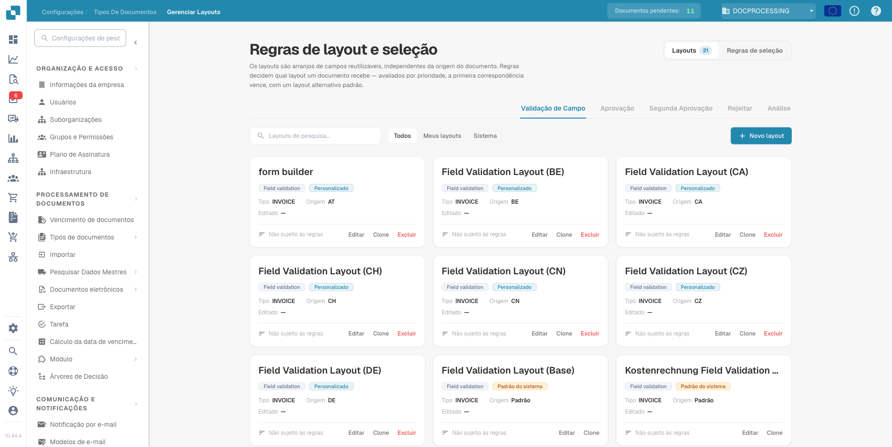
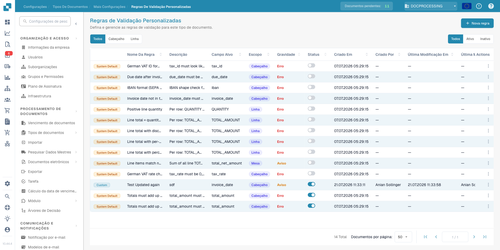
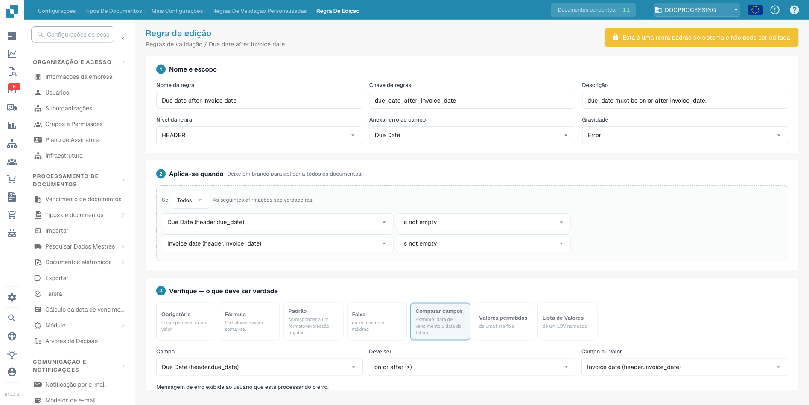
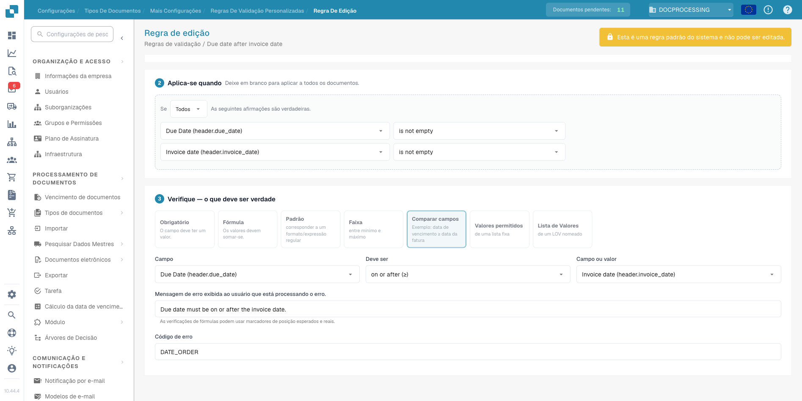

# Notas de versão DocBits — 14–23 de julho de 2026

_O que mudou na atualização de produção do DocBits a 23 de julho de 2026 (a
atualização do canal Nova), cobrindo tudo desde a versão de 14 de julho. Cada
serviço indica a versão agora em produção e, de seguida, as novidades ou
correções em linguagem simples. Os serviços não listados não tiveram alterações
visíveis para o cliente._

---

## Destaques

- **Manage Layouts e regras de validação chegam à aplicação.** Os motores de
  regras introduzidos no servidor na versão anterior têm agora uma interface
  completa. Pode gerir os layouts de documentos diretamente, definir as suas
  próprias regras de validação e deixar que sejam as regras a escolher o
  layout certo, em vez da origem do documento. Ambos ficam desligados até
  ativar **Custom Validation Rules** no tipo de documento — até optar por
  ativar, nada muda para si.
- **Tickets de suporte a partir do ecrã de erro.** Quando algo corre mal, pode
  agora abrir um ticket de suporte diretamente a partir do registo de erro. O
  ticket já inclui o contexto técnico, por isso não precisa de o descrever.
- **E-mail de entrada na região correta.** As organizações dos EUA passam a
  ter endereços de importação na sua própria região, e as caixas de correio
  Microsoft 365 em tenants de nuvens nacionais (GCC, 21Vianet e semelhantes)
  podem agora ser configuradas com uma seleção de Cloud Instance.
- **Estado de correspondência de PO mais claro.** As faturas cuja tabela de
  linhas não pôde ser mapeada eram rotuladas como "ordem de compra não
  encontrada", o que levava as pessoas a procurar o problema errado. Passam a
  ter o seu próprio estado "tabela incompleta", com detalhe ao nível da coluna
  sobre o que não foi mapeado.
- **Alterações a scripts protegidas por palavra-passe.** Os scripts
  personalizados podem alterar a forma como os documentos são processados, por
  isso cada edição de script passa a exigir uma palavra-passe que muda de hora
  a hora. Peça a atual ao seu administrador.
- **Nível de IA Turbo descontinuado.** O modelo Turbo chegou ao fim de vida.
  Quem o tinha selecionado foi movido automaticamente para o Fast; não é
  necessária qualquer ação.

---

## Web App — em produção: `10.44.4`

### Manage Layouts

Os motores de regras lançados do lado do servidor na versão anterior têm agora
a sua interface, em Definições → Tipos de Documento → Manage Layouts.

Os layouts são disposições de campos reutilizáveis, já não ligadas à origem do
documento. As regras de seleção decidem que layout cada documento recebe: são
avaliadas por prioridade, vence a primeira correspondência, com um layout
predefinido como recurso.

<figure><figcaption>
Layouts &#x26; Selection Rules: layouts reutilizáveis com seleção baseada em regras
</figcaption></figure>

### Regras de validação

As regras de validação verificam automaticamente os valores extraídos enquanto
um documento é processado e assinalam cada falha diretamente no documento,
associada ao campo em causa. O objetivo: apanhar dados errados durante a
validação, e não depois de o documento ter sido exportado para o seu ERP.
Verificações típicas são uma data de vencimento anterior à data da fatura,
linhas que não somam o total líquido, um IBAN ou número de IVA no formato
errado, ou um campo obrigatório deixado vazio.

As regras gerem-se em Definições → Tipos de Documento → Custom Validation
Rules. A versão inclui um catálogo de regras predefinidas do sistema; cada
regra permanece desligada até a ativar para esse tipo de documento.

<figure><figcaption>
Custom Validation Rules: o catálogo de regras de um tipo de documento, com cada regra ativada individualmente
</figcaption></figure>

Cada regra é composta por três partes. **Name &#x26; scope** (nome e âmbito)
define o nome da regra, se esta verifica o cabeçalho do documento ou cada
linha, a que campo o erro fica associado e se uma falha conta como erro ou
apenas como aviso. **Applies when** (aplica-se quando) contém as condições que
decidem em que documentos a regra é executada; se ficar vazio, a regra
aplica-se a todos os documentos.

<figure><figcaption>
Edição de uma regra: nome, âmbito e severidade em cima, as condições Applies when em baixo
</figcaption></figure>

**Check** (verificação) define o que tem de ser verdade, usando um de sete
tipos de verificação: um campo obrigatório, uma fórmula sobre montantes, um
padrão (formato ou regex), um intervalo numérico, uma comparação de dois
campos, uma lista fixa de valores permitidos ou uma List of Values nomeada. A
mensagem de erro e o código de erro apresentados ao utilizador que processa o
documento são escritos por si.

A regra de sistema "Due date after invoice date" (data de vencimento após a
data da fatura) ilustra o padrão: aplica-se quando ambas as datas estão
preenchidas, compara os dois campos com "on or after" (na data ou depois) e
devolve "Due date must be on or after the invoice date." quando a ordem está
errada.

<figure><figcaption>
A secção Check: comparação de campos, mensagem de erro personalizada e código de erro
</figcaption></figure>

### Trabalhar com documentos

- **Documentos eliminados:** abrir um documento entretanto eliminado mostra
  uma mensagem adequada em vez de erros de script.
- **Validação de campos:** o campo do número de página é mais largo e salta
  para a página ao premir Enter. Um campo tornado só de leitura por um script
  continua a mostrar a sua ligação de campo.
- **Extração de tabelas:** eliminar uma coluna liberta o respetivo nome para
  reutilização, e os cabeçalhos eliminados já não reaparecem na tabela
  guardada.
- **Aprovações:** os utilizadores já não conseguem aprovar um passo de Sales
  Tax para o qual o seu grupo não tem permissão, e o histórico de aprovações
  volta a mostrar todas as entradas.
- **Tarefas e notificações:** a opção de eliminar fica oculta para
  utilizadores sem direitos de administrador.

### Dashboard e pesquisa

- **Exportação:** as exportações usam o dashboard que tem selecionado, e a
  aplicação avisa antes de exportar um dashboard com alterações por guardar.
- **Pesquisa:** Invoice Type está disponível como campo de pesquisa, com a
  respetiva lista de valores.
- **Registo de importação:** os documentos divididos podem ser encontrados
  através do documento principal, e a coluna Failed Filenames lista apenas os
  ficheiros que realmente falharam ou foram ignorados.

### Início de sessão

- **Contas eliminadas:** iniciar sessão com uma conta eliminada passa a
  indicá-lo, em vez de falhar com um erro genérico.
- **SSO:** corrigido um erro ao iniciar sessão com uma região diferente
  selecionada.

### Definições e administração

- **Tickets de suporte:** crie um ticket diretamente a partir de um registo de
  erro. Os tickets incluem o ambiente e o canal de lançamento, e a captura de
  ecrã já não fica bloqueada.
- **Workflow Builder:** cartões recém-criados ou renomeados, modelos de
  e-mail e outros itens de listas pendentes aparecem imediatamente, sem
  recarregar a página.
- **Tipos de Documento:** nova definição Structured Extraction na secção de
  extração.
- **Seleção de modelo de IA:** o nível Turbo descontinuado desapareceu da
  lista; as seleções existentes mostram Fast.
- **Janela Versões dos Serviços:** passou a ter scroll, inclui o serviço Auth
  Bridge e mostra os nomes dos canais de lançamento Vesta e Nova.
- **Página de importação:** já não falha em organizações com uma entrada de
  subscrição vazia.

### Correções menores

As notificações vazias são suprimidas, a janela de criar/editar ideia tem
scroll, as caixas de seleção desalinhadas nas definições de campos voltaram a
estar alinhadas, as eliminações de documentos bloqueadas explicam porquê, e as
definições de E-Document lidam corretamente com a mudança de Default para
Custom.

## API Service — em produção: `12.61.8`

- **Regras de validação, amadurecidas:** novos operadores de condição
  (contém, começa por, termina em), valores provenientes de listas de
  valores, ativação por tipo de documento e um registo de auditoria que
  mostra quem criou ou alterou cada regra. Os documentos são revalidados
  automaticamente quando as regras mudam.
- **Regras de transformação:** podem agora definir ou limpar valores em todo
  o documento, são ativadas por tipo de documento e têm o mesmo registo de
  auditoria.
- **Regras de seleção de layout:** a ativação passou para o tipo de
  documento, e os modelos de layout registam quem os alterou e quando.
- **Segurança de scripts:** as alterações a scripts exigem uma palavra-passe
  baseada no tempo (ver Destaques).
- **Dashboards pessoais:** corrigidas as definições de partilha que não eram
  guardadas.
- **Pesquisa no dashboard:** Invoice Type junta-se aos campos de pesquisa
  alargada, e os documentos criados por uma divisão por código de barras ou
  QR são encontrados através do documento principal.
- **Carregamentos:** carregamentos repetidos do mesmo ficheiro durante uma
  nova tentativa de rede já não criam documentos duplicados.
- **Consulta de fornecedores:** os resultados chegam assim que os dados estão
  prontos, em vez de após uma espera fixa.
- **Exportação Infor:** os preços unitários mantêm quatro casas decimais. As
  exportações M3 podem incluir encargos de linha com valor zero.
- **Aprovações:** uma aprovação só é associada a um pedido de aprovação
  quando o aprovador é o responsável atribuído a esse pedido.
- **Estabilidade do início de sessão:** uma falha temporária na validação de
  tokens já não termina a sessão dos utilizadores; a aplicação tenta
  novamente.
- **Classificação:** as regras de origem comparam agora com todos os campos
  de origem do documento, e não com posições fixas.
- **Modelos de IA:** o nível Turbo (descontinuado) é remapeado para Fast em
  todo o lado, incluindo as variantes afinadas, com uma salvaguarda para que
  um modelo descontinuado nunca possa ser executado.

## Auth Service — em produção: `1.72.5`

- **Administração de utilizadores em massa:** adicione utilizadores
  existentes a suborganizações e grupos em massa via CSV, com correspondência
  pelo endereço de e-mail. Corrigidos também um bloqueio com linhas de CSV
  preenchidas de forma desigual e um erro de servidor ao adicionar dois ou
  mais utilizadores novos de uma vez.
- **Listas de membros:** os utilizadores eliminados já não aparecem nas
  listas de membros das suborganizações.
- **Single sign-on:** uma série de correções de robustez. Os tokens expirados
  devolvem agora uma resposta clara de "expirado", as organizações sem
  configuração SAML recebem uma resposta adequada de "não encontrado" em vez
  de um fluxo de início de sessão errado, o fim de sessão conclui sempre,
  mesmo quando o pedido de saída não pode ser verificado, e desapareceram
  várias falhas relacionadas com configuração de fornecedor de identidade em
  falta.
- **Tokens de sessão:** corrigidos os tokens de sessão de curta duração que
  eram rejeitados como inválidos mesmo sem estarem expirados.
- **Ferramentas de gestão:** a região da organização é visível na API de
  gestão, o utilizador de sistema de uma organização pode ser reatribuído, e
  a administração de planos e de utilização ganhou endpoints dedicados. Estas
  alterações afetam as ferramentas internas da equipa DocBits, não a
  aplicação do cliente.

## Email Service — em produção: `1.39.8`

- **Importação na região correta:** os domínios de e-mail de entrada existem
  por região, e os e-mails que chegam à região errada são reencaminhados para
  a certa. As organizações dos EUA já não dependem do caminho de entrada da
  UE.
- **Microsoft 365:** os tenants de nuvens nacionais configuram-se através de
  uma seleção de Cloud Instance, o que corrige as importações O365 para
  clientes dos EUA. Um tenant inválido produz agora um erro de início de
  sessão claro em vez de um erro de servidor, e credenciais de tenant
  incompletas falham de imediato com uma mensagem, em vez de silenciosamente.
- **Higiene da caixa de entrada:** os e-mails sem anexos são movidos para
  fora da caixa de entrada em vez de se acumularem.
- **Sem duplicados em novas tentativas:** os carregamentos para a API de
  documentos incluem uma chave de idempotência, pelo que uma entrega repetida
  não pode criar o mesmo documento duas vezes.
- **Nomes das origens:** as origens O365 com uma pasta configurada incluem o
  e-mail da conta no nome, para que origens semelhantes sejam distinguíveis.

## PO Match Service — em produção: `1.58.6`

- **Estado "tabela incompleta":** as faturas cuja tabela de linhas não pôde
  ser mapeada recebem o seu próprio estado, em vez do enganador "ordem de
  compra não encontrada" (ver Destaques). O dashboard mostra-o com o ícone de
  não correspondido.
- **Melhor detalhe dos erros:** as falhas de mapeamento de tabelas indicam a
  coluna específica que não foi mapeada.
- **Comportamento da API mais limpo:** os pedidos de regras de PO
  inexistentes devolvem uma resposta adequada de "não encontrado", e as
  entradas de cache corrompidas são descartadas em vez de causarem erros
  repetidos.

## Fulltext Service — em produção: `1.38.3`

- **Formatos numéricos europeus:** os montantes escritos com vírgula decimal
  (`1.234,56`) são normalizados antes da indexação, pelo que as pesquisas e
  os filtros por montante funcionam independentemente do formato numérico.
- **Contagens ERP:** corrigido um erro de token que podia interromper o fluxo
  de contagem em direto no dashboard.
- **Resiliência da indexação:** a indexação resiste agora a falhas
  temporárias da base de dados e do serviço de autenticação (repetição
  automática, recurso à base de dados principal) e descarta mensagens de fila
  malformadas em vez de as repetir indefinidamente.

## OCR Service — em produção: `1.9.8`

- **Documentos grandes:** o tempo disponível para o OCR escala com o tamanho
  do documento, pelo que ficheiros muito grandes já não falham por limite de
  tempo.
- **Caracteres invulgares:** um sanitizador limpa os caracteres que o motor
  de OCR não consegue representar, corrigindo falhas em documentos com
  símbolos exóticos.
- **Menos falhas transitórias:** os erros temporários de ligação ao
  armazenamento são repetidos automaticamente.

## Extraction Service — em produção: `1.52.0`

- **Faturas dos EUA com imposto zero:** corrigido um caso em que o par
  correto de valores líquido/imposto era descartado quando o valor do imposto
  é zero.
- **Extração de tabelas:** as tabelas continuam editáveis quando o mapeamento
  configurado espera mais colunas do que as que o documento fornece, e foi
  corrigida uma falha com dados de linha invulgares.
- **Modelos de IA:** descontinuação do nível Turbo, replicada do API Service.

## Docflow Service — em produção: `2.6.5`

- **Correspondência de PO em fluxos de trabalho:** os valores de comparação
  em falta são tratados como dados em falta e não como uma divergência.
- **Cartões de confirmação de encomenda:** o comprador e a pessoa responsável
  são determinados de forma fiável.
- **Custos de transporte:** quando nenhuma das partes tem encargos, o caso é
  resolvido pelo cartão do operador em vez de ficar parado.
- **Segurança:** os tokens de API de fluxos de trabalho são validados face à
  organização a que pertencem.

## Barcode Service — em produção: `1.17.4`

- **Divisões demoradas:** a ligação à fila de tarefas é mantida ativa durante
  trabalhos longos de códigos de barras, pelo que a divisão de lotes grandes
  já não fica parada perto do fim.

---

## Sem alterações nesta versão

**Auth Bridge** (`0.3.6`), **Auto Accounting** (`1.20.1`), **Docnet**
(`1.55.1`), **FTP** (`1.31.1`), **Operator** (`1.40.2`) e **Ideas**
(`0.3.1`) não têm alterações nesta janela.

<!-- Generated by the docbits-changelog skill (version-boundary mode: exact git
     ranges between the LATEST (2026-07-09..15) and NOVA (2026-07-15..21)
     version-bump commits supplied by the user, per service). -->
