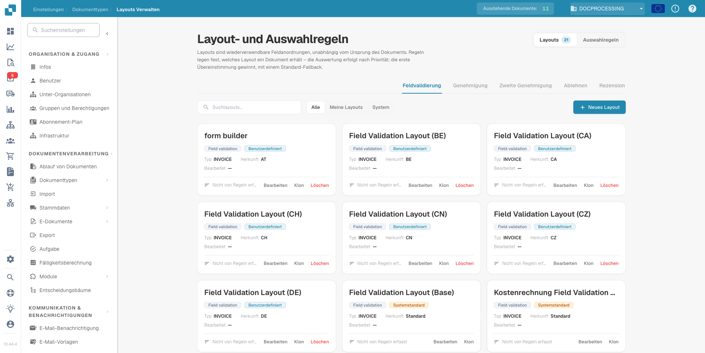
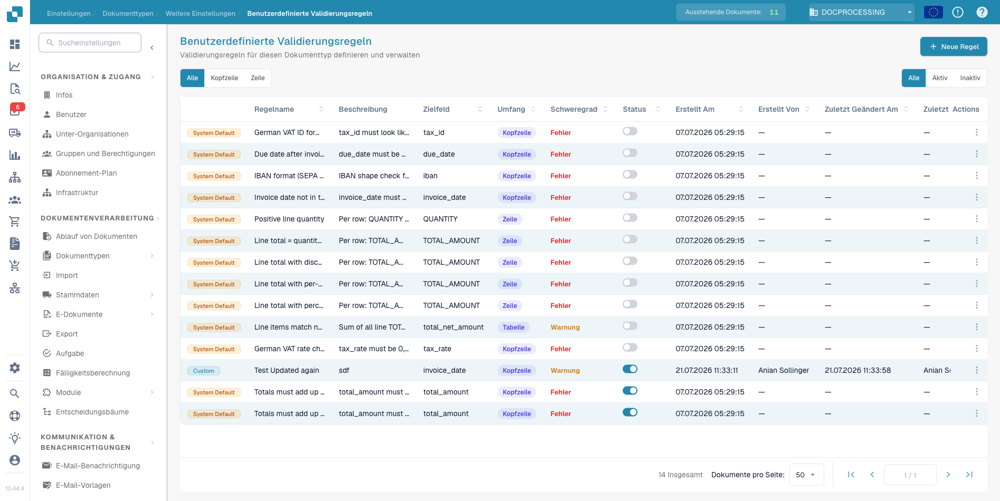
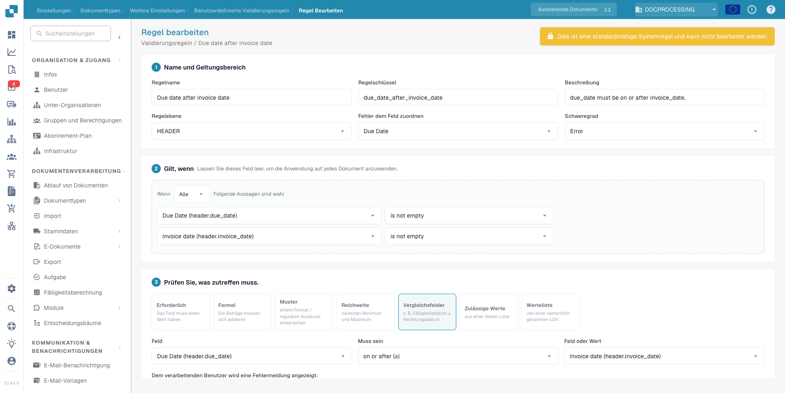
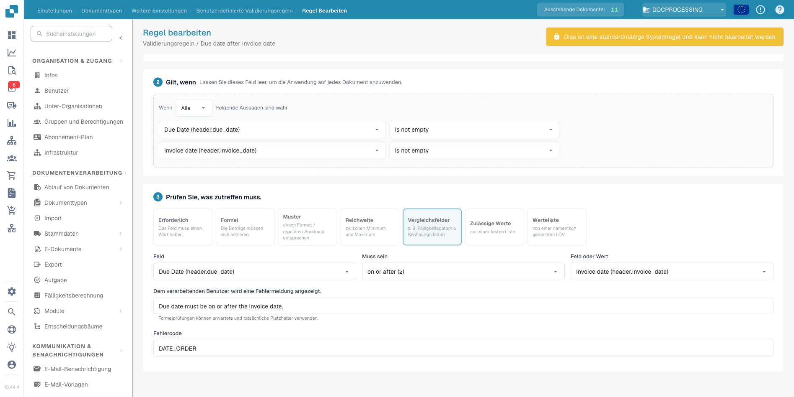

# DocBits Release-Notizen — 14.–23. Juli 2026

_Was sich mit dem DocBits-Produktions-Upgrade am 23. Juli 2026 (dem Update des
Nova-Kanals) geändert hat — alles seit dem Release vom 14. Juli. Jeder Service
unten zeigt die jetzt aktive Version, gefolgt von dem, was neu oder behoben
ist, in klarer Sprache. Nicht aufgeführte Services hatten keine für Kunden
sichtbaren Änderungen._

---

## Highlights

- **Layouts Verwalten (Manage Layouts) und Validierungsregeln kommen in die
  App.** Die im letzten Release serverseitig eingeführten Regelwerke haben
  jetzt eine vollständige Benutzeroberfläche. Sie können Dokumentlayouts
  direkt verwalten, eigene Validierungsregeln definieren und das passende
  Layout per Regeln auswählen lassen statt über die Herkunft des Dokuments.
  Beides bleibt ausgeschaltet, bis Sie **Custom Validation Rules** am
  Dokumenttyp aktivieren — bis dahin ändert sich für Sie nichts.
- **Support-Tickets direkt aus dem Fehlerbildschirm.** Wenn etwas schiefgeht,
  können Sie jetzt direkt aus dem Fehlereintrag ein Support-Ticket eröffnen.
  Das Ticket enthält den technischen Kontext bereits — Sie müssen ihn nicht
  mehr beschreiben.
- **E-Mail-Eingang in der richtigen Region.** US-Organisationen erhalten
  Import-Adressen für eingehende E-Mails in ihrer eigenen Region, und
  Microsoft-365-Postfächer auf nationalen Cloud-Tenants (GCC, 21Vianet und
  ähnliche) lassen sich jetzt über eine Cloud-Instance-Auswahl konfigurieren.
- **Klarerer PO-Matching-Status.** Rechnungen, deren Positionstabelle nicht
  zugeordnet werden konnte, trugen bisher den Status „Bestellung nicht
  gefunden“ — und schickten Anwender auf die Suche nach dem falschen Problem.
  Sie erhalten jetzt einen eigenen Status „Tabelle unvollständig“ mit Details
  auf Spaltenebene, was nicht zugeordnet werden konnte.
- **Skriptänderungen sind passwortgeschützt.** Eigene Skripte können die
  Dokumentverarbeitung verändern, deshalb erfordert jede Skriptänderung jetzt
  ein Passwort, das stündlich wechselt. Das aktuelle Passwort erhalten Sie von
  Ihrem Administrator.
- **Turbo-KI-Stufe eingestellt.** Das Turbo-Modell hat sein Lebensende
  erreicht. Wer es ausgewählt hatte, wurde automatisch auf Fast umgestellt; es
  ist nichts zu tun.

---

## Web App — live: `10.44.4`

### Layouts Verwalten (Manage Layouts)

Die im letzten Release serverseitig eingeführten Regelwerke haben jetzt ihre
Benutzeroberfläche — unter Einstellungen → Dokumenttypen → Layouts Verwalten.

Layouts sind wiederverwendbare Feldanordnungen und nicht mehr daran gebunden,
woher ein Dokument kam. Auswahlregeln entscheiden, welches Layout ein Dokument
erhält: ausgewertet nach Priorität, der erste Treffer gewinnt, mit einem
Standard-Layout als Rückfallebene.

<figure><figcaption>
Layout- und Auswahlregeln: wiederverwendbare Layouts mit regelbasierter Auswahl
</figcaption></figure>

### Validierungsregeln (Validation Rules)

Validierungsregeln prüfen extrahierte Werte automatisch während der
Dokumentverarbeitung und markieren jeden Verstoß direkt am Dokument — am
betroffenen Feld. Das Ziel: fehlerhafte Daten schon bei der Validierung
abfangen, nicht erst, nachdem das Dokument in Ihr ERP exportiert wurde.
Typische Prüfungen sind ein Fälligkeitsdatum vor dem Rechnungsdatum,
Positionen, die sich nicht zur Nettosumme aufsummieren, eine IBAN oder
USt-IdNr. im falschen Format oder ein leer gelassenes Pflichtfeld.

Sie verwalten die Regeln unter Einstellungen → Dokumenttypen → Custom
Validation Rules. Ein Katalog von Systemstandardregeln wird mit dem Release
ausgeliefert; jede Regel bleibt inaktiv, bis Sie sie für den jeweiligen
Dokumenttyp einschalten.

<figure><figcaption>
Custom Validation Rules: der Regelkatalog eines Dokumenttyps, jede Regel wird einzeln aktiviert
</figcaption></figure>

Jede Regel besteht aus drei Teilen. **Name &#x26; scope** (Name und
Geltungsbereich) legt fest, wie die Regel heißt, ob sie den Dokumentkopf oder
jede Position prüft, an welchem Feld der Fehler erscheint und ob ein Verstoß
als Fehler oder nur als Warnung zählt. **Applies when** (Gilt, wenn) enthält
die Bedingungen, die entscheiden, für welche Dokumente die Regel läuft;
bleibt der Abschnitt leer, gilt die Regel für jedes Dokument.

<figure><figcaption>
Regel bearbeiten: Name, Geltungsbereich und Schweregrad oben, darunter die Applies-when-Bedingungen
</figcaption></figure>

**Check** (Prüfung) definiert, was gelten muss — mit einem von sieben
Prüftypen: Pflichtfeld, Formel über Beträge, Muster (Format oder Regex),
Zahlenbereich, Vergleich zweier Felder, feste Liste erlaubter Werte oder eine
benannte List of Values. Fehlermeldung und Fehlercode, die der bearbeitende
Benutzer sieht, schreiben Sie selbst.

Die Systemregel "Due date after invoice date" (Fälligkeitsdatum nach dem
Rechnungsdatum) zeigt das Muster: Sie greift, wenn beide Daten gefüllt sind,
vergleicht die beiden Felder mit "on or after" (am oder nach) und meldet
"Due date must be on or after the invoice date.", wenn die Reihenfolge nicht
stimmt.

<figure><figcaption>
Der Check-Abschnitt: Felder vergleichen, eigene Fehlermeldung und eigener Fehlercode
</figcaption></figure>

### Arbeiten mit Dokumenten

- **Gelöschte Dokumente:** Das Öffnen eines zwischenzeitlich gelöschten
  Dokuments zeigt eine verständliche Meldung statt Skriptfehlern.
- **Feldvalidierung:** Das Eingabefeld für die Seitenzahl ist breiter und
  springt mit Enter zur gewählten Seite. Ein per Skript schreibgeschütztes
  Feld zeigt weiterhin seine Feldverbindung.
- **Tabellenextraktion:** Das Löschen einer Spalte gibt ihren Namen zur
  Wiederverwendung frei, und gelöschte Überschriften tauchen nicht mehr in
  der gespeicherten Tabelle auf.
- **Freigaben:** Benutzer können keinen Sales-Tax-Schritt mehr freigeben, für
  den ihre Gruppe keine Berechtigung hat, und die Freigabehistorie zeigt
  wieder alle Einträge.
- **Aufgaben und Benachrichtigungen:** Die Löschoption wird für Benutzer ohne
  Admin-Rechte ausgeblendet.

### Dashboard und Suche

- **Export:** Exporte verwenden das tatsächlich ausgewählte Dashboard, und
  die App warnt, bevor Sie ein Dashboard mit ungespeicherten Änderungen
  exportieren.
- **Suche:** Der Rechnungstyp (Invoice Type) steht als Suchfeld mit seiner
  Werteliste zur Verfügung.
- **Importprotokoll:** Aufgeteilte Dokumente lassen sich über ihr
  übergeordnetes Dokument finden, und die Spalte „Failed Filenames“ listet
  nur noch Dateien, die tatsächlich fehlgeschlagen sind oder übersprungen
  wurden.

### Anmeldung

- **Gelöschte Konten:** Die Anmeldung mit einem gelöschten Konto sagt das
  jetzt auch, statt mit einem generischen Fehler fehlzuschlagen.
- **SSO:** Fehler behoben, der beim Anmelden auftrat, während eine andere
  Region ausgewählt war.

### Einstellungen und Administration

- **Support-Tickets:** Erstellen Sie ein Ticket direkt aus einem
  Fehlereintrag. Tickets enthalten Umgebung und Release-Kanal, und die
  Screenshot-Aufnahme bleibt nicht mehr hängen.
- **Workflow Builder:** Neu erstellte oder umbenannte Karten, E-Mail-Vorlagen
  und andere Dropdown-Einträge erscheinen sofort — ohne die Seite neu zu
  laden.
- **Dokumenttypen:** Neue Einstellung „Structured Extraction“ im
  Extraktionsbereich.
- **KI-Modellauswahl:** Die eingestellte Turbo-Stufe ist aus dem Dropdown
  verschwunden; bestehende Auswahlen zeigen Fast.
- **Dialog „Service-Versionen“:** Jetzt scrollbar, enthält den Auth Bridge
  Service und zeigt die Release-Kanal-Namen Vesta und Nova.
- **Import-Seite:** Stürzt bei Organisationen mit leerem Abonnement-Eintrag
  nicht mehr ab.

### Kleinere Korrekturen

Leere Toast-Benachrichtigungen werden unterdrückt, der Dialog zum Erstellen
und Bearbeiten von Ideen scrollt, verrutschte Checkboxen in den
Feldeinstellungen sind wieder ausgerichtet, blockierte Dokumentlöschungen
erklären den Grund, und die E-Dokument-Einstellungen verarbeiten den Wechsel
von Default zu Custom sauber.

## API Service — live: `12.61.8`

- **Validierungsregeln, ausgereift:** Neue Bedingungsoperatoren (enthält,
  beginnt mit, endet mit), Werte aus Wertelisten-Quellen, Aktivierung pro
  Dokumenttyp und ein Audit-Trail, der zeigt, wer jede Regel erstellt oder
  geändert hat. Dokumente werden bei Regeländerungen automatisch neu
  validiert.
- **Transformationsregeln:** Können jetzt Werte am gesamten Dokument setzen
  oder leeren, werden pro Dokumenttyp aktiviert und tragen denselben
  Audit-Trail.
- **Layout-Auswahlregeln:** Die Aktivierung ist auf den Dokumenttyp
  umgezogen, und Layout-Vorlagen protokollieren, wer sie wann geändert hat.
- **Skript-Sicherheit:** Skriptänderungen erfordern ein zeitbasiertes
  Passwort (siehe Highlights).
- **Persönliche Dashboards:** Freigabe-Einstellungen, die sich nicht
  speichern ließen, sind behoben.
- **Dashboard-Suche:** Der Rechnungstyp gehört jetzt zu den erweiterten
  Suchfeldern, und Dokumente aus einer Barcode- oder QR-Aufteilung werden
  über ihr übergeordnetes Dokument gefunden.
- **Uploads:** Wiederholte Uploads derselben Datei während eines
  Netzwerk-Retrys erzeugen keine doppelten Dokumente mehr.
- **Lieferanten-Lookup:** Ergebnisse kommen, sobald die Daten bereitstehen,
  statt nach einer festen Wartezeit.
- **Infor-Export:** Stückpreise behalten vier Nachkommastellen. M3-Exporte
  können Positionszuschläge mit Betrag null enthalten.
- **Freigaben:** Eine Freigabe wird nur dann mit einer Freigabeanforderung
  verknüpft, wenn der Freigebende auch ihr Bearbeiter ist.
- **Anmeldestabilität:** Ein vorübergehender Fehler in der Token-Prüfung
  meldet Benutzer nicht mehr ab; die App versucht es stattdessen erneut.
- **Klassifizierung:** Quellregeln prüfen jetzt gegen jedes
  Dokumentquellen-Feld, nicht gegen feste Positionen.
- **KI-Modelle:** Die eingestellte Turbo-Stufe wird überall auf Fast
  umgestellt, inklusive feinabgestimmter Varianten — mit einer Absicherung,
  dass ein eingestelltes Modell nie ausgeführt werden kann.

## Auth Service — live: `1.72.5`

- **Benutzerverwaltung im Stapel:** Bestehende Benutzer lassen sich per CSV
  gesammelt zu Unterorganisationen und Gruppen hinzufügen, zugeordnet über
  die E-Mail-Adresse. Außerdem behoben: ein Absturz bei ungleichmäßig
  gefüllten CSV-Zeilen und ein Serverfehler beim gleichzeitigen Hinzufügen
  von zwei oder mehr neuen Benutzern.
- **Mitgliederlisten:** Gelöschte Benutzer erscheinen nicht mehr in den
  Mitgliederlisten von Unterorganisationen.
- **Single Sign-on:** Eine Reihe von Härtungskorrekturen. Abgelaufene Tokens
  liefern jetzt eine saubere „abgelaufen“-Antwort, Organisationen ohne
  SAML-Konfiguration erhalten eine korrekte Nicht-gefunden-Antwort statt
  eines falschen Anmeldeflusses, die Abmeldung wird immer abgeschlossen —
  auch wenn die Abmeldeanfrage nicht verifiziert werden kann — und mehrere
  Abstürze rund um fehlende Identity-Provider-Konfiguration sind beseitigt.
- **Sitzungstokens:** Behoben, dass kurzlebige Sitzungstokens als ungültig
  abgelehnt wurden, obwohl sie nicht abgelaufen waren.
- **Verwaltungswerkzeuge:** Die Region einer Organisation ist in der
  Verwaltungs-API sichtbar, der Systembenutzer einer Organisation kann neu
  zugewiesen werden, und die Plan- und Nutzungsverwaltung hat eigene
  Endpunkte erhalten. Diese Änderungen betreffen interne DocBits-Werkzeuge,
  nicht die Kunden-App.

## Email Service — live: `1.39.8`

- **Import in der richtigen Region:** Eingangs-E-Mail-Domains existieren pro
  Region, und Mails, die in der falschen Region ankommen, werden in die
  richtige weitergeleitet. US-Organisationen hängen nicht mehr am
  EU-Eingangspfad.
- **Microsoft 365:** Nationale Cloud-Tenants werden über eine
  Cloud-Instance-Auswahl konfiguriert — das repariert O365-Importe für
  US-Kunden. Ein ungültiger Tenant erzeugt jetzt einen klaren Anmeldefehler
  statt eines Serverfehlers, und unvollständige Tenant-Zugangsdaten schlagen
  sofort mit einer Meldung fehl, statt still zu scheitern.
- **Posteingangs-Hygiene:** E-Mails ohne Anhang werden aus dem Posteingang
  verschoben, statt sich dort zu stapeln.
- **Keine Duplikate bei Wiederholungen:** Uploads zur Dokument-API tragen
  einen Idempotenz-Schlüssel — eine wiederholte Zustellung kann dasselbe
  Dokument nicht zweimal anlegen.
- **Quellenbenennung:** O365-Quellen mit konfiguriertem Ordner enthalten die
  Konto-E-Mail im Namen, damit ähnliche Quellen unterscheidbar sind.

## PO Match Service — live: `1.58.6`

- **Status „Tabelle unvollständig“:** Rechnungen, deren Positionstabelle
  nicht zugeordnet werden konnte, erhalten einen eigenen Status statt des
  irreführenden „Bestellung nicht gefunden“ (siehe Highlights). Das Dashboard
  zeigt ihn mit dem Nicht-zugeordnet-Symbol.
- **Bessere Fehlerdetails:** Fehler bei der Tabellenzuordnung benennen die
  konkrete Spalte, die nicht zugeordnet werden konnte.
- **Sauberes API-Verhalten:** Anfragen nach nicht vorhandenen PO-Regeln
  liefern eine korrekte Nicht-gefunden-Antwort, und beschädigte
  Cache-Einträge werden verworfen, statt wiederholte Fehler zu verursachen.

## Fulltext Service — live: `1.38.3`

- **Europäische Zahlenformate:** Beträge mit Dezimalkomma (`1.234,56`) werden
  vor der Indexierung normalisiert — Betragssuchen und -filter funktionieren
  damit unabhängig vom Zahlenformat.
- **ERP-Zähler:** Token-Fehler behoben, der den Live-Zählerstrom auf dem
  Dashboard unterbrechen konnte.
- **Robuste Indexierung:** Die Indexierung übersteht jetzt vorübergehende
  Aussetzer von Datenbank und Auth Service (automatischer Retry, Fallback auf
  die primäre Datenbank) und verwirft fehlerhafte Queue-Nachrichten, statt
  sie endlos zu wiederholen.

## OCR Service — live: `1.9.8`

- **Große Dokumente:** Das OCR-Zeitbudget skaliert mit der Dokumentgröße —
  sehr große Dateien scheitern nicht mehr an einem Timeout.
- **Ungewöhnliche Zeichen:** Ein Bereinigungsschritt entfernt Zeichen, die
  die OCR-Engine nicht darstellen kann, und behebt damit Fehler bei
  Dokumenten mit exotischen Symbolen.
- **Weniger vorübergehende Fehler:** Temporäre Verbindungsfehler zum Speicher
  werden automatisch wiederholt.

## Extraction Service — live: `1.52.0`

- **US-Rechnungen ohne Steuer:** Fall behoben, in dem das korrekte
  Netto/Steuer-Paar verworfen wurde, wenn der Steuerbetrag null ist.
- **Tabellenextraktion:** Tabellen bleiben bearbeitbar, wenn die
  konfigurierte Zuordnung mehr Spalten erwartet, als das Dokument liefert,
  und ein Absturz bei ungewöhnlichen Zeilendaten ist behoben.
- **KI-Modelle:** Einstellung der Turbo-Stufe, übernommen vom API Service.

## Docflow Service — live: `2.6.5`

- **PO-Matching in Workflows:** Fehlende Vergleichswerte werden als fehlende
  Daten behandelt, nicht als Abweichung.
- **Auftragsbestätigungs-Karten:** Einkäufer und verantwortliche Person
  werden zuverlässig aufgelöst.
- **Frachtkosten:** Wenn keine der beiden Seiten Kosten ausweist, wird der
  Fall über die Operator-Karte gelöst, statt hängen zu bleiben.
- **Sicherheit:** Workflow-API-Tokens werden gegen die Organisation geprüft,
  zu der sie gehören.

## Barcode Service — live: `1.17.4`

- **Lang laufende Aufteilungen:** Die Verbindung zur Task-Queue wird bei
  langen Barcode-Jobs offen gehalten — das Aufteilen großer Stapel bleibt
  damit nicht mehr kurz vor dem Ende stehen.

---

## Unverändert in diesem Release

**Auth Bridge** (`0.3.6`), **Auto Accounting** (`1.20.1`), **Docnet**
(`1.55.1`), **FTP** (`1.31.1`), **Operator** (`1.40.2`) und **Ideas**
(`0.3.1`) enthalten in diesem Zeitraum keine Änderungen.

<!-- Generated by the docbits-changelog skill (version-boundary mode: exact git
     ranges between the LATEST (2026-07-09..15) and NOVA (2026-07-15..21)
     version-bump commits supplied by the user, per service). -->
