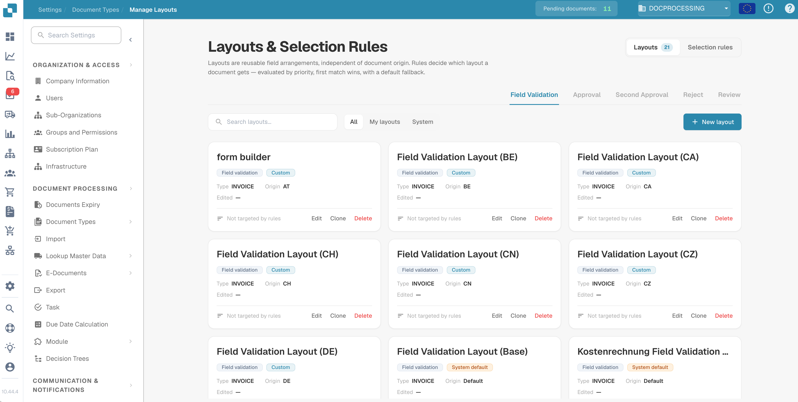
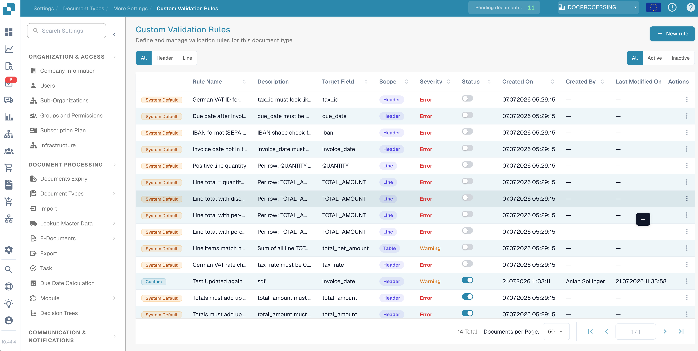
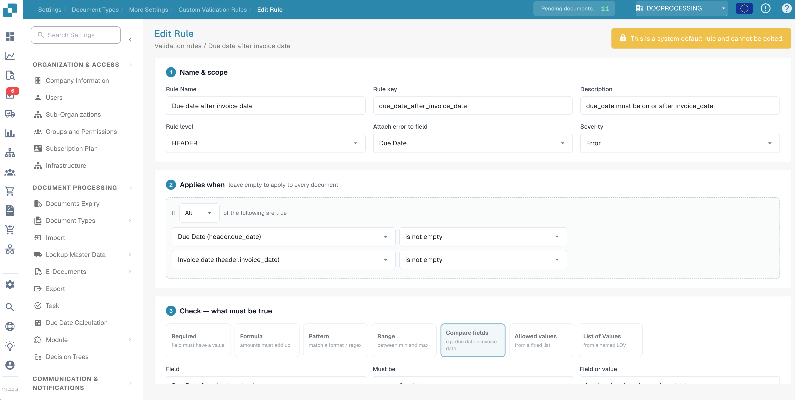
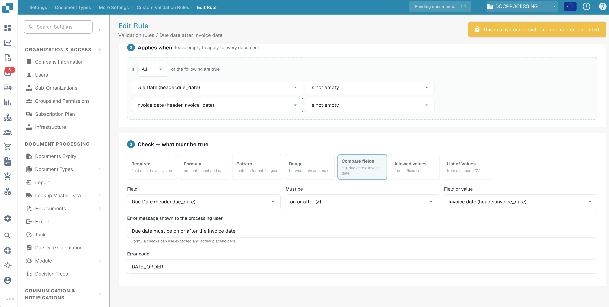

# DocBits Release Notes — 14–23 July 2026

_What changed in the DocBits production upgrade on 23 July 2026 (the Nova
channel update), covering everything since the 14 July release. Each service
lists the version now live, then what's new or fixed in plain language.
Services not listed had no customer-facing changes._

---

## Highlights

- **Manage Layouts and Validation Rules arrive in the app.** The rules engines
  introduced server-side in the last release now have a full user interface.
  You can manage document layouts directly, define your own validation rules,
  and let rules pick the right layout instead of the document's origin. Both
  are switched off until you enable **Custom Validation Rules** on the document
  type, so nothing changes for you until you opt in.
- **Support tickets from the error screen.** When something goes wrong, you can
  now open a support ticket directly from the error record. The ticket already
  contains the technical context, so you don't have to describe it.
- **Region-correct inbound e-mail.** US organisations get inbound import
  addresses in their own region, and Microsoft 365 mailboxes on national cloud
  tenants (GCC, 21Vianet and similar) can now be configured with a Cloud
  Instance selection.
- **Clearer PO matching status.** Invoices whose line-item table couldn't be
  mapped used to be labelled "purchase order not found", which sent people
  searching for the wrong problem. They now get their own "table incomplete"
  status with column-level detail on what didn't map.
- **Script changes are password-protected.** Custom scripts can change how
  documents are processed, so every script edit now requires a password that
  rotates hourly. Ask your administrator for the current one.
- **Turbo AI tier retired.** The Turbo model has reached end of life. Anyone
  who had it selected was moved to Fast automatically; no action needed.

---

## Web App — live: `10.44.4`

### Manage Layouts

The rules engines that shipped server-side in the last release now have their
user interface, under Settings → Document Types → Manage Layouts.

Layouts are reusable field arrangements, no longer tied to where a document
came from. Selection rules decide which layout a document gets: evaluated by
priority, first match wins, with a default fallback.

<figure><figcaption>
Layouts &#x26; Selection Rules: reusable layouts with rule-based selection
</figcaption></figure>

### Validation Rules

Validation Rules check extracted values automatically while a document is
processed, and flag every failure directly on the document, attached to the
field it concerns. The goal: catch bad data during validation, not after the
document has been exported to your ERP. Typical checks are a due date that
lies before the invoice date, line items that do not add up to the net total,
an IBAN or VAT ID in the wrong format, or a required field left empty.

You manage the rules under Settings → Document Types → Custom Validation
Rules. A catalogue of system default rules ships with the release; every rule
stays off until you switch it on for that document type.

<figure><figcaption>
Custom Validation Rules: the rule catalogue for a document type, each rule activated individually
</figcaption></figure>

Every rule is built from three parts. **Name &#x26; scope** says what the rule
is called, whether it checks the document header or each line, which field
the error attaches to, and whether a failure counts as an error or only a
warning. **Applies when** holds the conditions that decide which documents
the rule runs on; leave it empty and the rule applies to every document.

<figure><figcaption>
Editing a rule: name, scope and severity on top, the Applies-when conditions below
</figcaption></figure>

**Check** defines what must be true, using one of seven check types: a
required field, a formula over amounts, a pattern (format or regex), a
numeric range, a comparison of two fields, a fixed list of allowed values,
or a named List of Values. The error message and error code shown to the
processing user are yours to write.

The system rule "Due date after invoice date" shows the pattern: it applies
when both dates are filled, compares the two fields with "on or after", and
reports "Due date must be on or after the invoice date." when the order is
wrong.

<figure><figcaption>
The Check section: compare fields, custom error message and error code
</figcaption></figure>

### Working with documents

- **Deleted documents:** opening a document that was deleted in the meantime
  shows a proper message instead of script errors.
- **Field Validation:** the page-number input is wider and jumps to the page
  on Enter. A field made read-only by a script still shows its field
  connection.
- **Table extraction:** deleting a column frees its name for re-use, and
  deleted headers no longer reappear in the saved table.
- **Approvals:** users can no longer approve a Sales Tax step their group has
  no permission for, and the approval history shows all entries again.
- **Tasks and notifications:** the delete option is hidden from users without
  admin rights.

### Dashboard and search

- **Export:** exports use the dashboard you have selected, and the app warns
  you before exporting a dashboard with unsaved changes.
- **Search:** Invoice Type is available as a search field with its list of
  values.
- **Import log:** split documents can be found via their parent document, and
  the Failed Filenames column lists only files that actually failed or were
  skipped.

### Sign-in

- **Deleted accounts:** logging in with a deleted account says so instead of
  failing with a generic error.
- **SSO:** fixed an error when signing in while a different region was
  selected.

### Settings and administration

- **Support tickets:** create a ticket straight from an error record. Tickets
  carry the environment and release channel, and the screenshot capture no
  longer hangs.
- **Workflow Builder:** newly created or renamed cards, e-mail templates and
  other dropdown items appear immediately, without reloading the page.
- **Document Types:** new Structured Extraction setting in the extraction
  section.
- **AI model selection:** the retired Turbo tier is gone from the dropdown;
  existing selections show Fast.
- **Service Versions dialog:** now scrollable, includes the Auth Bridge
  service, and shows the release channel names Vesta and Nova.
- **Import page:** no longer crashes for organisations with an empty
  subscription entry.

### Smaller fixes

Empty toast notifications are suppressed, the new/edit idea dialog scrolls,
misaligned checkboxes in field settings are aligned again, blocked document
deletions explain why, and E-Document settings handle switching from Default
to Custom cleanly.

## API Service — live: `12.61.8`

- **Validation rules, matured:** new condition operators (contains, starts
  with, ends with), values from list-of-values sources, activation per
  document type, and an audit trail showing who created or changed each rule.
  Documents are re-validated automatically when rules change.
- **Transformation rules:** can now set or clear values on the whole document,
  are activated per document type, and carry the same audit trail.
- **Layout selection rules:** activation moved to the document type, and
  layout templates record who changed them and when.
- **Script security:** script changes require a time-based password
  (see Highlights).
- **Personal dashboards:** fixed sharing settings that wouldn't save.
- **Dashboard search:** Invoice Type joins the extended search fields, and
  documents created by a barcode or QR split are found via their parent
  document.
- **Uploads:** repeated uploads of the same file during a network retry no
  longer create duplicate documents.
- **Supplier lookup:** results arrive as soon as the data is ready instead of
  after a fixed wait.
- **Infor export:** unit prices keep four decimal places. M3 exports can
  include zero-amount line charges.
- **Approvals:** an approval is only linked to an approval request when the
  approver is its assignee.
- **Login stability:** a temporary failure inside token validation no longer
  logs users out; the app retries instead.
- **Classification:** source rules now match against every document source
  field, not fixed positions.
- **AI models:** the Turbo tier (retired) is remapped to Fast everywhere,
  including fine-tuned variants, with a guard so a retired model can never
  run.

## Auth Service — live: `1.72.5`

- **Bulk user administration:** add existing users to sub-organisations and
  groups in bulk via CSV, matched by e-mail address. Also fixed a crash on
  unevenly filled CSV rows and a server error when adding two or more new
  users at once.
- **Member lists:** deleted users no longer appear in sub-organisation member
  lists.
- **Single sign-on:** a series of hardening fixes. Expired tokens now return a
  clean "expired" response, organisations without a SAML configuration get a
  proper not-found answer instead of a wrong login flow, logout always
  completes even when the sign-out request can't be verified, and several
  crashes around missing identity-provider configuration are gone.
- **Session tokens:** fixed short-lived session tokens being rejected as
  invalid even though they weren't expired.
- **Management tooling:** organisation region is visible in the management
  API, the system user of an organisation can be reassigned, and plan and
  usage administration gained dedicated endpoints. These changes affect
  DocBits staff tooling, not the customer app.

## Email Service — live: `1.39.8`

- **Region-correct import:** inbound e-mail domains exist per region, and
  mails arriving in the wrong region are forwarded to the right one. US
  organisations no longer depend on the EU inbound path.
- **Microsoft 365:** national cloud tenants are configured via a Cloud
  Instance selection, fixing O365 imports for US customers. An invalid tenant
  now produces a clear login error instead of a server error, and incomplete
  tenant credentials fail immediately with a message rather than silently.
- **Inbox hygiene:** e-mails without attachments are moved out of the inbox
  instead of piling up.
- **No duplicates on retry:** uploads to the document API carry an idempotency
  key, so a retried delivery can't create the same document twice.
- **Source naming:** O365 sources with a folder configured include the account
  e-mail in their name, so similar sources are distinguishable.

## PO Match Service — live: `1.58.6`

- **"Table incomplete" status:** invoices whose line-item table couldn't be
  mapped get their own status instead of the misleading "purchase order not
  found" (see Highlights). The dashboard shows it with the not-matched icon.
- **Better error detail:** table-mapping failures name the specific column
  that didn't map.
- **Cleaner API behaviour:** requests for PO rules that don't exist return a
  proper not-found answer, and corrupt cache entries are dropped instead of
  causing repeated errors.

## Fulltext Service — live: `1.38.3`

- **European number formats:** amounts written with a decimal comma
  (`1.234,56`) are normalised before indexing, so amount searches and filters
  work regardless of number format.
- **ERP counts:** fixed a token error that could interrupt the live count
  stream on the dashboard.
- **Indexing resilience:** indexing now rides out temporary database and
  auth-service hiccups (automatic retry, fallback to the primary database)
  and discards malformed queue messages instead of retrying them forever.

## OCR Service — live: `1.9.8`

- **Large documents:** the OCR time budget scales with document size, so very
  large files no longer fail with a timeout.
- **Unusual characters:** a sanitizer cleans characters the OCR engine can't
  represent, fixing failures on documents with exotic symbols.
- **Fewer transient failures:** temporary storage connection errors are
  retried automatically.

## Extraction Service — live: `1.52.0`

- **Zero-tax US invoices:** fixed a case where the correct net/tax pair was
  dropped when the tax amount is zero.
- **Table extraction:** tables stay editable when the configured mapping
  expects more columns than the document provides, and a crash on unusual row
  data is fixed.
- **AI models:** Turbo tier retirement, mirrored from the API Service.

## Docflow Service — live: `2.6.5`

- **PO matching in workflows:** missing comparison values are treated as
  missing data rather than a mismatch.
- **Order confirmation cards:** buyer and responsible person are resolved
  reliably.
- **Freight charges:** when neither side has charges, the case is resolved by
  the operator card instead of stalling.
- **Security:** workflow API tokens are validated against the organisation
  they belong to.

## Barcode Service — live: `1.17.4`

- **Long-running splits:** the connection to the task queue is kept alive
  during long barcode jobs, so splitting large batches no longer stalls near
  the end.

---

## Unchanged in this release

**Auth Bridge** (`0.3.6`), **Auto Accounting** (`1.20.1`), **Docnet**
(`1.55.1`), **FTP** (`1.31.1`), **Operator** (`1.40.2`) and **Ideas**
(`0.3.1`) carry no changes in this window.

<!-- Generated by the docbits-changelog skill (version-boundary mode: exact git
     ranges between the LATEST (2026-07-09..15) and NOVA (2026-07-15..21)
     version-bump commits supplied by the user, per service). -->
