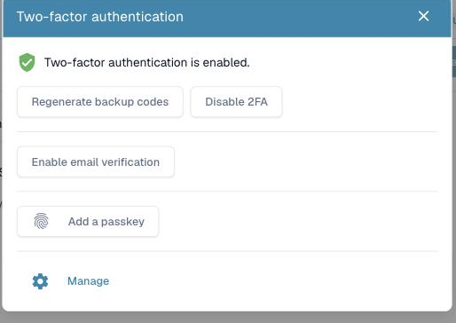
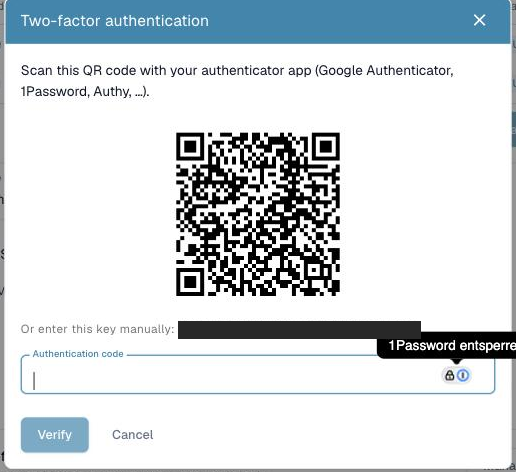
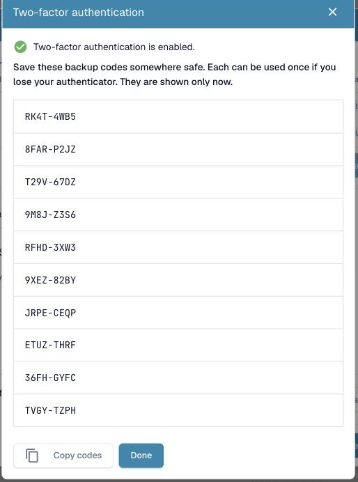
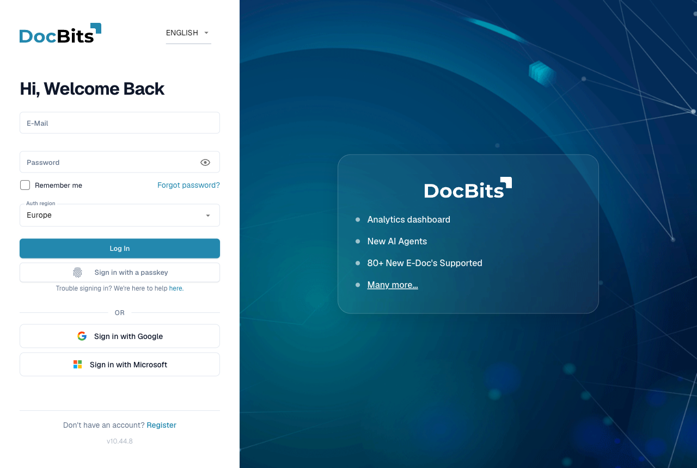
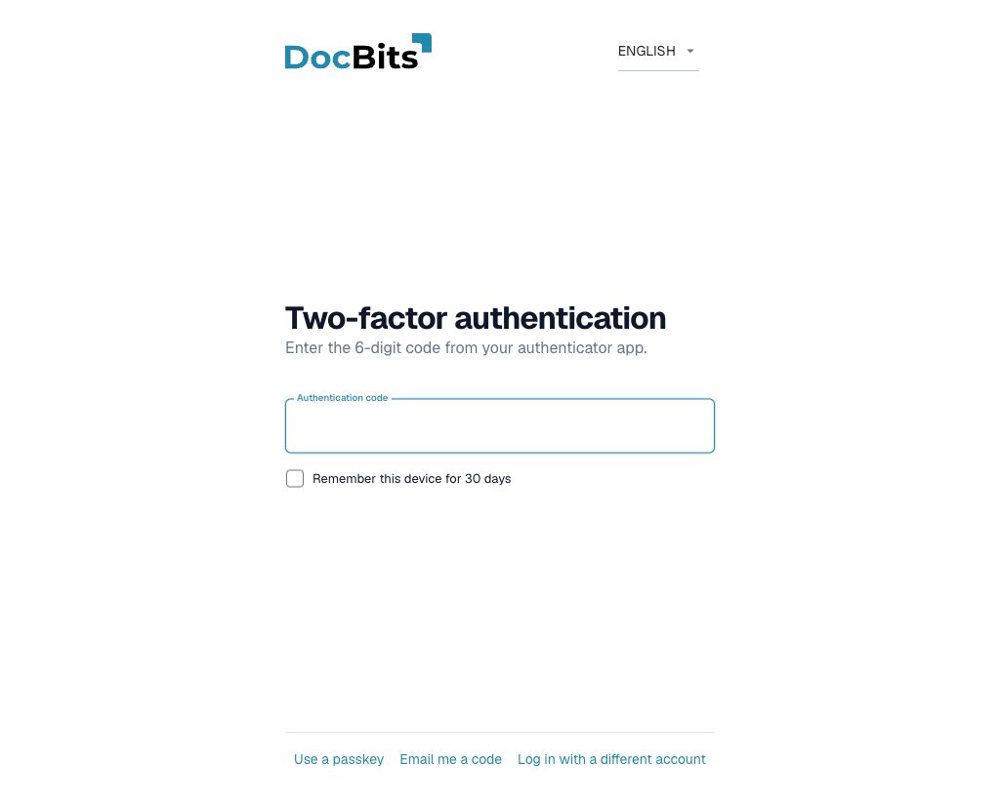
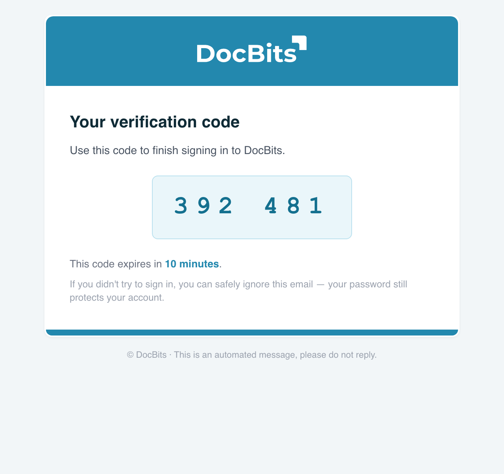
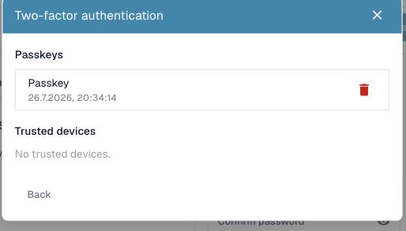

# Twee-factor-authenticatie (2FA)

## Overzicht

Twee-factor-authenticatie (2FA) voegt een tweede stap toe aan uw aanmelding. Na uw wachtwoord vraagt DocBits om een tweede factor die alleen u heeft — een code uit een authenticator-app, een code die naar u wordt gemaild, of een passkey (Touch ID, Windows Hello, YubiKey, 1Password). Zelfs als iemand uw wachtwoord achterhaalt, kan die persoon niet inloggen zonder die tweede factor.

2FA is **optioneel voor elke gebruiker** en kan **verplicht worden gesteld door de beheerder van uw organisatie**. Single sign-on (SSO)-aanmeldingen (Google, Microsoft, SAML) zijn vrijgesteld — uw identiteitsprovider dwingt al zijn eigen MFA af.

U kunt meer dan één methode registreren. De methoden die DocBits ondersteunt zijn:

* **Authenticator-app (TOTP)** — Google Authenticator, Microsoft Authenticator, 1Password, Authy, enz.
* **E-mailcode** — een 6-cijferige code die naar het e-mailadres van uw account wordt gestuurd.
* **Passkey (WebAuthn/FIDO2)** — Touch ID, Windows Hello, een hardwaresleutel (YubiKey), of een wachtwoordmanager.

Wanneer u uw eerste factor inschakelt, geeft DocBits u ook **tien back-upcodes** die u kunt gebruiken als u ooit de toegang tot uw methode verliest.

## Waar u het vindt

Open uw **profiel-/accountinstellingen** (rechtsboven in het accountmenu → **Profiel bewerken**) en selecteer **Twee-factor-authenticatie**. Het 2FA-dialoogvenster toont uw huidige status en de methoden die u kunt toevoegen.

<figure><figcaption>
Het dialoogvenster Twee-factor-authenticatie. Vanaf hier kunt u een authenticator-app of e-mailverificatie inschakelen, een passkey toevoegen, of <strong>Beheren</strong> openen.
</figcaption></figure>

## Een authenticator-app (TOTP) instellen

1. Klik in het 2FA-dialoogvenster op **2FA inschakelen**.
2. Scan de QR-code met uw authenticator-app (Google Authenticator, 1Password, Authy, …). Als u niet kunt scannen, gebruik dan de **handmatige sleutel** die onder de QR-code wordt weergegeven.
3. Voer de 6-cijferige code in die uw app toont en bevestig.
4. DocBits schakelt 2FA in en toont uw **back-upcodes** (zie hieronder).

<figure><figcaption>
Scan de QR-code met uw authenticator-app, of voer de handmatige sleutel in. Bevestig vervolgens met de 6-cijferige code die de app toont.
</figcaption></figure>

## E-mailverificatie instellen

1. Klik in het 2FA-dialoogvenster op **E-mailverificatie inschakelen**.
2. DocBits e-mailt een 6-cijferige code naar het adres van uw account.
3. Voer de code in om te bevestigen. E-mailverificatie is nu ingeschakeld.

## Een passkey toevoegen

1. Klik in het 2FA-dialoogvenster op **Een passkey toevoegen**.
2. Uw browser of apparaat vraagt u om te bevestigen met Touch ID, Windows Hello, een hardwaresleutel, of uw wachtwoordmanager.
3. De passkey wordt opgeslagen. U kunt meerdere passkeys toevoegen en ze later hernoemen of verwijderen.

## Back-upcodes

Wanneer u uw **eerste** factor inschakelt, toont DocBits **tien back-upcodes** — **eenmalig**. Elke code werkt één keer en laat u inloggen als u uw authenticator of telefoon verliest.

* Bewaar ze op een veilige plek (een wachtwoordmanager is ideaal).
* U kunt op elk moment een nieuwe set genereren met **Back-upcodes opnieuw genereren** (hiermee vervalt de oude set).

<figure><figcaption>
Uw tien back-upcodes, eenmalig weergegeven. Elke code werkt één keer — bewaar ze op een veilige plek.
</figcaption></figure>


Back-upcodes worden alleen weergegeven op het moment dat ze worden gegenereerd. DocBits kan ze niet opnieuw tonen — bewaar ze onmiddellijk.


## Inloggen met 2FA

1. Voer uw e-mailadres en wachtwoord in zoals gebruikelijk.

    <figure><figcaption>
Het inlogscherm. U kunt ook zonder wachtwoord inloggen met <strong>Inloggen met een passkey</strong>.
</figcaption></figure>
2. DocBits vraagt om uw tweede factor. Kies uw methode:
   * **Authenticator** — typ de huidige 6-cijferige code uit uw app.
   * **E-mail** — klik op **E-mail mij een code** om een code per e-mail te ontvangen en typ die vervolgens in.
   * **Passkey** — klik op **Een passkey gebruiken** en bevestig met Touch ID / Windows Hello / uw sleutel.
   * **Back-upcode** — als u uw gebruikelijke methode niet kunt gebruiken.

    <figure><figcaption>
Na uw wachtwoord vraagt DocBits om uw tweede factor. Wissel van methode met <strong>Een passkey gebruiken</strong> of <strong>E-mail mij een code</strong>, en vertrouw het apparaat desgewenst 30 dagen.
</figcaption></figure>
3. Bij succes bent u ingelogd.

### Hoe de e-mailcode eruitziet

Als u **E-mail** kiest, stuurt DocBits een bericht met een 6-cijferige code die na 10 minuten verloopt:

<figure><figcaption>
De e-mail met de verificatiecode. De code verloopt na 10 minuten en kan één keer worden gebruikt.
</figcaption></figure>

## Dit apparaat vertrouwen

In het scherm voor de tweede factor kunt u **Dit apparaat onthouden** aanvinken. DocBits slaat dan de 2FA-stap op dat apparaat **30 dagen** over. Het vertrouwen wordt automatisch ingetrokken wanneer u uw wachtwoord wijzigt, en u kunt het zelf op elk moment intrekken (zie hieronder).

## Uw passkeys en vertrouwde apparaten beheren

Open het 2FA-dialoogvenster en klik op **Beheren** om te bekijken wat is geregistreerd.

* **Passkeys** — hernoem een passkey (klik op de naam) of verwijder deze. Als u uw laatst overgebleven factor verwijdert, wordt 2FA uitgeschakeld.
* **Vertrouwde apparaten** — trek een enkel apparaat in, of **Alle apparaten intrekken** om overal een nieuwe 2FA-prompt af te dwingen.

<figure><figcaption>
De weergave Beheren toont uw geregistreerde passkeys en vertrouwde apparaten, waar u ze kunt hernoemen of verwijderen.
</figcaption></figure>

## 2FA uitschakelen

Klik in het 2FA-dialoogvenster op **2FA uitschakelen** en bevestig met een actuele authenticator-code of een back-upcode. Het uitschakelen van 2FA wist ook uw back-upcodes en trekt uw vertrouwde apparaten in.


Als uw organisatie MFA **verplicht** stelt, kunt u niet met een wachtwoord inloggen totdat er ten minste één factor is ingesteld. Vraag het uw beheerder als u niet zeker weet of MFA verplicht is voor uw organisatie.


## Aanmelden zonder wachtwoord (optioneel)

Zodra u een passkey heeft, kunt u **zonder uw wachtwoord te typen** inloggen via **Inloggen met een passkey** op het inlogscherm. Uw wachtwoord blijft werken als terugvaloptie. Aanmelden zonder wachtwoord vereist dat de passkey u verifieert (Touch ID / Windows Hello / pincode), waardoor het zowel sneller als phishingbestendig is.
