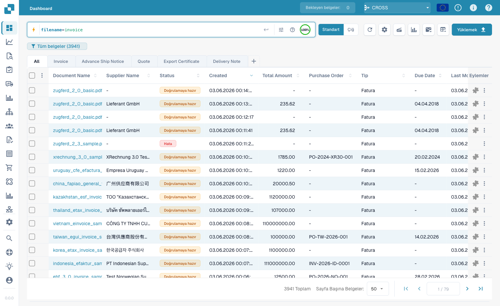
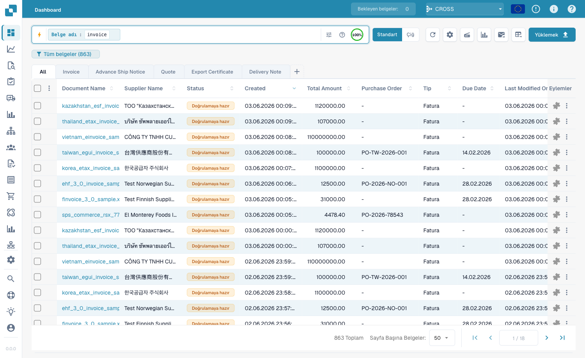
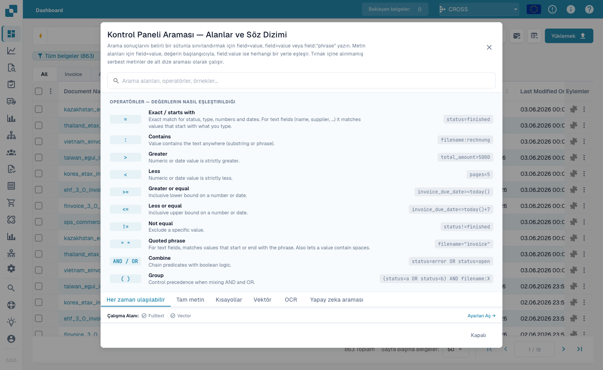

# Hızlı Arama

Panonun üstündeki **Hızlı Arama**, belge bulmanın en hızlı yoludur. Aradığınız
şeyi yazın — bir ad, bir durum, bir tutar, bir tarih — ve liste anında filtrelenir.

Bu kılavuz, aramanın kurulduğu sıraya göre düzenlenmiştir:

1. **Standart alanlar** — her belgenin sahip olduğu sütunlar (belge adı, durum,
   tarihler). Her zaman kullanılabilir.
2. **Tam metin alanları** — çıkarılan içerik (tedarikçi, sipariş numarası, fatura
   numarası, tutarlar, satırlar). Tam metin araması etkinleştirildiğinde
   kullanılabilir.
3. **Operatörler, kısayollar ve tarifler** — tam başvuru.

> Hiçbir şey ezberlemenize gerek yok: arama çubuğuna tıklayın ve listeden bir alan
> ve değer seçin. Aşağıdaki örnekler ayrıca doğrudan kopyalanacak yazılı biçimi de
> gösterir.

---

## Bölüm 1 — Standart alanlar

Standart alanlar, belgenin kendi sütunlarıdır. Tam metin araması açık olsun ya da
olmasın **her zaman kullanılabilir**.

### Belgeleri ada göre bulma

Belge adı en yaygın aramadır. Eşleştirmenin üç yolu vardır — hepsi **büyük/küçük
harfe duyarsız**:

#### `=` → ile başlar

```
filename=invoice
```

Adı «invoice» **ile başlayan** belgeleri bulur. Büyük/küçük harf yok sayıldığı
için bunların tümü `filename=invoice` ile eşleşir:

```
Invoice.pdf   iNVoice.pdf   iNvoiCE.pdf   INVOICE.pdf
Invoice.xml   iNVoice.xml   iNvoiCE.edi   …
```

`XYZ_Invoice.pdf` ile **eşleşmez** (orada «invoice» ortadadır — `:` kullanın).

<figure><figcaption><p><code>filename=invoice</code> — yalnızca «invoice» <strong>ile başlayan</strong> adlar, herhangi bir büyük/küçük harfle (<code>INVOICE.pdf</code>, <code>iNvoiCE.pdf</code>, <code>iNVoice.pdf</code>, <code>Invoice.pdf</code> eşleşir — 7 sonuç).</p></figcaption></figure>

#### `:` → içerir (herhangi bir yerde)

```
filename:invoice
```

`:` ile sözcük adın **herhangi bir yerinde** eşleşir — `2026_Invoice.pdf`,
`XYZ_Invoice ABC.pdf`, `123_Invoice ABC bla bla.pdf`.

<figure><figcaption><p><code>filename:invoice</code> — «invoice» ile adın herhangi bir konumunda eşleşir (<code>XYZ_Invoice ABC.pdf</code> de dahil).</p></figcaption></figure>

#### `="…"` → ile başlar *veya* biter

```
filename="invoice"
```

Tırnak işaretleri `=` operatörünün değerle **başlayan veya biten** adlarla
eşleşmesini sağlar.

> **Üçü bir satırda:** `=` → ile başlar · `:` → içerir · `="…"` → ile başlar veya
> biter. Hepsi büyük/küçük harfi yok sayar.

### Duruma göre bulma

```
status=ready_for_validation
```

Durum sabit bir listedir, bu nedenle `=` **tam** eşleşmedir ve çubuk bir değer
seçici sunar.

### Tarihe göre bulma

```
created_on>2026-05-25
```

Tarih aralıkları için `>`, `<`, `>=`, `<=` kullanın. Ayrıca **göreceli** tarihler:
`today()`, `today()-7` (son 7 gün), `today()+30`.

---

## Bölüm 2 — Tam metin alanları

Tam metin alanları **çıkarılan içerikte** arama yapar — tedarikçi, sipariş
numarası, fatura numarası, tutarlar, satırlar. **Turuncu** görünürler ve **tam
metin aramasının açık** olmasını gerektirir. Eşleştirme kuralları standart metin
alanlarıyla aynıdır (`=` ile-başlar, `:` içerir, `="…"` başlar-veya-biter).

### Bir tedarikçinin belgelerini bulma

```
supplier_name=Test
```

Çıkarılan tedarikçi adında ile-başlar; `supplier_name:fuji` herhangi bir yerde
eşleşir; `supplier_name:"Ruiz Foods"` boşluk içeren bir değeri tırnak içine alır.

### Tutara göre bulma

```
total_amount>5000
```

Bir pencere için `>`, `<`, `>=`, `<=` veya `between 1000 and 5000` kullanın.

### Eksik olanı bulma

```
supplier_name=""
```

`=""` «bu alan **ayarlanmamış**» demektir; `supplier_name!=""` «herhangi bir
tedarikçisi var» demektir. Aynı denetim her alan için geçerlidir, örn.
`ap_assignment_code=""`.

---

## Akıllı filtreler — tek tık

Arama açılır menüsünün üstünde **Akıllı filtreler** bulunur: tek tıkla hazır
aramalar. Her biri yazabileceğiniz bir sorgunun kısayoludur:

| Akıllı filtre | Bulur | Şuna eşittir |
|---------------|-------|--------------|
| ⚠️ **Gecikmiş** | Vade tarihi geçmiş | `invoice_due_date<today()` |
| 🕐 **Yakında dolacak** | Önümüzdeki 7 gün içinde | `invoice_due_date<=today()+7` |
| 👤 **Bana atanmış** | İşleminizi bekliyor | `assigned_to=<siz>` |
| 📅 **Bugünün gelen kutusu** | Bugün içe aktarılmış | `imported_on>=today()` |
| 📋 **Doğrulama bekliyor** | Doğrulanmaya hazır | `status=ready_for_validation` |
| 🧾 **Elektronik belgeler** | E-faturalar (XML, ZUGFeRD, EDI) | `is_edoc=true` |
| ✅ **Tam PO eşleşmesi** | Bir siparişle tam eşleşmiş | `po_match_status=full_matched` |
| ➗ **Kısmi PO eşleşmesi** | Kısmen eşleşmiş | `po_match_status=partial_matched` |
| 📉 **Eksik PO eşleşmesi** | Miktar veya fiyat siparişin altında | `po_match_status=under_matched` |

Üç **PO eşleşmesi** filtresi ve tam metin alanları, tam metin aramasının açık
olmasını gerektirir.

---

## Bölüm 3 — Operatörler, bağlayıcılar, kısayollar

### Yerleşik yardım

Arama çubuğundaki **yardım simgesi**, çalışma alanınızdaki tüm alanların,
operatörlerin ve kısayolların tam bir başvurusunu açar.

<figure><figcaption><p>Yerleşik yardım <strong>Pano Araması — Alanlar ve Söz Dizimi</strong>, her operatörü ve değerlerin nasıl eşleştiğini listeler (örn. «Tam / ile başlar»).</p></figcaption></figure>

### Alan türüne göre `=` ne anlama gelir

Her metin eşleşmesi büyük/küçük harfi yok sayar.

| Alan türü | Örnek | `=` anlamı |
|-----------|-------|------------|
| Metin (ad, tedarikçi, sipariş) | `filename=invoice` | **ile başlar** |
| Metin, herhangi bir yerde | `filename:invoice` | **içerir** |
| Metin, başlangıç *veya* son | `filename="invoice"` | **ile başlar veya biter** |
| Durum / tür / PO eşleşmesi (sabit listeler) | `status=finished` | **tam** |
| Tanımlayıcılar (fatura no, tedarikçi id) | `invoice_number=INV-100` | **tam** |
| Sayı | `total_amount>5000` | aralık (`> < >= <= between`) |
| Tarih | `created_on>2026-01-01` | aralık + `today()±N` |

### Operatörler

| Operatör | Anlamı |
|----------|--------|
| `=` | ile-başlar (metin) / tam (liste, sayı, tarih) |
| `:` | içerir (metin, herhangi bir yerde) |
| `="…"` | ile-başlar veya biter (metin) |
| `!=` | `=` operatörünün tersi |
| `>` `<` `>=` `<=` | büyük / küçük |
| `between … and …` | dahil aralık |
| `field=""` / `field!=""` | boş / ayarlanmış |
| `today()`, `today()-7`, `today()+30` | göreceli tarihler |

### Bağlayıcılar

Koşulları **AND** (her ikisi), **OR** (biri), **NOT** ve gruplamak için
parantez `( … )` ile birleştirin:

```
status=ready_for_validation AND supplier_name=Test
(status=error OR status=failed) AND created_on>today()-1
```

### Kısayollar

Aynı sorgular için daha kısa biçimler:

| Kısayol | Şuna eşittir |
|---------|--------------|
| `total_amount gt 5000` | `total_amount>5000` (gt/gte/lt/lte takma adları) |
| `due_date > today` | `due_date>today()` |
| `imported_on this_week` | bu ISO haftası (ayrıca `last_week`, `this_month`, …) |
| `ap_assignment_code is empty` | `ap_assignment_code=""` |
| `status:open` | `status=ready_for_validation` (open/closed/failed/done) |
| `total_amount not between 100, 200` | `total_amount<100 OR total_amount>200` |
| `status in (finished, error)` | `status=finished OR status=error` |
| `not status=finished` | `status!=finished` |
| `filename contains rechnung` | `filename:rechnung` |
| `total_amount > 5k` | `total_amount>5000` (`k`=bin, `M`=milyon) |
| `overdue` | `invoice_due_date<today() AND status!=finished` |
| `#INV-1234` | `invoice_id:INV-1234` |
| `@User` | `assigned_to:User` |
| `$5000+` | `total_amount>=5000` |

---

## Bölüm 4 — Gelişmiş arama modları

Alan aramasının ötesinde, üç önek belgenin içeriğinde arama yapar.

### Vektör (anlamsal) arama — `vector:`

Tam metne göre değil **anlama** göre eşleşir. Vector modülünü gerektirir.

```
vector: invoices about office supplies
vector: shipping delays with Hamburg port
```

### OCR metin araması — `ocr:`

Yalnızca sütunlarda değil, OCR'nin çıkardığı **sayfa metninde** arar.

```
ocr: Versandkosten
ocr: "purchase order PO-12345"
ocr: Hamburg AND doc_type=INVOICE
```

### Doğal dil (YZ) araması — `ai:`

Aradığınızı normal dilde tarif edin; YZ cümlenizi okur ve filtreleri (tedarikçi,
tarihler, tutarlar) yapılandırılmış bir sorguya çıkarır.

```
ai: invoices from Ruiz over 1000 last quarter
ai: overdue invoices waiting on approval
```

---

### Tarifler

| İstediğiniz… | Şunu yazın |
|--------------|------------|
| Doğrulamaya hazır, tam eşleşmiş | `status=ready_for_validation AND po_match_status=full_matched` |
| Bu tedarikçi, bu hafta | `supplier_name=Test AND created_on>today()-7` |
| Yüksek tutarlı gecikmiş faturalar | `total_amount>5000 AND invoice_due_date<today()` |
| Aynı anda iki tedarikçi | `supplier_name=fuji OR supplier_name=acme` |
| Bugünkü hatalı belgeler | `(status=error OR status=failed) AND created_on>today()-1` |
| Sipariş numarası önekine göre | `purchase_order=PO-2026` |

> Turuncu (tam metin) alanlar ve akıllı PO filtreleri **tam metin aramasının**
> açık olmasını gerektirir.
