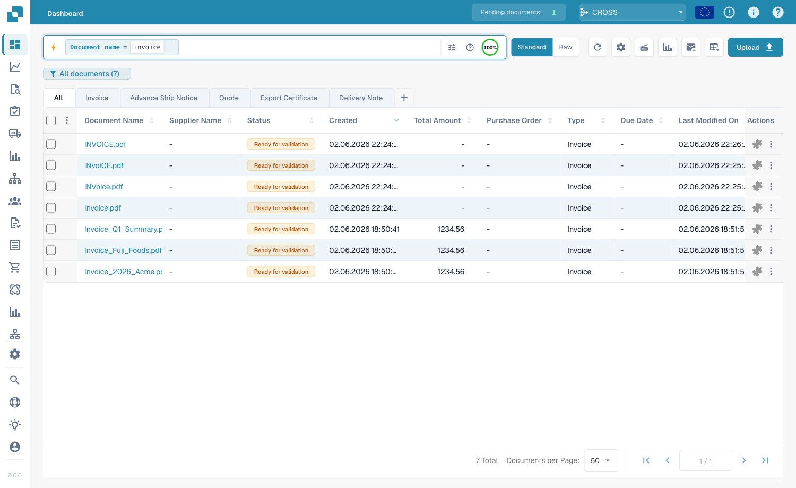
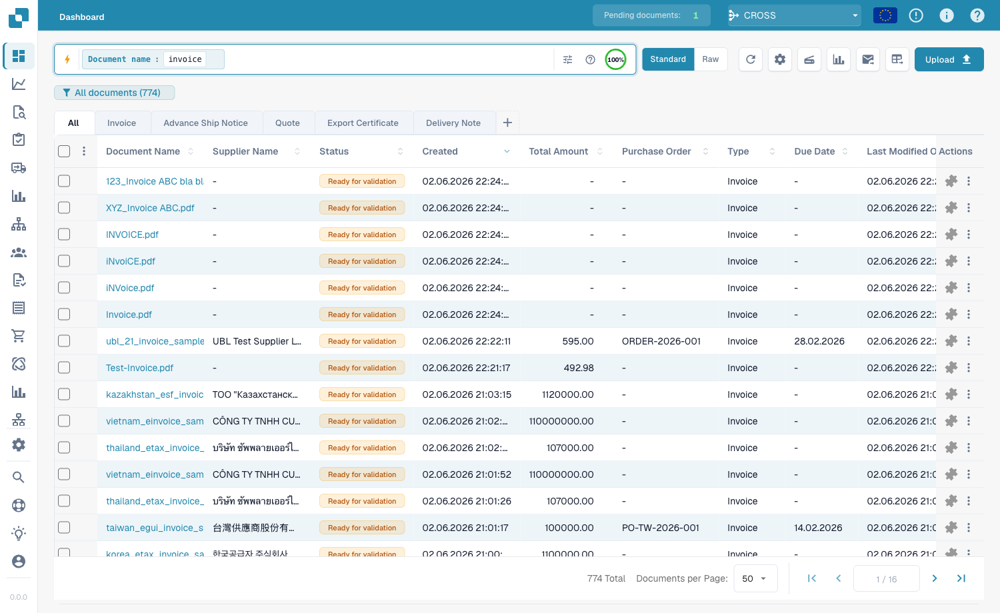
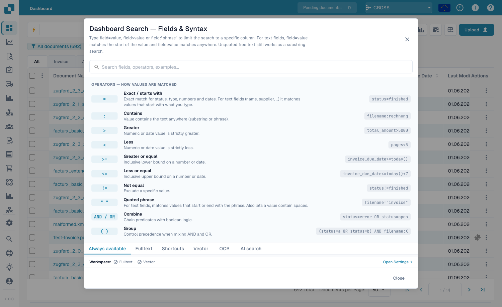

# Brza pretraga

**Brza pretraga** na vrhu kontrolne table je najbrži način da pronađete
dokumente. Ukucajte šta tražite — naziv, status, iznos, datum — i lista se
filtrira odmah.

Ovaj vodič je organizovan onako kako se pretraga gradi:

1. **Standardna polja** — kolone koje ima svaki dokument (naziv dokumenta,
   status, datumi). Uvek dostupna.
2. **Polja pretrage celog teksta** — izdvojeni sadržaj (dobavljač, broj
   porudžbine, broj fakture, iznosi, stavke). Dostupna kada je uključena pretraga
   celog teksta.
3. **Operatori, prečice i recepti** — kompletna referenca.

> Ne morate ništa da pamtite: kliknite na traku za pretragu i izaberite polje i
> vrednost sa liste. Primeri ispod prikazuju i ukucanu formu za direktno
> kopiranje.

---

## Deo 1 — Standardna polja

Standardna polja su sopstvene kolone dokumenta. **Uvek su dostupna**, bez obzira
da li je pretraga celog teksta uključena.

### Pronalaženje dokumenata po nazivu

Naziv dokumenta je najčešća pretraga. Tri načina podudaranja — svi **ne razlikuju
velika/mala slova**:

#### `=` → počinje sa

```
filename=invoice
```

Pronalazi dokumente čiji naziv **počinje sa** „invoice". Pošto se velika/mala
slova ignorišu, svi ovi se podudaraju sa `filename=invoice`:

```
Invoice.pdf   iNVoice.pdf   iNvoiCE.pdf   INVOICE.pdf
Invoice.xml   iNVoice.xml   iNvoiCE.edi   …
```

**Ne** podudara se sa `XYZ_Invoice.pdf` (tamo je „invoice" u sredini — koristite `:`).

<figure><figcaption><p><code>filename=invoice</code> — samo nazivi koji <strong>počinju sa</strong> „invoice", u bilo kojoj veličini slova (<code>INVOICE.pdf</code>, <code>iNvoiCE.pdf</code>, <code>iNVoice.pdf</code>, <code>Invoice.pdf</code> se podudaraju — 7 rezultata).</p></figcaption></figure>

#### `:` → sadrži (bilo gde)

```
filename:invoice
```

Sa `:` reč se podudara **bilo gde** u nazivu — `2026_Invoice.pdf`,
`XYZ_Invoice ABC.pdf`, `123_Invoice ABC bla bla.pdf`.

<figure><figcaption><p><code>filename:invoice</code> — podudara se sa „invoice" na bilo kojoj poziciji u nazivu (uključujući <code>XYZ_Invoice ABC.pdf</code>).</p></figcaption></figure>

#### `="…"` → počinje *ili* se završava sa

```
filename="invoice"
```

Navodnici čine da `=` podudara nazive koji **počinju ili se završavaju** vrednošću.

> **Tri u jednom redu:** `=` → počinje sa · `:` → sadrži · `="…"` → počinje ili se
> završava sa. Sve ignorišu velika/mala slova.

### Pronalaženje po statusu

```
status=ready_for_validation
```

Status je fiksna lista, pa je `=` **tačno** podudaranje i traka nudi birač
vrednosti.

### Pronalaženje po datumu

```
created_on>2026-05-25
```

Koristite `>`, `<`, `>=`, `<=` za opsege datuma. Takođe **relativni** datumi:
`today()`, `today()-7` (poslednjih 7 dana), `today()+30`.

---

## Deo 2 — Polja pretrage celog teksta

Polja pretrage celog teksta pretražuju **izdvojeni sadržaj** — dobavljača, broj
porudžbine, broj fakture, iznose, stavke. Prikazuju se **narandžasto** i zahtevaju
**uključenu pretragu celog teksta**. Pravila podudaranja su identična standardnim
tekstualnim poljima (`=` počinje-sa, `:` sadrži, `="…"` počinje-ili-završava).

### Pronalaženje dokumenata dobavljača

```
supplier_name=Test
```

Počinje-sa na izdvojenom nazivu dobavljača; `supplier_name:fuji` se podudara bilo
gde; `supplier_name:"Ruiz Foods"` stavlja vrednost sa razmacima u navodnike.

### Pronalaženje po iznosu

```
total_amount>5000
```

Koristite `>`, `<`, `>=`, `<=` ili `between 1000 and 5000` za opseg.

### Pronalaženje onoga što nedostaje

```
supplier_name=""
```

`=""` znači „ovo polje **nije postavljeno**"; `supplier_name!=""` znači „ima bilo
kog dobavljača". Ista provera radi na bilo kom polju, npr. `ap_assignment_code=""`.

---

## Pametni filteri — jedan klik

Na vrhu padajućeg menija za pretragu nalaze se **Pametni filteri**: gotove
pretrage jednim klikom. Svaki je prečica za upit koji biste mogli i da ukucate:

| Pametni filter | Pronalazi | Odgovara |
|----------------|-----------|----------|
| ⚠️ **Dospelo** | Prošao rok plaćanja | `invoice_due_date<today()` |
| 🕐 **Uskoro dospeva** | U narednih 7 dana | `invoice_due_date<=today()+7` |
| 👤 **Dodeljeno meni** | Čeka vašu akciju | `assigned_to=<vi>` |
| 📅 **Današnje sanduče** | Uvezeno danas | `imported_on>=today()` |
| 📋 **Čeka validaciju** | Spremno za validaciju | `status=ready_for_validation` |
| 🧾 **Elektronski dokumenti** | E-fakture (XML, ZUGFeRD, EDI) | `is_edoc=true` |
| ✅ **Potpuno PO podudaranje** | Potpuno usklađeno sa porudžbinom | `po_match_status=full_matched` |
| ➗ **Delimično PO podudaranje** | Delimično usklađeno | `po_match_status=partial_matched` |
| 📉 **PO podudaranje ispod** | Količina ili cena ispod porudžbine | `po_match_status=under_matched` |

Tri filtera **PO podudaranja** i polja celog teksta zahtevaju uključenu pretragu
celog teksta.

---

## Deo 3 — Operatori, veznici, prečice

### Ugrađena pomoć

**Ikona pomoći** na traci za pretragu otvara kompletnu referencu svih polja,
operatora i prečica vašeg radnog prostora.

<figure><figcaption><p>Ugrađena pomoć <strong>Pretraga kontrolne table — Polja i sintaksa</strong> navodi svaki operator i kako se vrednosti podudaraju (npr. „Tačno / počinje sa").</p></figcaption></figure>

### Šta `=` znači po tipu polja

Svako podudaranje teksta ignoriše velika/mala slova.

| Tip polja | Primer | `=` znači |
|-----------|--------|-----------|
| Tekst (naziv, dobavljač, porudžbina) | `filename=invoice` | **počinje sa** |
| Tekst, bilo gde | `filename:invoice` | **sadrži** |
| Tekst, početak *ili* kraj | `filename="invoice"` | **počinje ili se završava sa** |
| Status / tip / PO podudaranje (fiksne liste) | `status=finished` | **tačno** |
| Identifikatori (br. fakture, id dobavljača) | `invoice_number=INV-100` | **tačno** |
| Broj | `total_amount>5000` | opseg (`> < >= <= between`) |
| Datum | `created_on>2026-01-01` | opseg + `today()±N` |

### Operatori

| Operator | Značenje |
|----------|----------|
| `=` | počinje-sa (tekst) / tačno (lista, broj, datum) |
| `:` | sadrži (tekst, bilo gde) |
| `="…"` | počinje-sa ili završava-se (tekst) |
| `!=` | suprotno od `=` |
| `>` `<` `>=` `<=` | veće / manje od |
| `between … and …` | uključivi opseg |
| `field=""` / `field!=""` | prazno / postavljeno |
| `today()`, `today()-7`, `today()+30` | relativni datumi |

### Veznici

Kombinujte uslove sa **AND** (oba), **OR** (jedan), **NOT** i zagradama
`( … )` za grupisanje:

```
status=ready_for_validation AND supplier_name=Test
(status=error OR status=failed) AND created_on>today()-1
```

### Prečice

Kraći oblici za iste upite:

| Prečica | Odgovara |
|---------|----------|
| `total_amount gt 5000` | `total_amount>5000` (aliasi gt/gte/lt/lte) |
| `due_date > today` | `due_date>today()` |
| `imported_on this_week` | ova ISO nedelja (takođe `last_week`, `this_month`, …) |
| `ap_assignment_code is empty` | `ap_assignment_code=""` |
| `status:open` | `status=ready_for_validation` (open/closed/failed/done) |
| `total_amount not between 100, 200` | `total_amount<100 OR total_amount>200` |
| `status in (finished, error)` | `status=finished OR status=error` |
| `not status=finished` | `status!=finished` |
| `filename contains rechnung` | `filename:rechnung` |
| `total_amount > 5k` | `total_amount>5000` (`k`=hiljada, `M`=milion) |
| `overdue` | `invoice_due_date<today() AND status!=finished` |
| `#INV-1234` | `invoice_id:INV-1234` |
| `@User` | `assigned_to:User` |
| `$5000+` | `total_amount>=5000` |

---

## Deo 4 — Napredni režimi pretrage

Pored pretrage po poljima, tri prefiksa pretražuju sam sadržaj dokumenta.

### Vektorska (semantička) pretraga — `vector:`

Podudara po **značenju**, ne po tačnom tekstu. Zahteva Vector modul.

```
vector: invoices about office supplies
vector: shipping delays with Hamburg port
```

### OCR pretraga teksta — `ocr:`

Pretražuje **tekst stranica** koji je OCR izdvojio, ne samo kolone.

```
ocr: Versandkosten
ocr: "purchase order PO-12345"
ocr: Hamburg AND doc_type=INVOICE
```

### Pretraga prirodnim jezikom (VI) — `ai:`

Opišite običnim jezikom šta tražite; VI čita rečenicu i izdvaja filtere
(dobavljač, datumi, iznosi) u strukturirani upit.

```
ai: invoices from Ruiz over 1000 last quarter
ai: overdue invoices waiting on approval
```

---

### Recepti

| Želite… | Ukucajte ovo |
|---------|--------------|
| Spremno za validaciju, potpuno usklađeno | `status=ready_for_validation AND po_match_status=full_matched` |
| Ovaj dobavljač, ove nedelje | `supplier_name=Test AND created_on>today()-7` |
| Dospele fakture visokog iznosa | `total_amount>5000 AND invoice_due_date<today()` |
| Dva dobavljača istovremeno | `supplier_name=fuji OR supplier_name=acme` |
| Današnji dokumenti sa greškom | `(status=error OR status=failed) AND created_on>today()-1` |
| Po prefiksu broja porudžbine | `purchase_order=PO-2026` |

> Narandžasta (celog teksta) polja i pametni PO filteri zahtevaju uključenu
> **pretragu celog teksta**.
