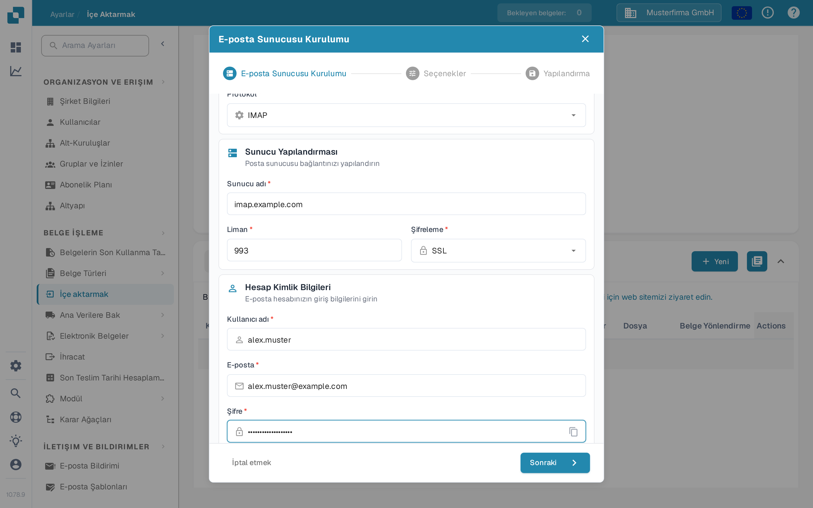

# IMAP



Burada yalnızca e-posta sağlayıcınızla ilgili gerekli bilgileri girmeniz yeterlidir: protokol, şifreleme, sunucu adı, liman, kullanıcı adı, e-posta adresi ve şifre ile e-posta klasörü.

<figure><figcaption>
Örnek değerlerle “E-posta Sunucusu Kurulumu” iletişim kutusu: protokol IMAP, sunucu imap.example.com, liman 993, şifreleme SSL.
</figcaption></figure>

## Dikkat edilecekler

* Gerekli tüm bilgileri arayüze girin. Sunucu ve liman gibi diğer bilgiler sağlayıcıya bağlıdır (hızlı bir web araması yardımcı olur).
* Klasör ve Move-Imported burada aynı işlevi görür. Klasör devre dışı bırakılamaz; boş bırakılırsa varsayılan olarak Gelen Kutusu kullanılır.
