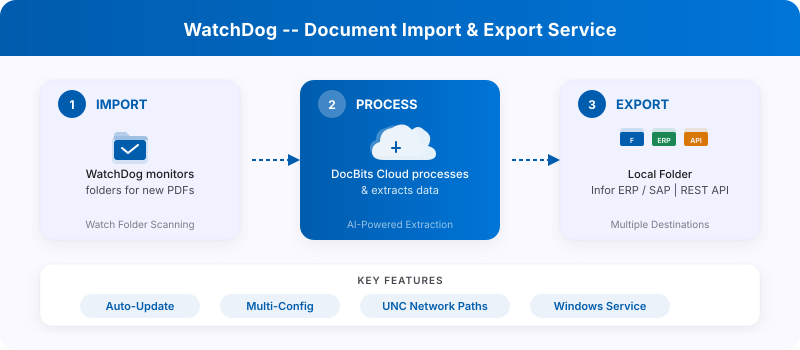

# WatchDog

<figure><figcaption></figcaption></figure>

<figure><figcaption></figcaption></figure>

O **WatchDog** é um serviço local baseado em Windows que monitora pastas locais em busca de documentos recebidos, os envia para a DocBits Cloud para processamento e exporta os documentos concluídos de volta para pastas locais ou sistemas ERP.

## Principais Recursos

* **Monitoramento automático de pastas** — observa caminhos locais e caminhos de rede UNC em busca de novos PDFs
* **Suporte a múltiplas configurações** — várias configurações de importação/exportação por instância
* **6 métodos de exportação** — Pasta Local, Infor IDM, Infor BOD, ION API, GLS840MI, REST API
* **Atualização Automática** — atualizações automáticas de versão com reversão em caso de falha
* **Gerenciamento remoto** — reinicie, atualize e configure pela interface do DocBits

## Início Rápido

### 1. Baixar o WatchDog

Baixe o `WatchDog.exe` em **Configurações → Processamento de Documentos → WatchDog → Aba Geral** no aplicativo DocBits.

### 2. Configurar via API Key

Abra o **Prompt de Comando como Administrador** e execute:

```powershell
WatchDog.exe -api YOUR_API_KEY
```

> **Observação:** A API Key está disponível nas suas Configurações do DocBits, na Aba Geral do WatchDog. Isso conecta o WatchDog à sua organização DocBits.

### 3. Instalar como Serviço do Windows

```powershell
WatchDog.exe install
WatchDog.exe start
```

### 4. Criar Configurações no DocBits

Todas as configurações de importação e exportação são criadas diretamente no **aplicativo DocBits**:

**Configurações → Processamento de Documentos → WatchDog → Aba Configurations**

* **Configurações de Importação** — defina as pastas monitoradas e os tipos de documento
* **Configurações de Exportação** — defina os destinos de exportação, modelos XSLT e métodos de exportação

> **Importante:** As configurações de exportação exigem um **tipo de documento** (`doc_type`). Configurações sem um tipo de documento serão rejeitadas.

### 5. Início Automático (Opcional)

Para iniciar o WatchDog automaticamente na inicialização:

1. Abra **Serviços** (`Win + R` → `services.msc`)
2. Encontre o **WatchDog** na lista
3. Defina o **Tipo de Inicialização** como **Automático (Início Atrasado)**

## Referência de Comandos

| Comando | Descrição |
| :--- | :--- |
| `WatchDog.exe -api KEY` | Configurar a API Key e conectar ao DocBits |
| `WatchDog.exe install` | Instalar como Serviço do Windows |
| `WatchDog.exe start` | Iniciar o serviço |
| `WatchDog.exe stop` | Parar o serviço |
| `WatchDog.exe debug` | Executar em modo console para solução de problemas |
| `WatchDog.exe --version` | Mostrar a versão atual |
| `WatchDog.exe --list-folders` | Listar as pastas monitoradas configuradas |
| `WatchDog.exe remove` | Desinstalar o serviço |

## Recursos Adicionais

* [Instalação do WatchDog V1](../../administration-and-setup/setup/watchdog/watchdog-installation.md)
* [Configuração do WatchDog V2](../../administration-and-setup/setup/watchdog/watchdog-v2-configuration.md)
* [FAQ do Administrador do WatchDog](../../administration-and-setup/setup/watchdog/watchdog-admin-faq.md)
