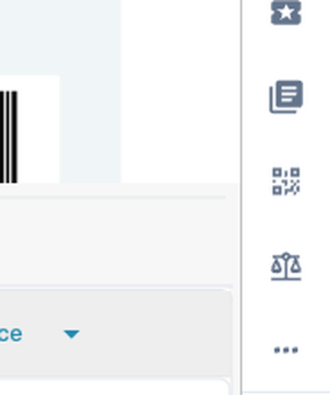
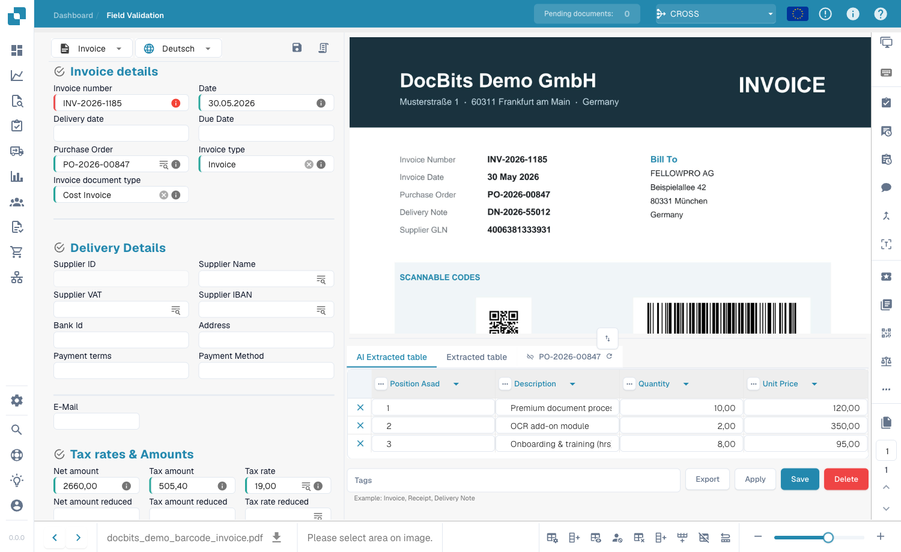
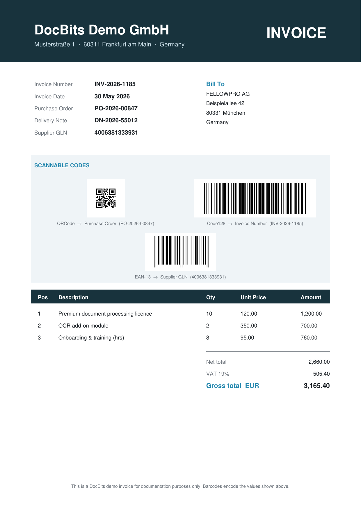
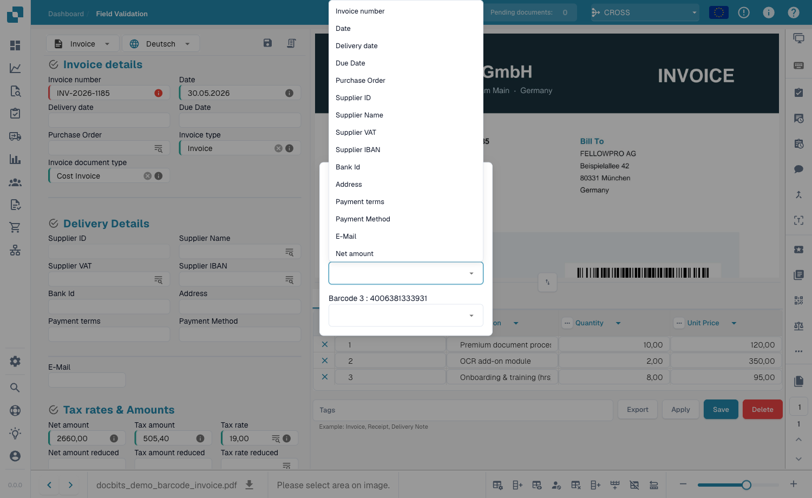
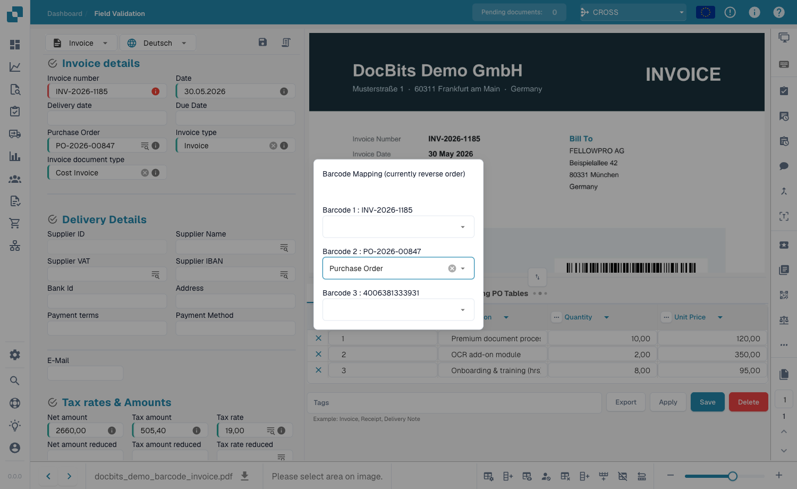
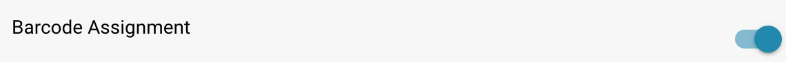

# Dodela putem barkoda

### Pregled

Podešavanje **Dodela putem barkoda** (Barcode Assignment) dodaje alatku za barkodove na **ekran za validaciju dokumenata**. Ona čita barkodove i QR kodove pronađene u dokumentu i omogućava vam da **njihove vrednosti dodelite poljima dokumenta** — na primer, da popunite broj narudžbine, referentni broj ili broj otpremnice iz barkoda umesto da ga kucate.

Ovo podešavanje je **podrazumevano isključeno**.

### Šta dobijate kada ga uključite

Kada je podešavanje uključeno, na traci sa alatkama na desnoj strani **ekrana za validaciju** (`/field_validation_v1/…`) pojavljuje se novo **dugme za barkod** (ikona QR koda). Ovo dugme je ulazna tačka za celu funkciju — bez ovog podešavanja ikona ostaje skrivena.

<figure><figcaption>
Kada je podešavanje uključeno, ikona barkoda se pojavljuje na traci sa alatkama za validaciju.
</figcaption></figure>

Evo ikone u kontekstu ekrana za validaciju, pored dokumenta koji se pregleda:

<figure><figcaption>
Ekran za validaciju — ikona barkoda (istaknuta, desna traka sa alatkama) prikazuje se samo kada je Dodela putem barkoda uključena.
</figcaption></figure>

### Kako se barkodovi čitaju

DocBits otkriva barkodove tokom obrade dokumenta i nudi njihove dekodirane vrednosti za dodelu. Jedan dokument može da sadrži više tipova barkoda — na primer **QR kod**, **Code 128** i **EAN-13** — od kojih svaki kodira drugačiju vrednost, kao što je broj narudžbine, broj fakture ili GLN dobavljača.

<figure><figcaption>
Primer DocBits demo fakture koja sadrži tri tipa barkoda (QR kod → broj narudžbine, Code 128 → broj fakture, EAN-13 → GLN dobavljača), od kojih svaki kodira vrednost koju možete dodeliti polju.
</figcaption></figure>


Koji se tipovi barkoda otkrivaju kontroliše podešavanje **Bar-Code / QR Code Extraction** (`Barcode Extraction Types`). Ako dijalog prikazuje *„no barcodes extracted found“*, uverite se da je izvlačenje barkodova uključeno i da su izabrani očekivani tipovi (npr. `QRCODE`, `CODE128`, `EAN13`).


### Korišćenje dijaloga Dodela putem barkoda

1. Otvorite dokument na **ekranu za validaciju**.
2. Kliknite na **ikonu barkoda** na desnoj traci sa alatkama.
3. Dijalog **Dodela putem barkoda** prikazuje svaki barkod koji je DocBits otkrio u dokumentu, prikazan kao `Barcode <n> : <vrednost>`.

<figure><figcaption>
Dijalog Dodela putem barkoda prikazuje svaki otkriveni barkod sa padajućom listom za izbor ciljnog polja.
</figcaption></figure>

4. Za svaki barkod otvorite njegovu padajuću listu i izaberite polje u koje vrednost treba da ide.

<figure><figcaption>
Svaki barkod može da se dodeli bilo kom polju dokumenta — npr. Broj narudžbine, Broj fakture, ID dobavljača.
</figcaption></figure>

5. Čim izaberete polje, ono se popunjava vrednošću barkoda.

<figure><figcaption>
Nakon izbora polja (ovde Broj narudžbine), polje se popunjava vrednošću barkoda.
</figcaption></figure>

### Kako se uključuje

1. Idite na **Podešavanja**.
2. Izaberite **Obrada dokumenata**.
3. Izaberite **Modul**.
4. Otvorite odeljak **Tip dokumenta**.
5. Pronađite **Dodela putem barkoda** i uključite prekidač.

<figure><figcaption>
Prekidač Dodela putem barkoda u Podešavanja → Obrada dokumenata → Modul.
</figcaption></figure>

### Prednosti

* **Brži unos bez grešaka**: Uzmite vrednosti direktno iz barkoda umesto da ih čitate i kucate ručno.
* **Manje grešaka u kucanju**: Skenirana vrednost je tačno ono što je kodirano u barkodu.
* **Vi zadržavate kontrolu**: Vi odlučujete koji barkod ide u koje polje tokom validacije.

### Kada koristiti ovu funkciju

* **Dokumenti sa barkodovima**: Kada vaši dokumenti sadrže barkodove/QR kodove čije vrednosti pripadaju određenim poljima (npr. brojevi narudžbine ili referentni brojevi).
* **Tokovi ručne validacije**: Kada osoba pregleda dokumente i želi brzo da popuni polja iz barkodova.
* **Ostavite isključeno** ako vaši dokumenti nemaju upotrebljive barkodove ili ako vam je potrebno samo automatsko **izvlačenje** barkodova/QR kodova.


**Ovo služi za čitanje vrednosti barkoda/QR koda i njeno dodeljivanje polju tokom validacije.** Automatsko izvlačenje strukturiranih podataka iz platnih kodova (kao što su Swiss QR Bill ili GiroCode) — kao i deljenje višestranične datoteke na stranicama razdvajačima sa barkodom — obrađuje **drugo** podešavanje: **Bar-Code / QR Code Extraction**.

