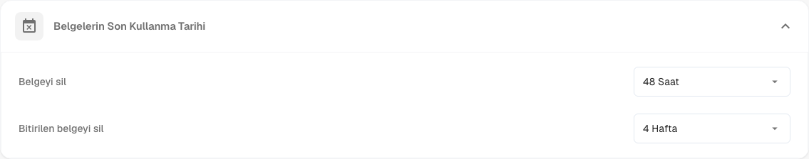
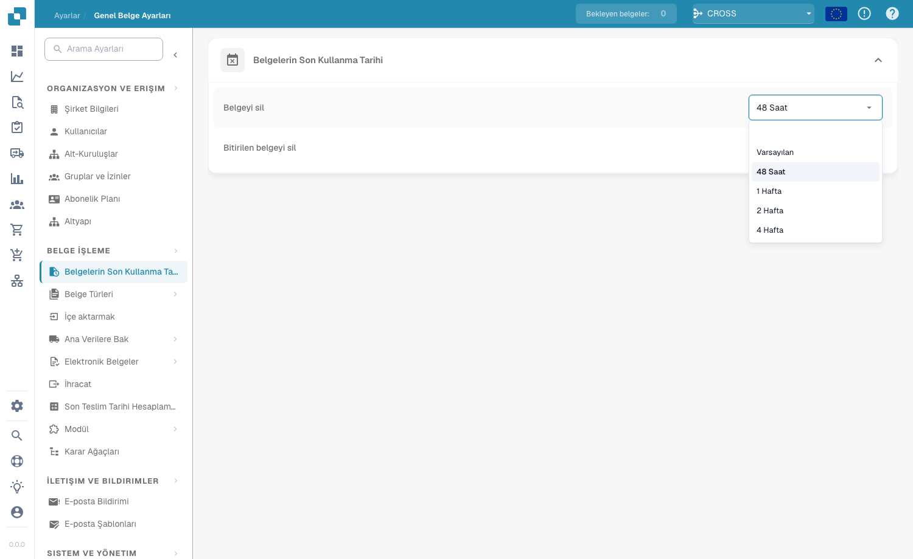

# Belge Süresinin Dolması

<figure><figcaption>
Belge süresi dolma ayarları
</figcaption></figure>

**Belge İşleme → Belgelerin Son Kullanma Tarihi** bölümünde, DocBits'in belgelerinizi otomatik olarak silmeden önce ne kadar süre saklayacağını belirlersiniz. Bu, depolama alanını yönetmenize, veri saklama politikalarını uygulamanıza ve belgelerin saklanma süresine ilişkin yasal veya kurumsal kurallara uymanıza yardımcı olur.

İki ayar otomatik silmeyi denetler:

| Ayar | Neyi denetler |
|------|---------------|
| **Belgeyi şu süre sonra sil** | İşlenmiş bir belgenin otomatik olarak silinmeden önce ne kadar süre saklanacağı. |
| **Tamamlanan belgeyi şu süre sonra sil** | Tamamlanmış (tam olarak işlenmiş ve dışa aktarılmış) bir belgenin otomatik olarak silinmeden önce ne kadar süre saklanacağı. |

Her ayar için açılır menüden bir zaman aralığı seçin:

<figure><figcaption>
Kullanılabilir saklama süreleri
</figcaption></figure>

| Seçenek | Anlamı |
|---------|--------|
| **Varsayılan** | Sistem varsayılan saklama süresini kullan (özel geçersiz kılma yok). |
| **48 Saat** | İşlemden 48 saat sonra sil. |
| **1 Hafta** | Bir hafta sonra sil. |
| **2 Hafta** | İki hafta sonra sil. |
| **4 Hafta** | Dört hafta sonra sil. |

Her iki ayar da belgelerin gereğinden uzun süre sistemde tutulmamasını sağlar — bu da gereksiz depolama kullanımını önler ve belge iş akışını düzenli tutar. Belge saklamaya ilişkin belirli düzenleyici gereksinimleri karşılaması gereken kuruluşlar için özellikle önemlidir.
