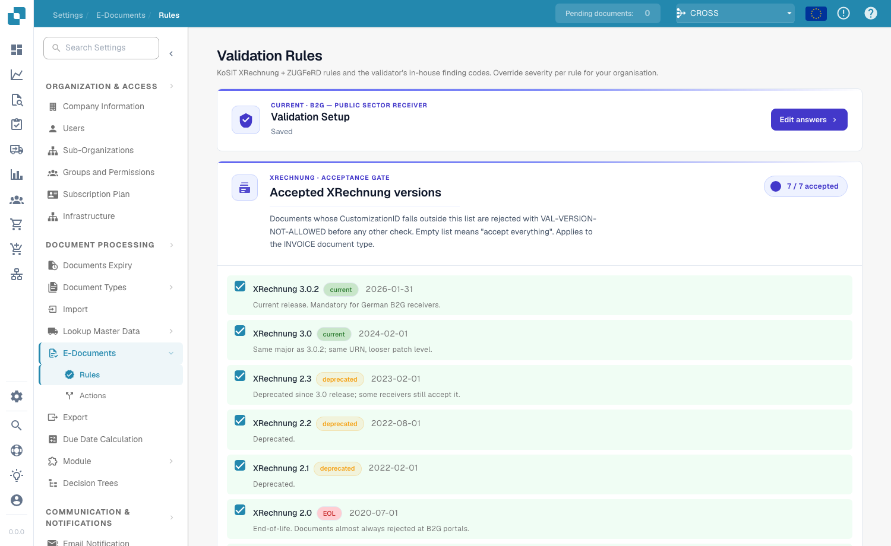
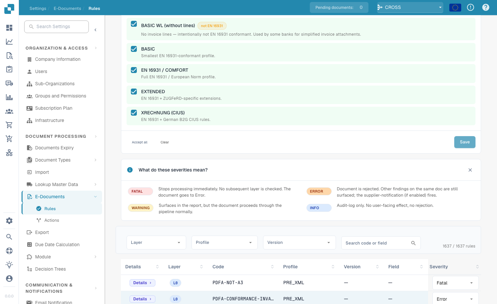
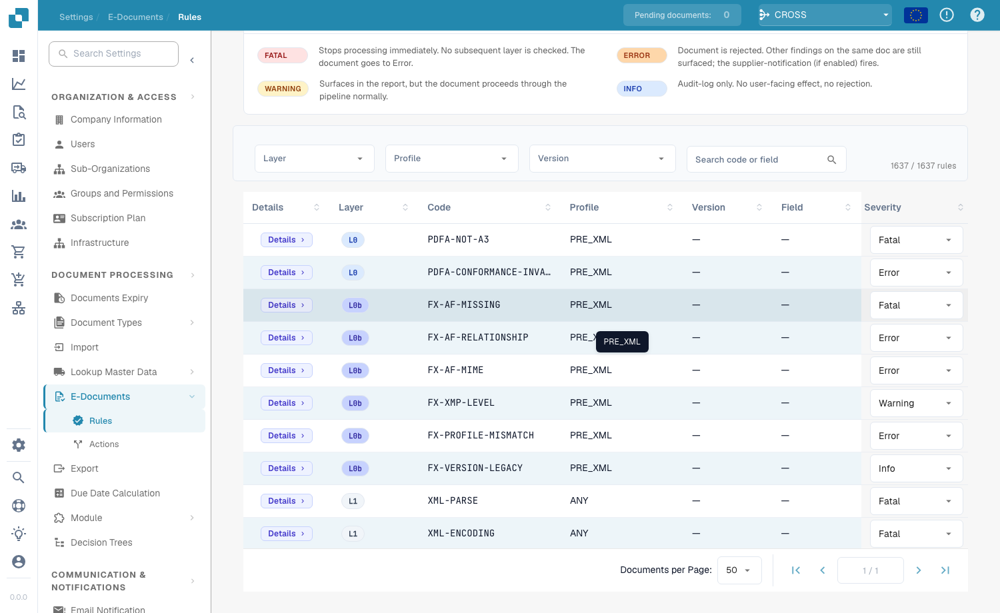

# Pravila validacije

<figure><figcaption>
Podešavanje validacije i prihvaćene XRechnung verzije
</figcaption></figure>

Stranica **Pravila validacije** (**Elektronski dokumenti → Pravila**) kontroliše kako DocBits validira dolazne e-fakture. Zasniva se na zvaničnom skupu pravila **KoSIT XRechnung + ZUGFeRD** uz interne kodove nalaza validatora i omogućava vam da zamenite ozbiljnost svakog pravila za svoju organizaciju.

## Podešavanje validacije

Kartica **Podešavanje validacije** prikazuje vaš trenutni profil validacije (na primer *B2G — Public Sector Receiver*). Kliknite na **Izmeni odgovore** da biste ponovo pokrenuli čarobnjak za podešavanje i promenili standard u odnosu na koji validirate.

## Prihvaćene XRechnung verzije

Kapija **Prihvaćene XRechnung verzije** navodi svaku XRechnung verziju. Označite verzije koje prihvatate — dokumenti čiji CustomizationID izlazi izvan ove liste odbijaju se sa `VAL-VERSION-NOT-ALLOWED` pre bilo koje druge provere. Prazna lista znači „prihvati sve". Svaka verzija je označena kao **current**, **deprecated** ili **EOL** zajedno sa datumom izdavanja.

## Prihvaćeni profili i model ozbiljnosti

<figure><figcaption>
Prihvaćeni profili i značenje svake ozbiljnosti
</figcaption></figure>

Izaberite koje **profile** prihvatate (BASIC WL, BASIC, EN 16931 / COMFORT, EXTENDED, XRECHNUNG (CIUS)) pomoću **Prihvati sve** / **Obriši**, a zatim **Sačuvaj**.

Svako pravilo validacije ima **ozbiljnost** koja određuje šta se dešava kada se aktivira:

| Ozbiljnost | Efekat |
|------------|--------|
| **FATAL** | Odmah zaustavlja obradu. Nijedan naredni sloj se ne proverava; dokument prelazi u Grešku. |
| **ERROR** | Dokument se odbija. Ostali nalazi na istom dokumentu se i dalje prikazuju; obaveštenje dobavljaču (ako je omogućeno) se aktivira. |
| **WARNING** | Pojavljuje se u izveštaju validacije, ali dokument normalno prolazi kroz tok. |
| **INFO** | Samo dnevnik revizije. Bez vidljivog efekta za korisnika i bez odbijanja. |

## Zamena ozbiljnosti pravila

<figure><figcaption>
Kompletna tabela pravila sa zamenom ozbiljnosti po pravilu
</figcaption></figure>

Tabela pravila navodi svako pravilo validacije (ukupno preko 1.600). Filtrirajte po **Sloju (Layer)**, **Profilu** ili **Verziji**, ili pretražujte po kodu ili polju. Za svako pravilo možete zameniti **Ozbiljnost** iz padajuće liste da biste je uskladili sa politikom svoje organizacije — na primer, spuštanjem pravila sa `ERROR` na `WARNING` tako da više ne odbija dokument.
