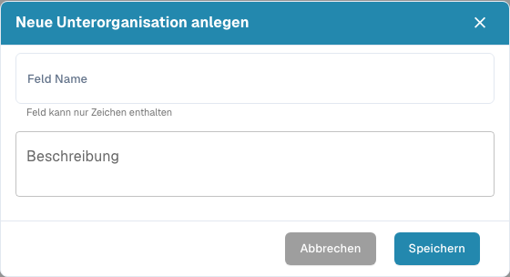
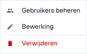
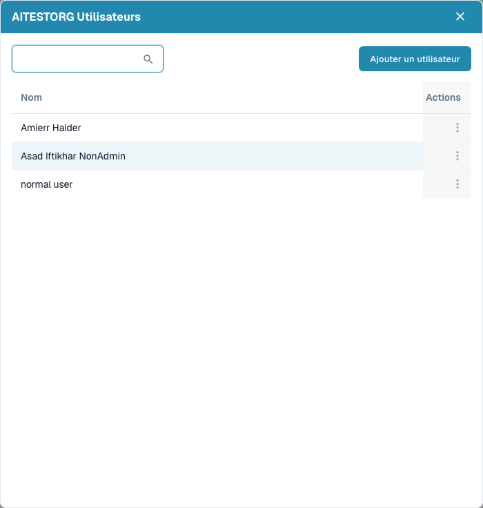
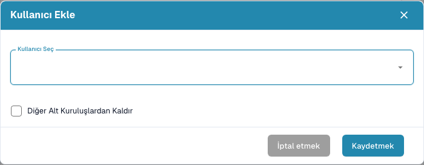
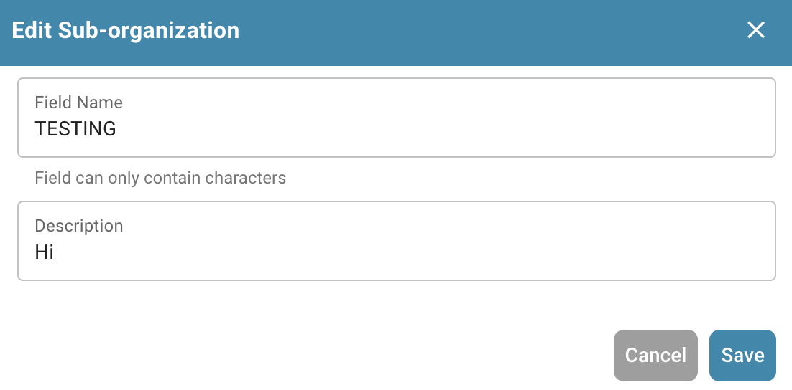

# Alt Organizasyonlar

<figure><figcaption>
Alt Organizasyonlar sayfası
</figcaption></figure>

Alt organizasyonlar, belgeleri, kullanıcıları ve iş akışlarını farklı departmanlar, ekipler veya birimler arasında yönetmek için DocBits içinde hiyerarşik bir yapı oluşturmanıza olanak tanır.

## Başlıca avantajlar

* **Yapılandırılmış organizasyon**: kullanıcıları ve belgeleri departmana, konuma veya iş birimine göre gruplandırın.
* **Ayrıntılı izinler**: her alt organizasyondaki belgelere hangi kullanıcıların erişebileceğini denetleyin.
* **Ayrı iş akışları**: her alt organizasyon kendi belge işleme kurallarına ve yapılandırmalarına sahip olabilir.
* **Raporlama**: her alt organizasyon için raporlar ve analizler oluşturun.

## Alt organizasyon listesi

Tablo, mevcut tüm alt organizasyonları aşağıdaki bilgilerle gösterir:

| Sütun | Açıklama |
|--------|-------------|
| **Ad** | Alt organizasyonun adı. |
| **Açıklama** | Alt organizasyonun amacına ilişkin kısa bir açıklama. |
| **Eylemler** | Kullanıcıları yönetme, alt organizasyonu düzenleme veya silme seçeneklerini içeren menü. |

Alt organizasyonları ada göre hızlıca bulmak için **arama** çubuğunu kullanın.

## Yeni bir alt organizasyon oluşturma

<figure><figcaption></figcaption></figure>

Sağ üst köşedeki `+ YENİ` düğmesine tıklayın.

<figure><figcaption></figcaption></figure>

Aşağıdaki menü görüntülenir:

<figure><figcaption></figcaption></figure>

Oluşturmak istediğiniz alt organizasyonun bilgilerini (ad ve açıklama) girin ve ardından `KAYDET` düğmesine tıklayın. Yeni oluşturulan alt organizasyonu daha sonra mevcut alt organizasyonlar listesinin sonunda bulabilirsiniz.

## Alt organizasyonları düzenleme

<figure><figcaption></figcaption></figure>

**Kullanıcıları yönetme:**

<figure><figcaption></figcaption></figure>

* **Kullanıcı ekleme:** yöneticiler yeni kullanıcı hesapları oluşturup bunları uygun alt organizasyona atayabilir.
* **Rolleri ve izinleri atama:** yöneticiler, bir alt organizasyon içindeki kullanıcıların rollerini ve izinlerini belirleyebilir. Bu genellikle belge yönetim sistemindeki belirli belgelere, klasörlere veya işlevlere erişim hakları atamayı içerir.
* **Profil ayrıntılarını yönetme:** yöneticiler, alt organizasyon içindeki kullanıcıların iletişim bilgileri veya departman bağlılığı gibi profil ayrıntılarını düzenleyebilir. Bu, kullanıcı verilerinin güncel ve doğru bir şekilde yönetilmesini sağlar.

<figure><figcaption></figcaption></figure>

Organizasyona yeni bir kullanıcı ekleyebilir ve kullanıcının diğer gruplardan kaldırılıp kaldırılmayacağını seçebilirsiniz.

**Kullanıcıyı düzenleme:**

<figure><figcaption></figcaption></figure>

* **Alt organizasyon ayarlarını düzenleme:** yöneticiler, bir alt organizasyonun ad, açıklama veya sistemdeki hiyerarşik düzeyi dahil olmak üzere ayarlarını ve özelliklerini düzenleyebilir.
* **Kullanıcı ayrıntılarını düzenleme:** yöneticiler, örneğin erişim haklarını ayarlamak veya iletişim bilgilerini güncellemek için bir alt organizasyon içindeki kullanıcıların ayrıntılarını düzenleyebilir.

**Kullanıcıyı silme:**

* **Alt organizasyonları silme:** yöneticiler, artık gerekli olmadıklarında veya yeniden yapılandırma gerektiğinde alt organizasyonları da silebilir. Bir alt organizasyonu silerken yöneticiler, ilişkili tüm kullanıcıların ve verilerin doğru şekilde işlendiğinden emin olmalıdır.

## "Cross Organizasyon" seçeneği

Etkinleştirildiğinde (sayfanın üst kısmındaki anahtar aracılığıyla), kullanıcılar yalnızca bir alt kuruluşun belgeleriyle sınırlı kalmak yerine tüm alt kuruluşların belgelerini tek bir birleşik görünümde görüntüleyebilir.

1. **Panoya (Dashboard)** gidin.
2. Sağ üst köşede, alt kuruluşlar arasında geçiş yapılabilen yerde **Cross** seçeneğini seçin.
3. Sayfa yeniden yüklenir ve tüm alt kuruluşlardaki belgeleri gösterir.
4. Tek bir alt kuruluş görünümüne dönmek için **Cross** seçeneğinin işaretini kaldırın.

<figure><figcaption>
Sağ üstteki kuruluş değiştiricide Cross seçimi
</figcaption></figure>
