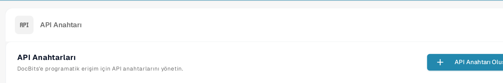

# API Çağrıları ve Örnekler

Bir API isteği, başka bir programın DocBits'teki bilgileri okumasını veya güncellemesini sağlar. Belgeleri değiştirmeden bağlantıyı kontrol edebilmek için salt okunur bir istekle başlayın.

## İstek göndermeden önce

1. Bir kuruluş yöneticisinden erişim isteyin ve entegrasyonunuz için bir API anahtarı oluşturun. Anahtarı gizli bir mağazada saklayın; ekran görüntüsüne, belgeye veya kaynak dosyasına koymayın. API anahtarlarını yönetme adımları için [Entegrasyon](../../../../admin-section/settings/global-settings/integration/README.md) bölümüne bakın.
2. [Güncel Sandbox API referansını](https://sandbox.api.docbits.com/docs) açın. Bu referans, o ortam için kullanılabilecek işlemleri, gereken değerleri ve örnek yanıtları listeler. Sandbox'tan ayrıldığınızda kendi ortamınızın referansını kullanın.

<figure><figcaption><p>API anahtarlarını Ayarlar → Entegrasyon ve SSO altında bulursunuz. Görsel hiçbir anahtar değeri içermez.</p></figcaption></figure>

## Örnek: belge türlerini okuma

Sandbox referansı **GET `/document_type/get_document_types`** işlemini listeler. Bu işlem, kuruluşunuz için kullanılabilir belge türlerini döndürür. `GET` bilgi okur; belge oluşturmaz veya değiştirmez.

API anahtarınızı yerel bir ortam değişkeni olarak ayarlayın, ardından isteği gönderin:

```sh
curl --fail-with-body \
  -H "X-API-KEY: ${DOCB...EY}" \
  "https://sandbox.api.docbits.com/sandbox-api/document_type/get_document_types"
```

Başarılı bir yanıt `success: true` ve belge türlerinden oluşan bir `data` listesi içerir. `401` yanıtı, isteğin kimlik doğrulamasının yapılmadığı anlamına gelir; yeniden denemeden önce anahtarı ve ortamı kontrol edin. Yukarıdaki URL yalnızca Sandbox içindir.

## Sonraki işlemi bulma

API referansında yapmak istediğiniz işi arayın, o işlemin açıklamasını ve zorunlu alanlarını okuyun ve `GET`, `POST` veya başka bir yöntem mi kullandığını kontrol edin. Sonucu doğrulamak için referanstaki örnek yanıtı kullanın. Postman anlatımı için [DocBits için Postman](../../../../setup/postman-for-docbits.md) rehberine bakın; bir istek göndermeden önce oradaki eski örnek URL'leri güncel API referansıyla doğrulayın.

Bu sayfadaki dört eski görsel, doğrulanmış DocBits uç noktaları göstermeden genel OCR, NLP, dosya dönüştürme ve belge yönetimi API'lerini anlatıyordu. Kaldırıldılar; çalıştırılabilir örnek olarak yalnızca yukarıda belgelenen DocBits işlemi sunulmaktadır.
