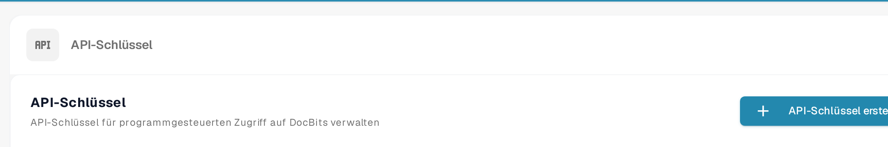

# API-Aufrufe und Beispiele

Ein API-Aufruf erlaubt es einem anderen Programm, Informationen in DocBits zu lesen oder zu aktualisieren. Beginnen Sie mit einer schreibgeschützten Anfrage, damit Sie die Verbindung prüfen können, ohne Dokumente zu verändern.

## Bevor Sie eine Anfrage senden

1. Bitten Sie eine Organisationsadministratorin oder einen Organisationsadministrator um Zugriff und [erstellen Sie einen API-Schlüssel](../../../../administration-and-setup/settings/global-settings/integration/api-key-management.md) für die Integration. Bewahren Sie den Schlüssel in einem Secret Store auf; setzen Sie ihn nicht in einen Screenshot, ein Dokument oder eine Quelldatei.
2. Öffnen Sie die [aktuelle Sandbox-API-Referenz](https://sandbox.api.docbits.com/docs). Sie listet die verfügbaren Vorgänge, erforderlichen Werte und Beispielantworten für diese Umgebung auf. Verwenden Sie die Referenz Ihrer eigenen Umgebung, wenn Sie die Sandbox verlassen.

<figure><figcaption><p>API-Schlüssel finden Sie unter Einstellungen → Integration &amp; SSO. Das Bild enthält keinen Schlüsselwert.</p></figcaption></figure>

## Beispiel: Dokumenttypen lesen

Die Sandbox-Referenz listet **GET `/document_type/get_document_types`**. Der Vorgang gibt die Dokumenttypen zurück, die Ihrer Organisation zur Verfügung stehen. `GET` liest Informationen; es erstellt oder verändert kein Dokument.

Legen Sie Ihren API-Schlüssel als lokale Umgebungsvariable fest und senden Sie dann die Anfrage:

```sh
curl --fail-with-body \
  -H "X-API-KEY: ${DOCB...EY}" \
  "https://sandbox.api.docbits.com/sandbox-api/document_type/get_document_types"
```

Eine erfolgreiche Antwort enthält `success: true` und eine Liste `data` mit Dokumenttypen. Eine `401`-Antwort bedeutet, dass die Anfrage nicht authentifiziert wurde; prüfen Sie den Schlüssel und die Umgebung, bevor Sie es erneut versuchen. Die URL oben gilt nur für die Sandbox.

## Den nächsten Vorgang finden

Suchen Sie in der API-Referenz nach dem, was Sie tun möchten, lesen Sie die Beschreibung und die erforderlichen Felder des Vorgangs und prüfen Sie, ob er `GET`, `POST` oder eine andere Methode verwendet. Bestätigen Sie das Ergebnis mit der Beispielantwort der Referenz. Eine Postman-Schritt-für-Schritt-Anleitung finden Sie unter [Postman für DocBits](../../../../advanced-functions-and-tools/postman-for-docbits/README.md); prüfen Sie dessen ältere Beispiel-URLs gegen die aktuelle API-Referenz, bevor Sie eine Anfrage senden.

Die vier älteren Bilder auf dieser Seite beschrieben generische OCR-, NLP-, Datei-Konvertierungs- und Dokumentmanagement-APIs, ohne geprüfte DocBits-Endpunkte zu zeigen. Sie wurden entfernt; nur der oben dokumentierte DocBits-Vorgang wird als ausführbares Beispiel präsentiert.
