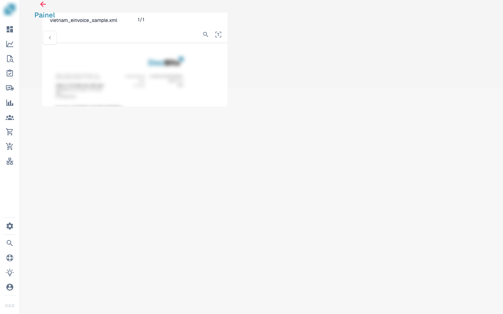

# Pagina

<figure><figcaption></figcaption></figure>

**Knop Opslaan:**

<figure><figcaption></figcaption></figure>

**Speciale regels toevoegen:**

<figure><figcaption></figcaption></figure>

<figure><figcaption></figcaption></figure>

**Fuzzy velden:**

<figure><figcaption></figcaption></figure>

**Vergrootglas:**

<figure><figcaption></figcaption></figure>

**Nieuw venster openen:**

<figure><figcaption></figcaption></figure>

**Sneltoetsen:**

<figure><figcaption></figcaption></figure>

**Taken:**

<figure><figcaption></figcaption></figure>

Om interne informatie te delen, kunnen taken worden aangemaakt en toegewezen aan een specifieke medewerker of groep binnen het bedrijf.

<figure><figcaption></figcaption></figure>

**Annotatiemodus:**

<figure><figcaption></figcaption></figure>

<figure><figcaption></figcaption></figure>

Je kunt annotaties op een document achterlaten. Dit kan handig zijn om informatie achter te laten voor andere gebruikers die dit document verder verwerken.

**Samenvoegen:**

<figure><figcaption></figcaption></figure>

Documenten kunnen hier worden samengevoegd, bijvoorbeeld wanneer er een pagina van een factuur ontbreekt; deze pagina's kunnen later op deze manier worden samengevoegd, zonder dat het hele document hoeft te worden verwijderd of opnieuw geüpload.

**OCR-weergave:**

<figure><figcaption></figcaption></figure>

In de OCR-weergave wordt de tekst automatisch uit het document gefilterd. Dit wordt gebruikt om relevante kenmerken te herkennen, zoals de postcode, het contractnummer, het factuurnummer en de sortering van een document.

**Ticket aanmaken:**

<figure><figcaption></figcaption></figure>

In tegenstelling tot taken, die intern binnen het bedrijf worden doorgegeven, is dit supportticket belangrijk om ons op de hoogte te stellen en direct een ticket aan te maken bij fouten en/of afwijkingen. Dit vereenvoudigt het proces aanzienlijk, omdat je de fout direct met het bijbehorende document kunt verzenden. Er is ook de mogelijkheid om de prioriteit in te stellen, een screenshot van het document te maken of er een te uploaden.

<figure><figcaption></figcaption></figure>

**Documentscript-logboeken:**

<figure><figcaption></figcaption></figure>

Scripts kunnen in de instellingen onder Documenttypen worden aangemaakt; deze informatie wordt dan hier weergegeven.

<figure><figcaption></figcaption></figure>

**Overige instellingen:**

<figure><figcaption></figcaption></figure>

**Document splitsen:**

* Hier kun je het document splitsen en pagina's uitknippen of verwijderen die niet nodig zijn.

**Document verbeteren:**

* Het document wordt opnieuw gestart.

**Documentflow:**

* Hier vind je de flow van het document.

**Naar de lay-outsjabloon gaan:**

* Met deze optie word je doorgestuurd en kun je je lay-out bewerken of de standaardsjabloon gebruiken.

**Verplichte velden:**

<figure><figcaption></figcaption></figure>

Er zijn velden die vereist zijn voor verdere verwerking; deze kunnen in de instellingen worden bewerkt.

Gebruik de tooltip om erachter te komen of:&#x20;

* Het een verplicht veld is (vereist)
* Validatie vereist is
* Laag vertrouwen
* Het totale belastingbedrag niet overeenkomt

**Naar de tabelextractieweergave gaan:**

<figure><figcaption></figcaption></figure>

Hier kom je in de tabelextractieweergave en heb je meer opties tot je beschikking. Bijvoorbeeld in de trainingsmodus het aanleren van de tabel.

**Niet-toegewezen kolommen toevoegen:**

<figure><figcaption></figcaption></figure>

Klik hier om niet-toegewezen kolommen toe te voegen en selecteer de kolommen die je in de tabel wilt hebben, of verwijder de kolommen die je niet nodig hebt.

<figure><figcaption></figcaption></figure>

**Niet-toegewezen kolommen tonen / Niet-toegewezen kolommen verbergen:**

<figure><figcaption></figcaption></figure>

<figure><figcaption></figcaption></figure>

**Tabelextractie voor deze leverancier blokkeren:**

<figure><figcaption></figcaption></figure>

**Tabel verwijderen:**

<figure><figcaption></figcaption></figure>

**Nieuwe tabelkolom toevoegen:**

<figure><figcaption></figcaption></figure>

<figure><figcaption></figcaption></figure>

Wanneer er een kolom ontbreekt, kun je hier een nieuwe kolom aanmaken. Geef de titel op, beslis of het een verplicht veld moet zijn, en het kolomtype (dit is belangrijk voor het juiste formaat).

**Tabelvalidatie negeren:**

<figure><figcaption></figcaption></figure>

**Tabelkolom herstellen:**

<figure><figcaption></figcaption></figure>
