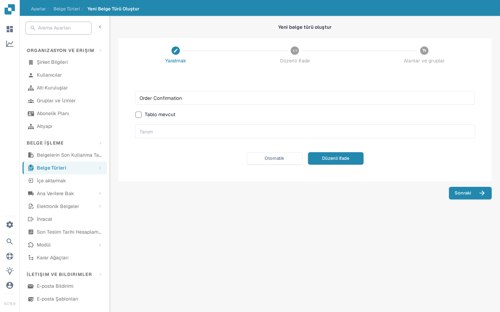
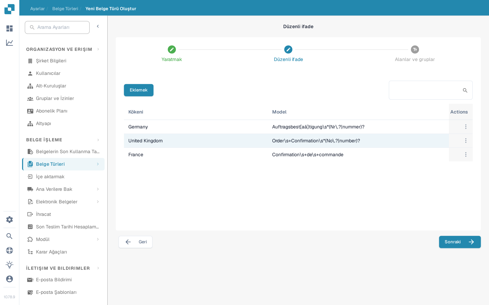

# Regex Manager

Bu DocBits özelliği, model sınıflandırmaya bir alternatiftir: belge türü için sınıflandırma ve diğer amaçlara yönelik aranabilir düzenli ifadeler yazmanızı sağlar.

**Belge türü:** Regex Manager düzenli ifade yazmanızı sağlar ve DocBits belgeyi bu ifadeler için arar. Belge tanımlı bir belgenin regex'iyle eşleşirse ilgili belge türüne sınıflandırılır. Örneğin “Gutschrift” ifadesini bulan bir düzenli ifade yazarsanız, DocBits bu terimi içeren belgeyi alacak belgesi olarak sınıflandırır.

**Belge kökeni:** Bu sayede DocBits, düzenli ifadeler aracılığıyla bir belgenin hangi ülkeden geldiğini bilir. Örneğin İspanyolca bir belge için yazılan düzenli ifade “Factura” terimini içeriyorsa ve DocBits bu terimi bir belgede bulursa, belgenin İspanyol kökenli olduğunu anlar ve buna göre sınıflandırır.

## Regex Manager'a erişim

Bu özelliği kullanmak için Ayarlar → Belge Türleri yolunu izleyin ve “Yeni” düğmesine tıklayın. “Yeni belge türü oluştur” sihirbazında belge türü için bir ad girin ve çıkarma yöntemi olarak “Otomatik” yerine “Düzenli ifade” seçin, ardından “Sonraki” ile devam edin.

<figure><figcaption>
Belge türü adının ve “Otomatik” ile “Düzenli ifade” seçimini gösteren “Yeni belge türü oluştur” sihirbazı.
</figcaption></figure>

## Regex ekleme ve kaldırma

Regex adımı, mevcut düzenli ifadeleri Kökeni ve Model sütunlarıyla bir tabloda gösterir; yeni regex girdileri oluşturmak için “Eklemek” düğmesi bulunur.

<figure><figcaption>
Mevcut düzenli ifadelerin tablosunu ve “Eklemek” düğmesini gösteren Regex adımı.
</figcaption></figure>
