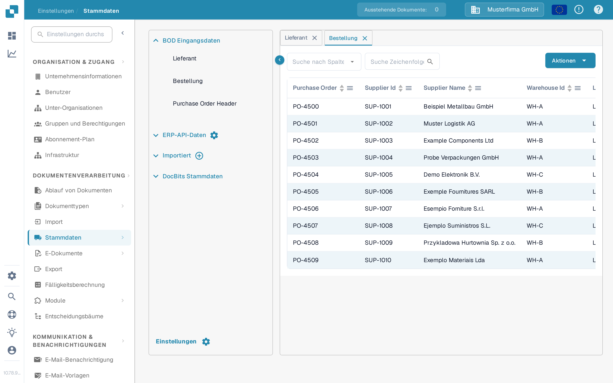

# Bestellabgleich

Um Ihre PO-Matching-Konfiguration zu testen, müssen Sie in LN/M3 eine Bestellung (Purchase Order) anlegen, um zu prüfen, ob INFOR mit DocBits synchronisiert ist.

## Eine Bestellung in INFOR anlegen

* LN: https://docs.infor.com/ln/10.4/en-us/lnolh/docs/ln\_10.4\_procpoug\_\_en-us.pdf
* M3: https://docs.infor.com/m3udi/16.x/en-us/m3beud/default.html?helpcontent=ois610.html

Sobald Sie die Bestellung angelegt haben, öffnen Sie Einstellungen → Stammdaten und suchen Sie dort nach der Bestellnummer der Bestellung, die Sie gerade angelegt haben. Sie sollte jetzt in Ihren Bestell-Stammdaten in DocBits erscheinen.

<figure><figcaption>
Die Bestellungen erscheinen in der Stammdaten-Übersicht.
</figcaption></figure>

Sie sollten hier Ihre eindeutige Bestellnummer sehen. Das bedeutet, dass DocBits und INFOR korrekt synchronisiert sind.

Laden Sie nun Ihre Rechnung hoch, deren Mengen und Einzelpreise zu der Bestellung passen, die Sie angelegt haben. Prüfen Sie das Dokument und wählen Sie im Validierungsbildschirm PO-Abgleich aus.

Die Positionen der Bestellung und der Rechnung sollten automatisch zusammengeführt werden. Wählen Sie dann einfach die Export-Option aus und prüfen Sie, ob das Dokument ohne Fehler exportiert wird. Falls beim Export ein Fehler auftritt, erstellen Sie ein Ticket für das DocBits-Support-Team, damit Ihnen geholfen wird. Wenn Sie nicht wissen, wie Sie in DocBits ein Ticket erstellen, finden Sie in unserer Übersichtsdokumentation zu DocBits eine Anleitung dazu.

\
